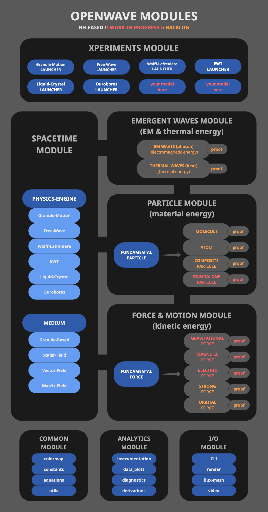

# OpenWave

<div align = "center">

  [](https://www.apache.org/licenses/LICENSE-2.0)
  [](https://www.python.org/)
  [](https://github.com/openwave-labs/openwave)
  [](https://x.com/openwavelabs/)
  [](https://youtube.com/@openwave-labs/)
  <!-- [](https://www.reddit.com/r/openwave/) -->

  

</div>

## What is OpenWave?

OpenWave is an open-source subatomic physics simulator for exploring fundamental physics through **classical field theory enriched with topology and nonlinearity** — the scientific tradition of de Broglie–Bohm pilot waves, wave structure of matter, and modern topological-soliton models. The platform is python-based and lets you model matter and energy phenomena using wave-dynamics, topological defects, and nonlinear potentials, investigating whether particles and forces can emerge from deterministic field equations rather than being postulated.

OpenWave is a computational platform for testing candidate field-theoretic models against a specific, well-defined scientific question: *can a classical Lagrangian field theory, when augmented with topology and the right nonlinear potentials, quantitatively reproduce specific particle-scale phenomena (Coulomb interaction, lepton mass spectrum, Zitterbewegung, quark confinement, annihilation)?* — with concrete pass/fail criteria for each phenomenon, applied uniformly across the candidate models implemented in the platform. See the [Scientific Position](#scientific-position) section below.

The platform implements multiple candidate mathematical frameworks through complementary approaches: SCALAR-FIELD models (similar to lattice gauge theory), VECTOR-FIELD models, both for research simulations, and a GRANULE-MOTION model for educational visualization. Each framework runs in the same numerical engine, enabling direct comparison of model predictions against shared observables.

### Research Goals

OpenWave investigates, in one integrated simulator, the chain of subatomic phenomena most relevant to advanced applied research. Four primary domains:

- **MATTER** — investigate particle emergence (leptons, quarks, nucleons, atoms) from topological defects + wave dynamics in a Lagrangian field
- **FORCES** — investigate whether all four forces can emerge from one classical-field framework: electric (from topology), strong (from string tension + standing waves), magnetic (from spin-induced transverse waves), gravitational (from density deficit / 4D boost-axis topology — the most speculative of the four)
- **ELECTROMAGNETIC WAVES** — photons and EM radiation as travelling perturbations of the vacuum field
- **HEAT** — whether wave-field degrees of freedom beyond bulk kinetic motion contribute to thermal physics

The first domain (matter) is the foundation; the other three are what the simulator is designed to compute *outputs* for. Each is intended to produce measurable quantities that — *if* the framework's predictions match experiment — could inform applied research.

OpenWave aims to:

- Explore matter, force emergence, EM-wave dynamics, and heat phenomena through wave-dynamics and topology in one integrated simulator
- Simulate candidate particle structures from topological defects + standing wave patterns in fields
- Test predictions against known physics (particle masses, force laws, decay rates, EM dispersion, thermal coupling) — pass criteria specified in `/research`
- Provide computational and visualization tools that — *if* the framework's predictions match experiment — could yield design parameters relevant to applied research

**Scientific Status:** OpenWave is a research tool for computational exploration. It uses lattice-discretization methodology (similar in spirit to lattice QCD's tooling, with classical field equations rather than quantized operators) to investigate alternative field-theoretic models and their predictions. Applied-research outputs are conditional on the framework's predictions matching experiment — see the [Scientific Position](#scientific-position) section for the falsifiability framing.


## Core Scope

OpenWave provides computational and visualization tools to explore, demonstrate, and *test* predictions through three main functions:

### Numerical Analysis (Analytical Tools)

- Runs simulations derived directly from built-in equations and energy-wave phenomena
- Compares simulation outcomes against experimental observations to test predictions
- Generates numerical analysis and data export for scientific publications

### Visual Demonstration (Educational Tools)

- Illustrates complex, often invisible phenomena for better comprehension
- Represents graphically wave equations and analysis
- Automates animation export for online video publishing

### Exploratory Simulations (Parametric + Cause-Effect Studies)

- Models experimental wave-field configurations for parametric studies
- Supports hypothesis testing and comparative analysis against theoretical predictions
- Runs **cause-effect experiments under perturbation** — apply external drives (EM fields, boundary conditions, parameter sweeps) and measure the field's dynamic response. This is what distinguishes the time-stepped simulation from the static numerical-validation workflow above, and it's the function relevant to any downstream applied research.

### COMPUTATIONAL MODELS

OpenWave provides complementary ways to explore wave mechanics:

#### Scalar and Vector Field Models (Research Oriented)

- 3D wave-field evolved by partial differential equations (PDEs) and analytical wave-form expressions
- Similar in spirit to lattice QCD (discrete spacetime + GPU integration), but with **classical field equations and no gauge structure** — different mathematical object
- Scalable for matter formation and force simulations
- Indexed by spatial coordinates with field properties at each voxel

#### Granule-Motion Model (Education Oriented)

- Discrete particle visualization with phase-shifted oscillations
- Intuitive for understanding wave mechanics
- Ideal for education and visualization


## SCIENTIFIC BACKGROUND

OpenWave is a shared simulation platform for exploring classical wave-field dynamics with topological defects as a computational approach to particle emergence. The current research direction combines **topological defects** (static structure giving integer charge and spin) with **wave dynamics** (Klein-Gordon-like perturbations around a vacuum field, plus standing-wave interference for orbit quantization) — drawing directly from the frameworks contributed by the collaborators below.

### Scientific Position

OpenWave belongs to the **classical-field-theory-with-topology-and-nonlinearity tradition** — the scientific lineage of de Broglie–Bohm pilot waves, wave structure of matter, 4D field-theoretic extensions of teleparallelism, the Landau–de Gennes topological-defect model from soft-matter physics, and classical elastic-solid frameworks. Its experimental sibling is the **hydrodynamic quantum analogs** program (Bush, Couder — silicone-oil walking droplets that reproduce single-slit interference, tunneling, orbital quantization, and orbital-level splitting under rotation in classical fluid dynamics, the latter of which is an analog to atomic level splitting).

The shared insight: a sufficiently rich classical field, with the right nonlinearity and the right topology, can reproduce phenomena historically attributed to quantum behavior — without operators, Hilbert space, or probability amplitudes.

### How We Work

OpenWave is built to be disconfirmed. Every model is held to concrete, public pass/fail criteria ([MODELS.md](MODELS.md)), and results are reported as what they are, often ratios rather than finished physical numbers, with the limits stated plainly. We would rather find the flaw than defend the thesis, and we treat being wrong as progress. Critiques, replications, and refutations are as welcome as new models.

### Platform vs. Model — what survives if a model fails

OpenWave is the **simulator and comparison engine**; the candidate frameworks contributed by Yee, Duda, Close, Werbos, and others are **models** running inside that simulator. The platform value comes from hosting multiple frameworks side-by-side on the same numerical engine, running them against shared observables, and providing cause-effect experimentation under perturbation. Those capabilities survive any individual model being wrong: if a candidate framework fails its pass criteria, the platform's value as a comparison engine is intact and another candidate can be tested. The simulator IS the product, not any particular physics it embeds. The model-by-model validation status lives in [MODELS.md](MODELS.md), the side-by-side comparison table with per-criteria status and the script behind every cell.

### Historical Pioneers

- Albert Einstein — [EPR Paradox, Determinism Debates](https://en.wikipedia.org/wiki/Einstein%E2%80%93Podolsky%E2%80%93Rosen_paradox)
- Louis de Broglie — [Pilot Wave Theory Foundations](https://en.wikipedia.org/wiki/Pilot_wave_theory)
- David Bohm — [Bohmian Mechanics](https://en.wikipedia.org/wiki/De_Broglie%E2%80%93Bohm_theory)
- Milo Wolff — [Wave Structure of Matter](https://www.amazon.com/dp/0962778710) & [Schroedinger's Universe](https://www.amazon.com/Schroedingers-Universe-Origin-Natural-Laws-ebook/dp/B001MIZV3A)
- Gabriel LaFreniere — [Matter is Made of Waves](https://lafreniere.pages.dev/)

### Major Theoretical Contributions

| Contributor | Framework | Contribution |
| --- | --- | --- |
| [Jeff Yee](https://www.youtube.com/@EnergyWaveTheory) | [Energy Wave Theory (EWT)](https://energywavetheory.com "Energy Wave Theory") | A proposed deterministic field-theoretic alternative to quantum mechanics, drawing conceptual inspiration from historical wave interpretations of QM (de Broglie, Bohm, Wolff). Primary physics advisor and collaborator on OpenWave since its inception. |
| [Dr. Jarek Duda](https://en.wikipedia.org/wiki/Jaros%C5%82aw_Duda_(computer_scientist)) | [Liquid-Crystal Particle Analogs](https://en.wikipedia.org/wiki/Draft:Liquid_crystal_particle_analogs "Topological Field Framework") | A Landau-de Gennes field framework modeling particles as topological defects with integer-quantized charge. Proposes unifying electromagnetism, quantum mechanics, and gravity through a single vector order parameter, with mass and Zitterbewegung derived from a time-crystal mechanism (see [arXiv:2108.07896](https://arxiv.org/pdf/2108.07896), [arXiv:2501.04036](https://arxiv.org/pdf/2501.04036)). |
| [Dr. Robert Close](https://www.classicalmatter.org) | ["Equation of Everything" (Foundations of Physics 2025)](https://doi.org/10.1007/s10701-025-00839-0 "Classical Wave Mechanics") | A classical elastic-solid framework that derives the Dirac equation from a nonlinear vector wave equation for spin density, giving every term a concrete physical interpretation in the underlying medium. |
| [Dr. Paul Werbos](https://en.wikipedia.org/wiki/Paul_Werbos) | [Ouroboros System (chaoiton framework)](https://zenodo.org/records/20357670) | A two-vector-field classical Lagrangian (A_μ, J_μ on Minkowski spacetime) where particles emerge as **chaoitons** — time-periodic localized solutions that escape Derrick's theorem via oscillation rather than topology. Charge quantization derives from the mutual Chern-Simons linking number between A and J flux lines (also see [What Does the Universe Look Like? A New Dark Matter Candidate from the Ouroboros Lagrangian](https://zenodo.org/records/20350105)). |

How these frameworks compare against the shared observables, criteria by criteria with validation status and the script behind each cell: **[MODELS.md](MODELS.md)**.

### Platform Contributors

OpenWave is a multi-contributor open-source platform. Alongside the theoretical frameworks contributed by the physics advisors above, the platform itself is built collaboratively:

| Contributor | Role |
| --- | --- |
| [Rodrigo Griesi](https://github.com/xrodz) (OpenWave Labs) | Founder, lead engineer/researcher, project director — sets vision, methodology, and engineering direction |
| [Łukasz Smoliński](https://github.com/lsmolinski) | OpenWave Contributor — extended Energy Wave Theory into a body-centered-cubic lattice formulation ([Enhanced EWT](https://zenodo.org/search?q=metadata.creators.person_or_org.name%3A%22Smoli%C5%84ski%2C%20%C5%81ukasz%22&l=list&p=1&s=10&sort=bestmatch)) |
| [Anthropic Claude Code](https://claude.com/product/claude-code) (Fable 5 Model) | AI agent contributor: code, numerical analysis, derivations, documentation, manuscript review |
| Community contributors | Repo open to external contributions under [Apache 2.0](LICENSE) |

The platform's design treats AI agents as first-class contributors, not as a tool layered on top of the work. Numerical analyses, derivations, and code are performed by AI agents under engineering direction from OpenWave Labs; all artifacts are open-source so any researcher can reproduce, refute, or extend.

### Computational Approach

OpenWave evolves classical wave-field values on a 3D lattice via GPU-accelerated PDE integration (Taichi), similar in spirit to lattice QCD but with classical field equations and no gauge structure. Multiple complementary models (scalar, vector, director-field, granule-motion) allow cross-checking of mechanisms and direct comparison between candidate Lagrangians.

The platform supports two complementary computational workflows:

- **Static numerical validation** — boundary-value-problem solvers (`scipy.solve_bvp` and similar) verify that a candidate Lagrangian produces specific particle configurations at equilibrium (e.g., does this Lagrangian admit a chaoiton with H/Q matching the electron?). Single-point checks of a model's predictions.
- **Dynamic field simulation** — the Taichi GPU kernel evolves the full field forward in time on a 3D lattice, supporting many interacting particles, perturbations, and cause-effect experimentation. This is where modulation, scattering, and time-resolved phenomena get tested.

Both workflows operate on the same underlying field equations. Validation answers "does the theory produce the right particles?"; simulation answers "given the theory works, what happens when we perturb it?"

### Open Research Questions

- Can topological defects in a vacuum field reproduce particle charge quantization, integer winding, and far-field Coulomb interaction?
- Can Klein-Gordon-like dynamics around the vacuum give rise to mass, relativistic kinematics, and intrinsic (time-crystal) oscillation?
- Can standing-wave interference between defect emissions produce orbit quantization (electron shells, composite particles)?
- Can the same framework recover Coulomb, strong, and gravitational forces at their respective scales?


## INSTALLATION INSTRUCTIONS

For development installation refer to [Contribution Guide](CONTRIBUTING.md)

```bash
# Make sure you have Python >=3.12 installed
# If not, refer to Python installation instructions below

# Clone the OpenWave repository, on your terminal run:
  git clone https://github.com/openwave-labs/openwave.git
  cd openwave # point to local directory where OpenWave was installed

# Install OpenWave package & dependencies
  pip install .  # reads dependencies from pyproject.toml
```

### Python installation instructions

- Recommended: Anaconda Package Distribution
- Install from: <https://www.anaconda.com>

## USAGE

### Play with the /xperiments module

XPERIMENTS are virtual lab scripts where you can explore wave mechanics and simulate various phenomena.

- **Highly Recommended:**
  - Read the [**WELCOME TO OPENWAVE**](WELCOME.md) to get started.
- Then, on your terminal run:

```bash
# Launch xperiments using the CLI xperiment selector

  openwave -x

# Run sample xperiments shipped with the OpenWave package, tweak them, or create your own
```

<div align = "center" style="text-align: center">
  <table>
    <tr>
      <td style="text-align: center">
        <div align = "center">
          <a></a>
          <br>Standing Wave Xperiment
        </div>
      </td>
      <td style="text-align: center">
        <div align = "center">
          <a></a>
          <br> Wave Amplitude Envelope
        </div>
      </td>
    </tr>
    <tr>
      <td style="text-align: center">
        <div align = "center">
          <a></a>
          <br> Particle Attraction Xperiment
        </div>
      </td>
      <td style="text-align: center">
        <div align = "center">
          <a></a>
          <br> Wave Interference Xperiment
        </div>
      </td>
    </tr>
  </table>
</div>

## INSTRUMENTATION FRAMEWORK

Xperiments support configurable instrumentation and probe integration for real-time data acquisition and numerical analysis. The framework provides zero-overhead data collection that can be toggled on or off per simulation.

**Capabilities:**

- **Energy Monitoring:** Track charge levels and energy stabilization throughout simulation runtime
- **Field Probes:** Sample displacement, amplitude, and frequency at specified voxel coordinates
- **Profile Analysis:** Generate cross-sectional displacement profiles along field axes
- **Data Export:** Output time-series data to CSV format for external processing
- **Automated Visualization:** Generate publication-ready plots for charge profiles, energy levels, and probe time-series analysis

```python
# Enable instrumentation in xperiment parameters
"analytics": {
    "INSTRUMENTATION": True,  # Toggle data acquisition
}
```

<div align = "center" style="text-align: center">
  <table>
    <tr>
      <td style="text-align: center">
        <div align = "center">
          <a></a>
          <br>Energy Charging
        </div>
      </td>
      <td rowspan="2" style="text-align: center; vertical-align: middle">
        <div align = "center">
          <a></a>
          <br> Probe Analysis
        </div>
      </td>
    </tr>
    <tr>
      <td style="text-align: center">
        <div align = "center">
          <a></a>
          <br>Charge Profile
        </div>
      </td>
    </tr>
  </table>
</div>

## UNDER-THE-HOOD

Check **[SYSTEM ARCHITECTURE](SYS_ARCH.md)** for more details on OpenWave's Package contents and architecture.

<div align = "center" style="text-align: center">
  <table>
    <tr>
      <td style="text-align: center">
        <div align = "center">
          <a href="SYS_ARCH.md"></a>
        </div>
      </td>
    </tr>
  </table>
</div>

## WANNA HELP?

### WITH IDEAS (anyone, human or AI)

You do not need to write code to contribute. Open a discussion or an issue to propose a reframe, challenge a result, flag an error, or replicate or refute any cell in [MODELS.md](MODELS.md). Some of the sharpest contributions here began as a single issue comment. Newcomers and AI agents are equally welcome.

### WITH DEVELOPMENT

- Please read the [Contribution Guide](CONTRIBUTING.md)
- See `/dev_docs` for coding standards and development guidelines
  - [Coding Standards](dev_docs/CODING_STANDARDS.md)
  - [Performance Guidelines](dev_docs/PERFORMANCE_GUIDELINES.md)
  - [Loop Optimization Patterns](dev_docs/LOOP_OPTIMIZATION.md)
  - [Markdown Style Guide](dev_docs/MARKDOWN_STYLE_GUIDE.md)
- **This is the Way!** ... Real human power comes from collaboration.

### WITH RESOURCES

- Support this project via [Buy Me a Coffee](https://buymeacoffee.com/openwave)

## LICENSE & ATTRIBUTION

OpenWave is licensed under the [Apache License, Version 2.0](LICENSE).

This means:

- ✅ You can use, modify, and distribute OpenWave
- ✅ Commercial use is permitted
- ✅ Contributors grant a patent license for their contributions; defensive termination protects all users
- ✅ Derivative works may be distributed under different terms, including proprietary, provided attribution and NOTICE requirements are met
- ⚠️ Redistributions must retain copyright, license, and [NOTICE](NOTICE) files

### Third-Party Software

OpenWave uses several open-source libraries. See [THIRD_PARTY_NOTICES](THIRD_PARTY_NOTICES) for full attribution and license information for:

- **Taichi Lang** (Apache 2.0) - GPU-accelerated computing and rendering
- **NumPy** (BSD-3) - Numerical computing
- **SciPy** (BSD-3) - Scientific computing
- **Matplotlib** (BSD-compatible) - Visualization
- **PyAutoGUI** (BSD-3) - GUI automation

All dependencies use licenses compatible with Apache 2.0.

### Trademark

"OpenWave" is a trademark of OpenWave Labs. See [TRADEMARK](TRADEMARK) for usage guidelines.
