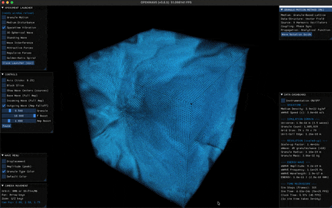
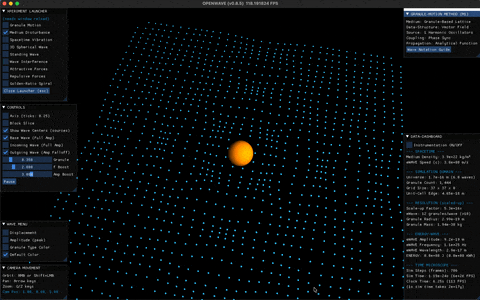
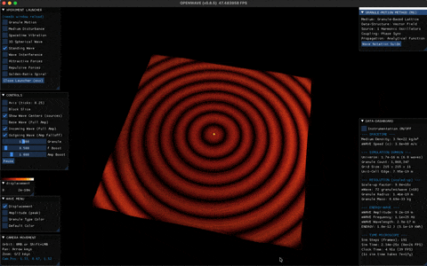
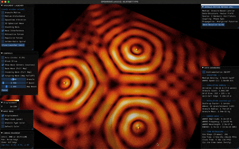
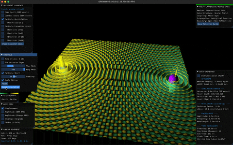
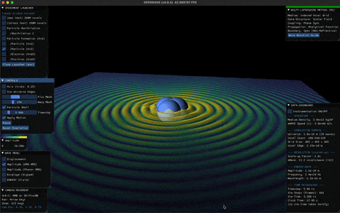
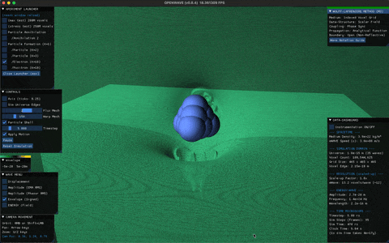
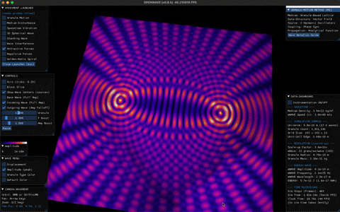
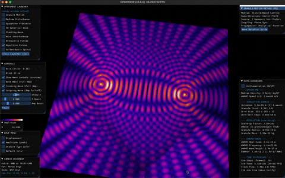
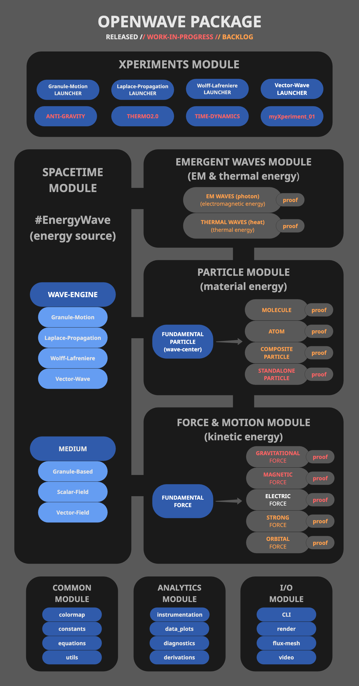

# OpenWave

<div align = "center">

  [](https://www.gnu.org/licenses/)
  [](https://www.python.org/)
  [](https://github.com/openwave-labs/openwave)
  [](https://www.reddit.com/r/openwave/)
  [](https://x.com/openwavelabs/)
  [](https://youtube.com/@openwave-labs/)

  

</div>

## What is OpenWave?

OpenWave is an open-source subatomic wave simulator for exploring fundamental physics through classical wave mechanics. The platform is python-based and lets you model matter and energy phenomena using wave-dynamics, investigating whether particles and forces can emerge from wave-equations.

The platform implements a proposed mathematical framework through various complementary approaches: SCALAR-FIELD methods (similar to lattice gauge theory), VECTOR-FIELD methods, both for research simulations, and a GRANULE-MOTION method for educational visualization.

### Research Goals

OpenWave aims to:

- Model matter, force unification and energy phenomena through wave-dynamics
- Simulate particle emergence from standing wave patterns in fields
- Validate wave-mechanics against known physics
- Provide computational and visualization tools for wave-dynamics models

**Scientific Status:** OpenWave is a research tool for computational exploration using lattice field theory methodology to investigate alternative field equations and their predictions.


## Core Scope

OpenWave provides computational and visualization tools to explore, demonstrate, and validate predictions through three main functions:

### Numerical Validation (Analytical Tools)

- Runs simulations derived directly from built-in equations and energy-wave phenomena
- Validates outcomes by comparing them against experimental observations
- Generates numerical analysis and data support for scientific publications

### Visual Demonstration (Educational Tools)

- Illustrates complex, often invisible phenomena for better comprehension
- Represents graphically wave equations and analysis
- Automates animation export for online video publishing

### Exploratory Simulations (Hacking Energy)

- Models experimental wave-field configurations for parametric studies
- Supports hypothesis testing and comparative analysis against theoretical predictions

## Computational Approaches

OpenWave provides complementary ways to explore wave mechanics:

### Scalar and Vector Field Methods (Research Oriented)

- 3D wave-field using partial differential equations (PDEs) and other wave functions
- Similar methodology to lattice QCD (quantum chromodynamics)
- Scalable for matter formation and force simulations
- Indexed by spatial coordinates with field properties at each voxel

### Granule-Motion Method (Education Oriented)

- Discrete particle visualization with phase-shifted oscillations
- Intuitive for understanding wave mechanics
- Ideal for education and visualization

## Explore ENERGY LAYERS that might be the source of matter & forces

```text
================================================================
 ❓ LAYER 0: ψαλλ ιτ ςηατεωερ υοθ ςαντ, ςε δον'τ κνος υετ
================================================================
 ✅ LAYER 1: QUANTUM ENERGY WAVE & TIME EMERGENCE
================================================================
 ✅ LAYER 2: WAVE CENTERS & STANDING WAVES
================================================================
 ✅ LAYER 3: STANDALONE PARTICLE EMERGENCE
================================================================
 🚧 LAYER 4: ELECTROMAGNETISM EMERGENCE
================================================================
 🚧 LAYER 5: GRAVITY EMERGENCE
================================================================
 🚧 LAYER 6: EMERGENT WAVES (PHOTON & THERMAL ENERGY)
================================================================
 🚧 LAYER 7: COMPOSITE PARTICLE EMERGENCE
================================================================
```

<div align = "center" style="text-align: center">
  <table style="border: none">
    <!-- ═══ LAYER 1 ═══ -->
    <tr>
      <td colspan="3" style="text-align: left; vertical-align: top; padding-left: 16px">
        <b>✅ LAYER 1: QUANTUM ENERGY WAVE & TIME EMERGENCE</b>
        <br><br>An energy wave fills all of space — the source of matter, forces, and time itself. Waves arrive from all directions creating an isotropic field. Time emerges as the fundamental wave cycle: frequency IS the rate of change. Where wavelength is shorter, change happens faster; where longer, slower.
        <br><br>
      </td>
    </tr>
    <tr>
      <td style="text-align: center; border: none">
        <div align = "center">
          
          <br><sub>Energy Wave</sub>
          <br><br>
        </div>
      </td>
      <td style="text-align: center; border: none">
        <div align = "center">
          
          <br><sub>Medium Disturbance</sub>
          <br><br>
        </div>
      </td>
      <td style="text-align: center; border: none">
        <div align = "center">
          
          <br><sub>Longitudinal & Transverse Waves</sub>
          <br><br>
        </div>
      </td>
    </tr>
    <!-- ═══ LAYER 2 ═══ -->
    <tr>
      <td colspan="3" style="text-align: left; vertical-align: top; padding-left: 16px">
        <b>✅ LAYER 2: WAVE CENTERS & STANDING WAVES</b>
        <br><br>Wave centers are localized disturbances that elastically change the energy wave. The disturbance creates spherical standing waves near the center (the particle itself) and propagates traveling waves outward (the force field). A single wave center is a fundamental particle (K=1 neutrino).
        <br><br>
      </td>
    </tr>
    <tr>
      <td style="text-align: center; border: none">
        <div align = "center">
          
          <br><sub>Standing Waves</sub>
          <br><br>
        </div>
      </td>
      <td style="text-align: center; border: none">
        <div align = "center">
          
          <br><sub>Wave Interference</sub>
          <br><br>
        </div>
      </td>
      <td style="border: none"></td>
    </tr>
    <!-- ═══ LAYER 3 ═══ -->
    <tr>
      <td colspan="3" style="text-align: left; vertical-align: top; padding-left: 16px">
        <b>✅ LAYER 3: STANDALONE PARTICLE EMERGENCE</b>
        <br><br>Same-phase wave centers lock into standing wave energy wells, forming stable multi-WC structures. Opposite-phase wave centers annihilate through wave cancellation. K=10 (electron/positron) is the first stable standalone particle — a 1-3-6 tetrahedral arrangement where all WCs sit near energy nodes.
        <br><br>
      </td>
    </tr>
    <tr>
      <td style="text-align: center; border: none">
        <div align = "center">
          
          <br><sub>Particle Annihilation</sub>
          <br><br>
        </div>
      </td>
      <td style="text-align: center; border: none">
        <div align = "center">
          
          <br><sub>Particle Formation K=3</sub>
          <br><br>
        </div>
      </td>
      <td style="text-align: center; border: none">
        <div align = "center">
          
          <br><sub>Particle Formation K=10</sub>
          <br><br>
        </div>
      </td>
    </tr>
    <!-- ═══ LAYER 4 ═══ -->
    <tr>
      <td colspan="3" style="text-align: left; vertical-align: top; padding-left: 16px">
        <b>🚧 LAYER 4: ELECTROMAGNETISM EMERGENCE</b>
        <br><br>Non-dual tetrahedral geometry (K=10) forces spin — continuous WC rotation that converts longitudinal to transverse waves. Spin creates charge (electric force), the Bohr magneton (magnetic force), and the traveling wave pattern beyond particle radius that IS the electromagnetic field. Coulomb and magnetic forces emerge from wave interference.
        <br><br>
      </td>
    </tr>
    <tr>
      <td style="text-align: center; border: none">
        <div align = "center">
          
          <br><sub>Attractive Forces</sub>
          <br><br>
        </div>
      </td>
      <td style="text-align: center; border: none">
        <div align = "center">
          
          <br><sub>Repulsive Forces</sub>
          <br><br>
        </div>
      </td>
      <td style="text-align: center; border: none">
        <div align = "center">
          <br><sub>WORK-IN-PROGRESS</sub>
          <br><sub>LAYER</sub>
          <br><br>
        </div>
      </td>
    </tr>
    <!-- ═══ LAYER 5 ═══ -->
    <tr>
      <td colspan="3" style="text-align: left; vertical-align: top; padding-left: 16px">
        <b>🚧 LAYER 5: GRAVITY EMERGENCE</b>
        <br><br>Spin energy conversion (Longitudinal to Transverse) creates a longitudinal amplitude deficit — a "shadow" in the wave field. This energy drainage produces a net inward force: gravity. The 10^-42 ratio between electromagnetic and gravitational force emerges from the accumulated spin deficit over K wave centers.
        <br><br>
      </td>
    </tr>
    <tr>
      <td style="text-align: center; border: none">
        <div align = "center">
          <br><sub>WORK-IN-PROGRESS</sub>
          <br><sub>LAYER</sub>
          <br><br>
        </div>
      </td>
    </tr>
    <!-- ═══ LAYER 6 ═══ -->
    <tr>
      <td colspan="3" style="text-align: left; vertical-align: top; padding-left: 16px">
        <b>🚧 LAYER 6: EMERGENT WAVES (PHOTON & THERMAL ENERGY)</b>
        <br><br>Photons are traveling wave packets — discrete disturbances propagating through the medium that carry energy and apply force upon absorption. Thermal energy is encoded in standing wave amplitude or frequency modulation within particle structure, rather than bulk kinetic motion.
        <br><br>
      </td>
    </tr>
    <tr>
      <td style="text-align: center; border: none">
        <div align = "center">
          <br><sub>WORK-IN-PROGRESS</sub>
          <br><sub>LAYER</sub>
          <br><br>
        </div>
      </td>
    </tr>
    <!-- ═══ LAYER 7 ═══ -->
    <tr>
      <td colspan="3" style="text-align: left; vertical-align: top; padding-left: 16px">
        <b>🚧 LAYER 7: COMPOSITE PARTICLE EMERGENCE</b>
        <br><br>Standalone particles combine through the strong force (electric + magnetic at sub-wavelength distances, ~137x Coulomb). Protons form from 4 electrons + 1 positron in tetrahedral arrangement. Neutrons add an electron at center. Nuclei, atoms, and molecules build up through Coulomb + magnetic orbital forces.
        <br><br>
      </td>
    </tr>
    <tr>
      <td style="text-align: center; border: none">
        <div align = "center">
          <br><sub>WORK-IN-PROGRESS</sub>
          <br><sub>LAYER</sub>
          <br><br>
        </div>
      </td>
    </tr>
  </table>
</div>

## Scientific Background

OpenWave implements [Energy Wave Theory (EWT)](https://energywavetheory.com "Energy Wave Theory"), a proposed deterministic subatomic wave mechanics framework that provides an alternative mathematical formalism to quantum field theory (QFT). Key points:

### Computational Approach

- **QFT Standard Method:** Lattice gauge theory - discretizes spacetime into a grid with quantum field values at each point
- **OpenWave Wave-Field Mechanics** - discretizes spacetime into a grid with classical wave-field values at each voxel
- **OpenWave Granule-Motion** - educational visualization of wave mechanics
- **Both QFT and OpenWave:** Produce predictions about particle behavior, forces and interactions from field dynamics

### Scientific Context

- Quantum field theory is the experimentally validated standard framework
- Lattice QCD is the standard computational method for QFT (Nobel Prize 2004, 2008)
- OpenWave uses similar lattice methodology but with different field equations
- Research question: Can classical wave-field dynamics reproduce quantum-like phenomena?
- EWT provides testable predictions that can be validated against experimental data

### Goal: Computational Utility

OpenWave serves two distinct purposes depending on implementation level:

**At Research Levels:**

Research questions to investigate:

- 🔬 Can wave-field dynamics reproduce experimentally observed particle properties?
- 🔬 Can standing wave patterns model matter formation (electrons, nuclei, atoms, molecules)?
- 🔬 Can fundamental forces (electric, magnetic, gravitational, nuclear) emerge from wave-field gradients?
- 🔬 Can computational predictions be validated against experimental data?
- 🔬 Can this approach provide computationally efficient alternatives for specific simulations?

**At Education Levels:**

Current capabilities (Released):

- ✅ Makes wave mechanics intuitive and visual
- ✅ Demonstrates wave interference, standing waves, propagation
- ✅ Helps students understand wave-field thinking

## Theoretical Source

OpenWave is a programmatic computing and rendering package based on the [Energy Wave Theory (EWT)](https://energywavetheory.com "Energy Wave Theory") mathematical framework.

Prior to using and contributing to OpenWave, it is recommended to study and familiarize yourself with this approach to subatomic physics from the following resources:

### EWT Resources

- Main Entry Point: [EWT Website](https://energywavetheory.com)
- Research Papers: [Publications](https://www.researchgate.net/profile/Jeff-Yee-3)
- Explainer Videos: [Video Channel](https://www.youtube.com/@EnergyWaveTheory)
- Literature: [eBooks](https://www.amazon.com/gp/product/B078RYP7XD)

### Pioneers and Origins

The [Energy Wave Theory (EWT)](https://energywavetheory.com "Energy Wave Theory") is a deterministic quantum mechanics model proposed by [Jeff Yee](https://www.youtube.com/@EnergyWaveTheory) that draws conceptual inspiration from historical work on wave interpretations of quantum mechanics:

**Historical Inspiration:**

- Albert Einstein - [EPR Paradox, Determinism Debates](https://en.wikipedia.org/wiki/Einstein%E2%80%93Podolsky%E2%80%93Rosen_paradox)
- Louis de Broglie - [Pilot Wave Theory Foundations](https://en.wikipedia.org/wiki/Pilot_wave_theory)
- David Bohm - [Bohmian Mechanics](https://en.wikipedia.org/wiki/De_Broglie%E2%80%93Bohm_theory)
- Milo Wolff - [Wave Structure of Matter](https://www.amazon.com/dp/0962778710) & [Schroedinger's Universe](https://www.amazon.com/Schroedingers-Universe-Origin-Natural-Laws-ebook/dp/B001MIZV3A)
- Gabriel LaFreniere - [Matter is Made of Waves](https://github.com/openwave-labs/lafreniere)

**Theoretical Classification:** EWT is a deterministic wave mechanics framework that provides mechanistic explanations for quantum phenomena through classical wave-field dynamics.

## Installation Instructions

For development installation refer to [Contribution Guide](CONTRIBUTING.md)

```bash
# Make sure you have Python >=3.12 installed
# If not, refer to Python installation instructions below

# Clone the OpenWave repository, on your terminal run:
  git clone https://github.com/openwave-labs/openwave.git
  cd openwave # point to local directory where OpenWave was installed

# Install OpenWave package & dependencies
  pip install .  # reads dependencies from pyproject.toml
```

### Python installation instructions

- Recommended: Anaconda Package Distribution
- Install from: <https://www.anaconda.com>

## Usage

### Play with the /xperiments module

XPERIMENTS are virtual lab scripts where you can explore wave mechanics and simulate various phenomena.

- **Highly Recommended:**
  - Read the [**WELCOME TO OPENWAVE**](WELCOME.md) to get started.
- Then, on your terminal run:

```bash
# Launch xperiments using the CLI xperiment selector

  openwave -x

# Run sample xperiments shipped with the OpenWave package, tweak them, or create your own
```

<div align = "center" style="text-align: center">
  <table>
    <tr>
      <td style="text-align: center">
        <div align = "center">
          <a></a>
          <br>Standing Wave Xperiment
        </div>
      </td>
      <td style="text-align: center">
        <div align = "center">
          <a></a>
          <br> Wave Amplitude Envelope
        </div>
      </td>
    </tr>
    <tr>
      <td style="text-align: center">
        <div align = "center">
          <a></a>
          <br> Particle Attraction Xperiment
        </div>
      </td>
      <td style="text-align: center">
        <div align = "center">
          <a></a>
          <br> Wave Interference Xperiment
        </div>
      </td>
    </tr>
  </table>
</div>

## Instrumentation Framework

Xperiments support configurable instrumentation and probe integration for real-time data acquisition and numerical analysis. The framework provides zero-overhead data collection that can be toggled on or off per simulation.

**Capabilities:**

- **Energy Monitoring:** Track charge levels and energy stabilization throughout simulation runtime
- **Field Probes:** Sample displacement, amplitude, and frequency at specified voxel coordinates
- **Profile Analysis:** Generate cross-sectional displacement profiles along field axes
- **Data Export:** Output time-series data to CSV format for external processing
- **Automated Visualization:** Generate publication-ready plots for charge profiles, energy levels, and probe time-series analysis

```python
# Enable instrumentation in xperiment parameters
"analytics": {
    "INSTRUMENTATION": True,  # Toggle data acquisition
}
```

<div align = "center" style="text-align: center">
  <table>
    <tr>
      <td style="text-align: center">
        <div align = "center">
          <a></a>
          <br>Energy Charging
        </div>
      </td>
      <td rowspan="2" style="text-align: center; vertical-align: middle">
        <div align = "center">
          <a></a>
          <br> Probe Analysis
        </div>
      </td>
    </tr>
    <tr>
      <td style="text-align: center">
        <div align = "center">
          <a></a>
          <br>Charge Profile
        </div>
      </td>
    </tr>
  </table>
</div>

## Wanna Know What's Under-the-Hood?

Check OpenWave's [System Architecture](SYS_ARCH.md)

<div align = "center" style="text-align: center">
  <table>
    <tr>
      <td style="text-align: center">
        <div align = "center">
          <a href="SYS_ARCH.md"></a>
        </div>
      </td>
    </tr>
  </table>
</div>

## Wanna Help Developing this Project?

- Please read the [Contribution Guide](CONTRIBUTING.md)
- See `/dev_docs` for coding standards and development guidelines
  - [Coding Standards](dev_docs/CODING_STANDARDS.md)
  - [Performance Guidelines](dev_docs/PERFORMANCE_GUIDELINES.md)
  - [Loop Optimization Patterns](dev_docs/LOOP_OPTIMIZATION.md)
  - [Markdown Style Guide](dev_docs/MARKDOWN_STYLE_GUIDE.md)
- **This is the Way!** ... Real human power comes from collaboration.

> ***"There is a way to break the laws of physics: Challenge the models used to create them."***
>
> *OpenWave Team, 11/11/25*

## License and Attribution

OpenWave is licensed under the [GNU Affero General Public License v3.0 (AGPL-3.0)](LICENSE).

This means:

- ✅ You can use, modify, and distribute OpenWave
- ✅ Commercial use is permitted
- ⚠️ If you distribute modified versions (including as a web service), you must release your source code under AGPL-3.0
- ⚠️ You cannot create closed-source proprietary versions (this PROTECTS against misuse while keeping the project truly open-source)

### Third-Party Software

OpenWave uses several open-source libraries. See [THIRD_PARTY_NOTICES](THIRD_PARTY_NOTICES) for full attribution and license information for:

- **Taichi Lang** (Apache 2.0) - GPU-accelerated computing and rendering
- **NumPy** (BSD-3) - Numerical computing
- **SciPy** (BSD-3) - Scientific computing
- **Matplotlib** (BSD-compatible) - Visualization
- **PyAutoGUI** (BSD-3) - GUI automation

All dependencies use licenses compatible with AGPL-3.0.

### Trademark

"OpenWave" is a trademark of OpenWave Labs. See [TRADEMARK](TRADEMARK) for usage guidelines.
