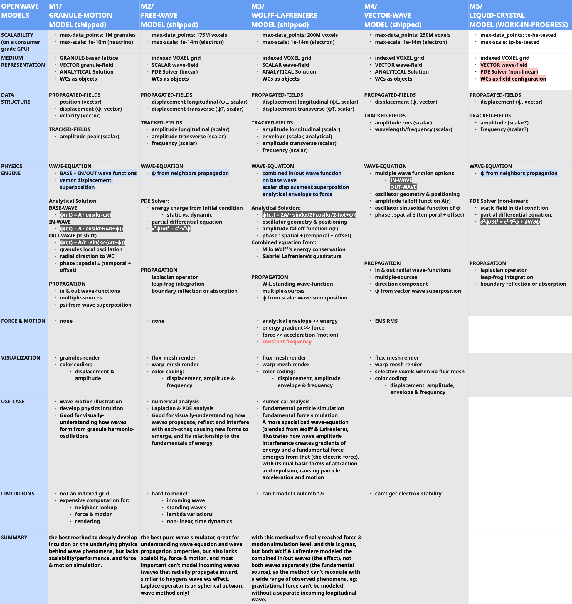

# WELCOME TO OPENWAVE

## What is OpenWave?

OpenWave is an open-source subatomic wave simulator for exploring fundamental physics through **classical field theory enriched with topology and nonlinearity** — the scientific tradition of de Broglie–Bohm pilot waves, wave structure of matter, and modern topological-soliton models. The platform is python-based and lets you model matter and energy phenomena using wave-dynamics, topological defects, and nonlinear potentials, investigating whether particles and forces can emerge from deterministic field equations rather than being postulated.

The platform implements multiple candidate mathematical frameworks through complementary approaches: SCALAR-FIELD models (similar to lattice gauge theory), VECTOR-FIELD models, both for research simulations, and a GRANULE-MOTION model for educational visualization. Each framework runs in the same numerical engine, enabling direct comparison of model predictions against shared observables.

### Beyond the granule demos — OpenWave for research

The walkthrough below uses the GRANULE-MOTION model for an intuitive introduction to wave concepts. The research-oriented side of OpenWave goes further: scalar / vector / director-field models running on a Taichi GPU lattice, multiple candidate Lagrangians compared side-by-side on shared observables, and cause-effect experiments where you perturb the field and measure its dynamic response. If you want the research-platform framing, the M-model contributors, and the falsifiability framing, see the main [README](README.md) → "Scientific Position" and "Platform vs. model" sections.


## Computational Approaches

OpenWave provides complementary ways to explore wave mechanics:

### Scalar and Vector-Field Models (Research Oriented)

- **Methodology:** Lattice wave-field theory — similar in spirit to lattice QCD methods (discrete spacetime + GPU integration), but with classical field equations rather than quantized operators
- **Implementation:** 3D vector field grid with PDE-based wave propagation equations
- **Scale:** Wavelength-scale to molecules
- **Purpose:** Research simulations for matter formation, force modeling, and quantitative comparison of model predictions against experimental data
- **Use Case:** Physics research, computational experimentation, theoretical exploration of particle and force emergence

### Granule-Motion Model (Education Oriented)

- **Methodology:** Particle-based visualization with phase-shifted oscillations
- **Implementation:** Discrete granules representing wave simulation
- **Scale:** Planck-scale to wavelength
- **Purpose:** Educational visualization, understanding wave formation
- **Use Case:** Learning, illustration, animation, introduction to wave concepts

**Key Insight:** WAVE-FIELD models use similar computational *tools* to lattice quantum field theory (lattice discretization, GPU integration), but evolve **classical field equations** rather than quantized operators — no Wick rotation, path integrals, or gauge structure. GRANULE-MOTION model provides intuitive visuals for the underlying wave concepts. Both are computational tools for investigating wave-dynamics models of physical phenomena.

## Xperiments

OpenWave Xperiments is a collection of interactive physics simulations that brings wave-field dynamics to life through real-time visualization and computation.

**GRANULE-MOTION model Demos** showcase wave mechanics fundamentals through intuitive visualizations. These xperiments demonstrate how waves propagate, interfere, and create standing patterns - the foundational concepts that will be scaled up in WAVE-FIELD research simulations.

Each Xperiment is fully customizable (via user controls and Python scripting), enabling you to adjust parameters such as universe size, wave source configurations, and visualization settings to investigate wave behavior at different scales.

**Recommended:**

- **Follow the GRANULE-MOTION demo sequence below if you are new to OpenWave**
- **WAVE-FIELD research tools** are also available for matter formation simulations

## XPERIMENTS GRANULE-MOTION DEMO (start here)

### 1. Spacetime Vibration

> **Note:** This is a **granule-motion educational visualization** carried over from OpenWave's earlier models (M1). The current research framework (M5) treats the **vacuum as a static ordered ground state**, with oscillation as a property of *topological defects* (particles), not of spacetime itself. This demo is retained as an intuitive teaching aid for wave concepts at Planck-scale visualization.

**In this educational demo:**

- High-frequency oscillations (~10^25Hz) are visualized via discrete granules with phase-shifted motion — a *visualization tool*, not a physical claim about spacetime structure
- If you slow the simulator and increase amp boost, the underlying wave patterns become visible (these waves are the visualization output of the granule motion)
- These wave patterns are called ENERGY WAVES — the computational primitives for the granule-motion teaching model
- In the M5 framework these traveling perturbations are emitted *by* defects oscillating at `ω = 2mc²/ℏ` (the de Broglie clock), not from a pre-oscillating vacuum

**What you're seeing:** An educational visualization of wave mechanics; the physics in M5 is more carefully framed as defect oscillation, not vacuum oscillation.

<div align = "center">

  

</div>

### 2. Spherical Wave

This xperiment demonstrates in a 3D view how a spherical longitudinal wave propagates through the granular simulation. Longitudinal waves are the primary mode for modeling ENERGY WAVE propagation.

**Educational value:** Helps visualize how waves spread through a medium and how energy transfers from one location to another.

<div align = "center">

  

</div>

### 3. Standing Wave

This xperiment demonstrates standing wave patterns that emerge from inward and outward wave interactions. In the M5 framework, **topological defects** (the particles themselves) are the primary structure-bearers; standing waves are *emitted by* defect oscillations and contribute to particle-pair interactions and orbital quantization.

- **Observation:** Notice how stable patterns form when waves interfere constructively

**Research question:** How do standing wave patterns from defect oscillations contribute to particle-particle interactions, orbital structure, and resonance phenomena? OpenWave helps explore this computationally.

<div align = "center">

  

</div>

### 4. Play with other Xperiments and Start your Research

Now that you're introduced to the basic concepts of wave phenomena in this computational framework, you can start experimenting with different wave configurations and parameters. Use the tools provided in the OpenWave platform to create your own simulations and explore how waves behave in various scenarios.

**What you can explore:**

- Wave interference patterns
- Energy transfer mechanisms
- Stable wave structures
- Resonance phenomena
- How changing parameters affects outcomes
- Experiment the WAVE-FIELD models with more advanced wave equations and numerical analysis

To launch the Xperiments Selector Menu:

- Follow installation instructions at [README file](README.md)
- Then, on your terminal run:

```bash
# Launch xperiments using the CLI xperiment selector

  openwave -x

# Run sample xperiments shipped with the OpenWave package, tweak them, or create your own
```

<div align = "center" style="text-align: center">
  <table>
    <tr>
      <td style="text-align: center">
        <div align = "center">
          <a></a>
          <br>Standing Wave Xperiment
        </div>
      </td>
      <td style="text-align: center">
        <div align = "center">
          <a></a>
          <br> Wave Amplitude Envelope
        </div>
      </td>
    </tr>
    <tr>
      <td style="text-align: center">
        <div align = "center">
          <a></a>
          <br> Particle Attraction Xperiment
        </div>
      </td>
      <td style="text-align: center">
        <div align = "center">
          <a></a>
          <br> Wave Interference Xperiment
        </div>
      </td>
    </tr>
  </table>
</div>

## OpenWave's Computational Implementation

- **WAVE-FIELD Models** use lattice wave-field methodology (similar in spirit to lattice QCD's discretization + GPU integration) with classical field equations from alternative theoretical models
- **GRANULE-MOTION Model** provides particle-based visualizations for intuitive understanding
- Both are computational frameworks for testing model predictions against experimental data

## OPENWAVE MODELS



## Getting Help and Contributing

- See the main [README](README.md) for contribution guidelines
- Follow development on [GitHub](https://github.com/openwave-labs/openwave)
- Join discussions on [Reddit](https://www.reddit.com/r/openwave/)
- Watch tutorials on [YouTube](https://youtube.com/@openwave-labs/)

**Welcome to the exploration!** 🌊
