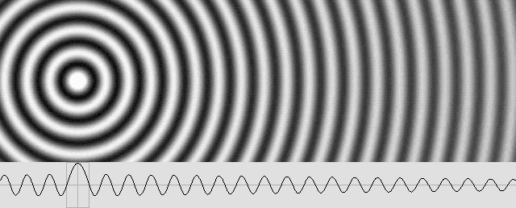

# WAVE EQUATIONS

## Wave Equations Explored (wave_engine.py)

Five wave equation forms have been implemented, each representing different physical models:

### 1. Wolff-Original

```text
ψ = A · e^(iωt) · sin(kr)/r
  = A · [cos(ωt) + i·sin(ωt)] · sin(kr)/r
```

- Pure standing wave (sin(kr)/r sinc envelope at all distances)
- Complex oscillator from e^(iωt) expansion
- quadrature_term = 1.0 gives full complex rotation (√2 boost)
- quadrature_term = 0.0 gives real part only: cos(ωt)·sin(kr)/r
- **Limitation**: No traveling wave component — standing wave everywhere, no energy radiation

### 2. LaFreniere-Marcotte Original

```text
Phase:      sin(kr) / (kr)      → 1 as r→0
Quadrature: (1-cos(kr)) / (kr)  → 0 as r→0

ψ = A · [cos(ωt)·Phase + sin(ωt)·Quadrature]
```

- Partially standing/traveling wave (LaFreniere's "partially standing wave")
- sinc-normalized (1/kr not 1/r): center amplitude = 1 regardless of wavelength
- Quadrature term (1-cos(kr))/(kr) provides the traveling wave character
- Near center: Phase dominates → standing behavior
- Far from center: both Phase and Quadrature contribute → traveling character
- **Limitation**: Standing-to-traveling transition is inherent in the math, not independently controllable

### 3. LaFreniere-Marcotte Phase-Warped (Corrected)

```text
x = kr
If x < π:  x_c = x + (π/2)·(1 - x/π)²   (core correction)
Else:       x_c = x

ψ = sin(x_c - ωt) / x_c
```

- Marcotte Wave Generator equation from sa_spherical.html
- Single outgoing traveling wave with nonlinear phase correction near origin
- Core correction warps phase forward by up to π/2 at center
- Creates standing-wave-like appearance without explicit in-wave
- Produces the partial_standing.gif behavior below
- **Decomposed for phasor**: Phase = sin(x_c)/x_c, Quadrature = -cos(x_c)/x_c



### 4. Combined Wolff-LaFreniere

```text
ψ(r,t) = A · [sin(ωt - kr) - sin(ωt)] / r
Expanded:
ψ(r,t) = A · [-cos(ωt) · sin(kr)/r - sin(ωt) · (1 - cos(kr))/r]
```

- Combines Wolff's sin(kr)/r spatial envelope with LaFreniere's quadrature term
- Phase term: sin(kr)/r → k as r→0 (Wolff normalization, amplitude scales with k)
- Quadrature term: (1-cos(kr))/r → 0 as r→0 (provides traveling wave character)
- The -sin(ωt) uniform pulsation term creates a "breathing" effect at all distances
- Uses 1/r normalization (not 1/kr) — center amplitude depends on wavelength
- **Limitation**: standing wave nodes (zeros of sin(kr)) persist at all distances, and the uniform pulsation term doesn't match LaFreniere's reference animations

#### 5. Weighted Partial Standing Wave

```text
ψ = A · [w(r)·sin(kr + ωt) + sin(kr - ωt)] / kr

w(r) = 1 / (1 + (r / (transition·λ))^8)    (sharp Lorentzian)
```

- Explicit in-wave + out-wave superposition
- Weight function controls standing → traveling transition independently
- transition = 1.25λ: standing waves stable within 1.25 wavelengths
- Power 8 gives near-step-function rolloff
- Standing limit (w=1): 2·sin(kr)·cos(ωt)/kr — fixed nodes at kr = nπ
- Traveling limit (w=0): sin(kr - ωt)/kr — nodes move outward
- **Most physically motivated**: reflects actual in-wave/out-wave dynamics

## Phasor Superposition (Analytical Amplitude, more details below)

All five wave forms have been decomposed into phasor components for exact amplitude computation:

```text
ψ_total(t) = P·cos(ωt) + Q·sin(ωt)

Peak amplitude = √(P² + Q²)
RMS amplitude  = Peak / √2
```

Per wave center n, coefficients C_n and S_n are computed from the spatial wave function, then rotated by source_offset φ_n to a shared cos(ωt)/sin(ωt) basis:

```text
P += C_n·cos(φ_n) + S_n·sin(φ_n)
Q += -C_n·sin(φ_n) + S_n·cos(φ_n)
```

This replaces the EMA-RMS tracking with an exact, instantaneous result — no observation window, no smoothing artifacts.

## Force Computation

```text
E(x) = ρ · V · (f · A(x))²      energy per grid point / voxel
F(x) = -∇E(x)                    force = negative energy gradient
```

- Compute energy density at each grid point from phasor RMS amplitude
- Force is the negative gradient of energy density (central differences)
- Computing F from ∇E directly (not expanded chain rule) ensures that future additions of variable ρ(x), f(x), λ(x) are automatically captured without changing force logic
- Scale correction (M3 only): F_real = F_scaled / S⁴ (universe scaling)
- Units: computed in qg·am/rs², converted to Newtons

---

### Wave Interference Patterns (LaFreniere reference animations)

These animations from LaFreniere's site show the interference effects we need to reproduce in OpenWave to validate force emergence.

## Primary Reference: Two Opposite-Phase Wave Centers


This animation is the most important reference for our research. It displays the complete wave interaction picture for two wave centers with opposing phase:

**Near-field (within ~1λ of each wave center):**

- Clear standing wave rings visible around each WC core — fixed concentric nodes that don't move
- This is the near-field regime where standing wave forces dominate
- The standing wave structure IS the particle — its spatial extent is ~1λ

**Far-field (beyond ~1λ from each wave center):**

- Only traveling waves — rings move outward from each WC
- Amplitude should fall off as 1/r to conserve energy for 3D radial spherical waves (hard to tell from 2D animation, but physically required)
- This is the electrostatic regime where Coulomb-like forces operate

**Between the wave centers:**

- Amplitude is visibly **reduced** in the gap — destructive interference from opposing phases
- This amplitude reduction creates a lower energy zone → attraction force (exactly as expected for opposite charges)
- The 1D cross-section at bottom confirms: the envelope dips between the WCs

**Traveling waves inside the gap:**

- Between the WCs, traveling waves from each source propagate inward (toward the center of the image)
- As they approach the midpoint equidistant from both WCs, they superpose into a **standing wave pattern** at the center of the gap
- This midpoint standing wave forms because counter-propagating traveling waves from each source meet head-on

**Key observations for simulation:**

- The standing wave region is sharply localized (~1λ around each WC) — this matches a steep weight function rolloff
- The far-field is cleanly traveling — no residual standing wave character
- The interference pattern in the gap is smooth — no oscillatory artifacts
- The 1D envelope shows the exact profile the phasor RMS should reproduce

## Constructive and Destructive Reference Animations

**Constructive interference (opposite charge, separation = nλ → repulsion):**

- Top (1D cross-section): amplitude envelope is HIGHER between the two particles — the peaks grow in the midpoint region
- Bottom (2D view): concentric standing wave rings around each particle, with a bright structured "biconvex" standing wave field between them
- At this separation, the standing wave antinodes from each source align → constructive superposition → higher energy between → repulsive force


**Destructive interference (opposite charge, separation = (n+½)λ → attraction):**

- Top (1D cross-section): amplitude envelope DROPS between the two particles — near-cancellation at midpoint
- Bottom (2D view): concentric rings around each particle, but the region between them shows reduced/flattened wave structure
- At this separation, antinodes of one source align with nodes of the other → destructive superposition → lower energy between → attractive force


**Critical observation**: Both animations show particles in **opposing phase** (opposite charge) — the concentric rings are inverted relative to each other (dark vs light at same radius). The difference between the two patterns is a **spatial shift of λ/2** in the particle separation distance.

## Key Insight: Force Depends on Both Phase AND Separation

The interference pattern at any point depends on the **total phase difference**, which combines two contributions:

```text
Δφ_total = source_offset_difference + k · separation_distance
         = (φ₁ - φ₂) + k · d
```

This means:

- The same charge pair can produce either constructive or destructive interference depending on their exact separation in units of λ
- The force has an **oscillatory component** with spatial period λ, modulated by the 1/r amplitude decay
- At separations where antinodes align: higher energy between → repulsion
- At separations where antinodes meet nodes: lower energy between → attraction
- The **net force** (averaged over oscillation) should still give the correct sign (attractive for opposite charge, repulsive for same charge), but individual wavelength-scale positions create alternating force zones
- This oscillatory behavior may correspond to the quantum mechanical standing wave shells that determine electron orbital positions in atoms

## Two Force Regimes: Standing Wave Lock vs Electrostatic Force

The weighted partial standing wave equation naturally creates **two distinct force regimes** based on distance:

**Near-field (within standing wave distance, r < transition·λ):**

- Both in-wave and out-wave are present with comparable amplitude
- The interference creates alternating constructive/destructive zones at every λ/2
- Force direction **oscillates** — attraction at some separations, repulsion at others
- Behavior depends on charge phase:
  - **Same phase**: standing wave interference creates stable lock-in positions — particles are trapped in energy wells, wiggling but unable to escape. This is the regime where quarks lock together (gluon field), electron orbital shells form, and particle bonding occurs at all scales
  - **Opposite phase**: standing wave interference also occurs, but in this case the net force is attractive — particles are drawn together until they share the same point in space and **annihilate**. Their waves have opposite phase, so when wave centers overlap, total destructive interference eliminates both wave centers entirely. The particles cease to exist, and their wave energy is released (as photons/radiation)
- **Candidate theory for matter structure**: same-phase particles stabilize in energy wells where they oscillate but can't escape — the basic bonding mechanism from subatomic to atomic scales. Opposite-phase particles annihilate — explaining matter-antimatter annihilation as complete wave cancellation

**Far-field (beyond standing wave distance, r > transition·λ):**

- Only the traveling out-wave remains (in-wave has decayed away)
- The interference between traveling waves from two sources creates a smooth amplitude modulation
- Behavior depends on charge phase:
  - **Same phase**: constructive interference between particles → higher amplitude in the gap → repulsive force
  - **Opposite phase**: destructive interference between particles → lower amplitude in the gap → attractive force
- No oscillatory lock-in — this is the **electrostatic (Coulomb) regime**
- Force should decay as 1/r² with distance
- This is the classical electric force that operates between distant charged particles

**Open question**: Does the transition between these two regimes happen cleanly at the standing wave boundary (transition·λ), or is there a gradual crossover? The `weight` function controls this — a sharp weight rolloff (power 8) should create a relatively clean boundary, but this needs simulation validation.

## Summary: Force Regime Matrix

| Regime     | Same Phase                        | Opposite Phase                                |
| ---------- | --------------------------------- | --------------------------------------------- |
| Near-field | Lock-in (quarks, orbits, bonding) | Attraction → annihilation (wave cancellation) |
| Far-field  | Constructive → repulsion          | Destructive → attraction                      |

## Electron-Proton Interaction (Future Research)

The electron (-) "orbiting" a proton (+) is not an orbit in the planetary sense. In EWT, the proton is proposed to be a **composite particle**: quarks formed by electrons (-) locked together in standing wave wells, with a positron (+, an electron with π phase offset) at the center. This structure has both attraction and repulsion forces that create regions where the net force on a nearby electron is zero.

The result is that an electron near a proton **wiggles** rather than orbits — it experiences a messy, non-deterministic motion as the standing wave force field constantly shifts it between attraction and repulsion zones. This is analogous to a ping-pong ball suspended in an air stream: it wiggles up and down as air pressure force alternates with gravitational force, never settling into a fixed path.

This behavior directly corresponds to the **probability cloud of quantum orbitals** — the electron doesn't have a predictable trajectory, but rather a statistical distribution of positions determined by the standing wave force landscape around the proton. The discrete orbital shells emerge as the stable wiggle-zones where the time-averaged force is zero but the restoring force prevents escape.

## Current Status: Lock-In Instability

The standing wave lock-in behavior **is observed in the simulator** — particles do oscillate in potential wells created by wave interference. However, they eventually escape, indicating the system is not yet stable enough to validate the theory. Possible causes:

- **Numerical precision**: f32 floating-point errors accumulate over many timesteps, introducing drift that eventually overwhelms the shallow energy wells
- **Force equation calibration**: the force scale factor, unit conversions, or S⁴ scaling correction may introduce systematic errors
- **Euler integration**: first-order integration is known to add or remove energy from oscillatory systems — symplectic integrators (Verlet, leapfrog) conserve energy better
- **Grid resolution**: if the standing wave wells are only a few voxels wide, the finite-difference gradient may not resolve the force accurately
- **Weight function tuning**: the transition sharpness and position may not match the physical model — too sharp creates numerical artifacts, too gradual washes out the lock-in wells

These are solvable engineering problems, not fundamental physics issues. The fact that lock-in is observed at all is encouraging.

**Note**: The wiggling/oscillatory force behavior is currently observed even at large separations (far-field), where it should not occur. Particles beyond the standing wave distance should experience a smooth, monotonic electrostatic force — but instead they still behave as if inside each other's standing wave field. This suggests one or more of:

- The phasor RMS envelope still contains standing wave node structure at large r (the sinc `sin(kr)/kr` zeros persist in the phasor coefficients even in the far-field)
- The weight function rolloff may not be sharp enough, or the transition distance needs recalibration
- The force gradient sampling radius may be too small relative to wavelength, aliasing the standing wave oscillations into the force calculation
- The amplitude field itself may need spatial smoothing or low-pass filtering beyond the standing wave boundary to extract only the 1/r envelope trend

**Root cause analysis**: The weight function successfully kills the in-wave in the far-field, but the out-wave itself (`sin(kr - ωt) / kr`) still carries the `sin(kr)/kr` sinc oscillation. The phasor coefficients for the out-wave are `C_n = A·sin(kr)/kr` — this has zeros at every `kr = nπ` regardless of distance. So the phasor RMS inherits the standing wave node structure from the out-wave's spatial function, even though the wave is purely traveling.

**Possible solution — dual-treatment force computation**: The force calculation may need different amplitude treatments for each regime:

- **Near-field** (r < transition·λ): use the raw phasor RMS with full oscillatory structure. The standing wave nodes create the energy wells that produce lock-in forces. The oscillation IS the physics here
- **Far-field** (r > transition·λ): use a spatially smoothed or analytically derived envelope of the phasor amplitude, extracting only the 1/r decay trend. The oscillatory nodes are an artifact of the sinc spatial function, not physically meaningful for the electrostatic force at this scale

The `transition` parameter in the weight function could serve double duty — controlling both the standing-to-traveling wave transition AND the raw-to-smoothed amplitude transition for force computation.

Resolving this is critical — without clean far-field electrostatic behavior, the Coulomb force cannot be validated. The near-field lock-in and the far-field electrostatic force are both needed, but they require different amplitude field treatments.

---

## Phasor Superposition for Analytical Wave Field Computation

Research notes on replacing per-timestep numerical wave superposition with analytical phasor precomputation.

## Problem

Given multiple wave sources emitting waves of the form:

```text
ψ = A(r) · cos(ωt ± kr + φ + π) · direction
```

Do we need to simulate the superposition of all waves from all sources at every timestep to get `displacement_am[i, j, k]`? Or can we derive a combined equation and just oscillate the temporal term?

## Phasor Superposition (Constant λ)

**Yes — analytically solvable**, as long as all sources share the same frequency ω.

### Key Insight

Each wave from source *n* at a grid point:

```text
ψₙ = Aₙ(rₙ) · cos(ωt - krₙ + φₙ)
```

Since they all share ω, the sum of N cosines at the same frequency is **always** a single cosine at that frequency:

```text
ψ_total = R · cos(ωt + Φ)
```

where **R** (resultant amplitude) and **Φ** (resultant phase) are computed once per grid point via phasor addition.

### Method

Represent each wave as a complex phasor (dropping the shared ωt):

```text
Pₙ = Aₙ(rₙ) · e^{i(-krₙ + φₙ)} · d̂ₙ
```

where `d̂ₙ` is the direction vector. Sum them:

```text
P_total = Σ Pₙ
```

Then at each grid point, extract the resultant vector phasor **per xyz component**:

- `R_x, R_y, R_z = |P_total_x|, |P_total_y|, |P_total_z|`
- `Φ_x, Φ_y, Φ_z = arg(P_total_x), arg(P_total_y), arg(P_total_z)`

### Two-Phase Computation

1. **Precomputation (once):** For each grid point, sum the phasors from all sources to get `R[i,j,k]` and `Φ[i,j,k]` (vector quantities, one per spatial component).
1. **Time evolution (cheap):** Evaluate per component — no per-source loop needed at runtime:

```text
displacement[i,j,k].x = R_x · cos(ωt + Φ_x)
displacement[i,j,k].y = R_y · cos(ωt + Φ_y)
displacement[i,j,k].z = R_z · cos(ωt + Φ_z)
```

The scalar amplitude at that point: `√(R_x² + R_y² + R_z²)`

### Caveats

- All sources must have the **same ω** (monochromatic). If frequencies differ, one phasor sum per distinct frequency is needed.
- Amplitudes A(r) must not change in time (no source motion or amplitude modulation).
- The wave equation must be **linear** (superposition principle holds).

## Analytical Amplitude (Replaces EMA-RMS Tracking)

The phasor approach gives amplitude **directly** — no RMS tracking needed.

The magnitude `|P_total|` *is* the steady-state amplitude at that point. It's exact, not an approximation converging over time like EMA-RMS.

Since the wave is `R · cos(ωt + Φ)`:

- Displacement oscillates between `-R` and `+R`
- RMS = `R / √2`

Both are known analytically from precomputation. **No temporal tracking required.**

This replaces both:

- The per-timestep multi-source superposition loop
- The EMA-RMS amplitude tracker (`amp_local_rms_am`)

## Extension: Variable Wavelength λ(r)

### Hypothesis

Wave centers may have longer wavelengths at the core (pushing amplitude up to conserve energy/steepness), with λ getting shorter as r increases until stabilizing at some distance.

### Phasor Approach with Variable λ

The phasor method **still works**. The only change is how phase is computed.

With constant λ, phase from source to point = `kr` (linear in distance).

With λ(r), since `k(r) = 2π/λ(r)`, the phase becomes an **integrated phase** (WKB / eikonal approach):

```text
φ(r) = ∫₀ʳ k(r') dr'
```

The phasor for source *n* becomes:

```text
Pₙ = Aₙ(rₙ) · e^{i(-φ(rₙ) + φₙ)} · d̂ₙ
```

Everything else is identical — sum phasors, extract R and Φ per component, oscillate with ωt.

### Considerations for Variable λ

1. **The phase integral:** For each source–voxel pair, compute `∫₀ʳ k(r') dr'`. If λ(r) has a closed-form expression, this integral may have an analytical solution. Otherwise, precompute it numerically once.
1. **Amplitude A(r):** If λ shortens with r to conserve energy/steepness, the amplitude envelope will differ from simple `1/r`. Derive from energy conservation — typically `A(r) ∝ 1/(r · √(k(r)))` (WKB amplitude correction).
1. **Still monochromatic:** As long as the temporal frequency ω remains the same everywhere (λ changing with r means the *spatial* structure changes, not the oscillation rate), phasor summation remains valid.

## Impact of Moving Wave Centers (Force & Motion)

If wave centers move due to force/motion computation, the phasor precomputation (R and Φ at each grid point) becomes invalid after each move and must be recomputed.

The recomputation is the same `O(grid_points × sources)` loop as the current per-timestep superposition. **If sources move every frame, there is no performance gain** over the current approach.

### When Phasors Win vs. Don't

| Scenario | Phasor benefit |
| --- | --- |
| Static sources, many render frames | Huge — precompute once, oscillate cheaply |
| Sources move every N frames | Moderate — amortize phasor cost over N frames |
| Sources move every frame | **None** — same cost as current approach |

### Multi-Rate Stepping (Potential Optimization)

Force/motion typically operates on a **slower timescale** than wave oscillation. If decoupled:

- **Outer loop (slow):** Compute forces, move sources, recompute phasor field
- **Inner loop (fast):** Oscillate `cos(ωt + Φ)` for visualization / sub-stepping

Phasors pay off during the inner loop. The benefit depends on whether the sim needs multiple wave oscillation steps per force update — if force and wave evaluation are 1:1, there's no gain.

### Benefits Regardless of Source Motion

Even with sources moving every frame, phasors still provide:

- **Exact amplitude** `R[i,j,k]` for free — no EMA-RMS convergence lag
- **Cleaner separation** of spatial structure from temporal oscillation
- **Direct inspectability** of amplitude/phase fields between force steps
