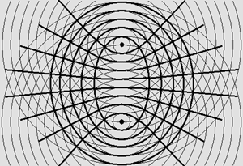

# ADDITIONAL THEORIES TO EWT

## LaFreniere's Force Mechanisms

## Radiation Pressure as the Force Carrier

Forces are not abstract — they arise from **radiation pressure** of waves propagating through the medium. When waves superpose to create standing wave patterns between particles, the standing waves exert radiation pressure on both sides, resulting in opposite motion (action-reaction). The force mechanism is purely mechanical: wave pressure pushing on wave centers.

## The Diffractive Lens Effect

Standing wave fields between particles act as **diffractive lenses**. Each amplitude zone (antinode) functions as a lens element:

- Zones with λ/2 phase shifts between them block or diffract out-of-phase wavefronts
- In-phase wavelets converge at focal points via Huygens' principle
- This focuses and **amplifies** wave energy along the axis connecting the particles
- The amplification is what makes the electrostatic force strong — the field acts like thousands of stacked lenses concentrating wave energy
- Radiated energy is transmitted to the opposite side with much more intense pressure

## Phase Relationships and Charge

The interaction type depends on the phase relationship between wave centers:

- **Full wavelength (λ) phase difference** → central standing wave field pushes outward → **repulsion**
- **Half wavelength (λ/2) phase difference** → inverted field pattern pulls inward → **attraction**
- This maps directly to source_offset: 0 vs π offset = half-wavelength phase difference

## Fundamental Wave Interference Principle

A critical distinction from LaFreniere:

- Waves traveling in the **same direction** can cancel (destructive interference)
- Waves traveling in **opposite directions never cancel** — they **always produce standing waves**

This means counter-propagating waves (in-wave + out-wave) always create standing wave structure. The standing waves periodically appear and disappear everywhere simultaneously, but the energy is never lost — it redistributes locally.

## Magnetic Fields as Hyperboloid Wave Patterns

Two concentric spherical wave systems (e.g., two electrons in proximity) produce interference on **hyperboloid** and ellipsoidal surfaces. LaFreniere's key insights:

- Two shifted sets of hyperboloids produce the well-known **magnetic lines of force**
- Magnetic poles are emitters/receivers of **one-way waves** (traveling in one direction only)
- Same poles (identical one-way systems): no standing wave field → radiation pressure → **repulsion**
- Opposite poles (inverted one-way systems): standing wave amplification → wave focusing → **attraction**
- Three or more emitters regularly spaced produce complex magnetic field line patterns

## The Lorentz Force

Arises from particle motion through hyperboloid wave patterns:

- Charged particles moving on orthogonal planes to existing field patterns constantly change direction
- The mechanism involves secondary fields created by electron waves within complex force fields
- Particles undulating on hyperboloid surfaces experience the classical Lorentz force

## Standing Waves Modify the Medium

Standing waves alternately compress and dilate the medium at antinodes:

- Compressed medium transmits waves faster (higher pressure → higher wave speed)
- Dilated medium transmits waves slower
- The wave is progressively scattered as it propagates through density variations
- This creates a local variation in the speed of light — another interpretation of "spacetime curvature"

## Fields Contain Energy (Mass)

Fields of force are not abstract constructs — they contain real energy:

- Field energy follows E = mc², contributing to the system's total mass
- "Canned" kinetic energy stored in fields is responsible for nuclear energy
- The resulting energy must be considered as additional mass in all calculations

## Maxwell's Equations — LaFreniere's Reinterpretation

A controversial but relevant claim:

- Pure electromagnetic traveling waves do not exist in vacuum
- Light and radio waves are regular longitudinal traveling waves in the medium
- They can induce electric and magnetic fields when interacting with matter
- Maxwell's equations describe field behavior around material devices (antennas, conductors), not wave propagation in vacuum
- Fields cannot exist far from matter in vacuum — only traveling waves persist

---

## Smoliński's Contributions (BCC Lattice Geometric Framework)

Source: "The Geometric Identity of Gravity and Dimensional Unification" (Smoliński, 2026) — see [MagnetismGravity](references/MagnetismGravity_v4.pdf) and [GitHub](https://github.com/lsmolinski/MagnetismGravity).

Łukasz Smoliński has developed a zero-parameter extension of EWT where all physical constants are derived from π, e, Planck constants, and the fundamental geometry of a Body-Centered Cubic (BCC) lattice. While primarily a theoretical derivation framework (not a simulation engine), several concepts are directly relevant to OpenWave's force unification goals:

## Gravity as Push-Out / Buoyancy

Instead of gravity arising from wave attenuation (shading), Smoliński models it as a **structural push-out force**:

- Solitons (particles) displace medium density from their interior
- This creates a pressure deficit — a buoyancy effect within the high-density medium
- Gravity is the mechanical consequence of this density displacement, not a "message" between particles but a permanent structural "tilt" in the lattice geometry
- This is compatible with the wave shading model but provides a more concrete mechanism
- **Connection to granule dynamics and time**: Density in the medium is directly related to granule velocity — the speed at which granules cycle through their elliptical motion (90° phase-shifted from displacement). A density deficit means slower granule cycling → lower local frequency → longer λ → slower rate of change (time dilation). This links Smoliński's buoyancy mechanism to the Time Dynamics hypothesis: gravitational time dilation near massive bodies emerges from the same density/pressure deficit that produces the gravitational force itself. See [Time Dynamics](06_time_dynamics.md) for the full chain: **movement → granule velocity → density/pressure → frequency → time**

## Density Hierarchy

The transition from electromagnetic to gravitational force scales is governed by hierarchical density dilution in the lattice:

- **Max Packing** (N_max = 10⁵⁴): Pure geometric capacity of the BCC lattice
- **Statutory Density** (N_stat = 10⁵²): Standard vacuum density
- **Effective Density** (N_eff = 10⁴⁸): Matter-occupied regions after push-out

The 10⁻⁴² electromagnetic-to-gravitational force ratio emerges geometrically from the packing impedance of the BCC lattice, not as an arbitrary constant. This could provide calibration targets for our gravitational force simulations.

## The Degraded EMC Wall

A structural interface that ensures the **isotropy of gravity** despite the discrete lattice structure:

- The BCC lattice is inherently anisotropic (discrete directions)
- The Degraded EMC Wall acts as a boundary that smooths out directional artifacts
- This allows the discrete lattice to produce a perfectly spherical 1/r² pressure gradient
- Directly relevant to our 1/r² force law challenge: explains how oscillatory wave structure averages out to smooth macroscopic force

## Vacuum Stiffness Modulator (ϵ_M)

A single geometric parameter that governs multiple physical constants:

- Fine-structure constant (α)
- Gravitational constant (G)
- Lepton anomalous magnetic moments
- Smoliński derives all of these from ϵ_M without free parameters

## Soliton Geometry: Two Domains and Toroidal Flows

Smoliński identifies two distinct physical domains operating within a soliton (particle):

- **Energy Domain (ρ_E)**: The internal "engine" of the particle — dynamic wave-flows governed by **r⁵ scaling** and **non-linear toroidal geometry**. This is where spin and magnetic moments are generated. The flows are asymmetric and toroidal (doughnut-shaped circulation)
- **EMC Domain (ρ(r))**: The structural displacement of the medium constituents themselves — governed by **r³ scaling**, spherical and isotropic. This is where gravity emerges as a push-out force

The **Principle of Geometric Masking** describes how the internal toroidal asymmetry is hidden behind the spherical EMC boundary: the Degraded EMC Wall acts as a geometric low-pass filter, smoothing the asymmetric internal dynamics into isotropic external gravity.

**Relevance to OpenWave:**

1. **Non-linear wave equations**: The wave equation inside the soliton is explicitly non-linear. **Smoliński's Soliton Wave Equation** (MagnetismGravity_v2, Sec 6.1, Eq. 18-19): `(∂²/∂t² - c²∇²)Ψ + k(|ε_M|)·Ψ³ = 0` — standard wave equation + cubic NLS stabilizing term. The Ψ³ non-linearity prevents dispersion and creates soliton stability; its coefficient k depends on the magnetic deficit |ε_M| (medium elasticity). Solutions are NOT pure sinc — the spatial structure differs from sin(kr)/kr. This aligns with the variable-λ(r) research ([Yee & Hauger](references/Spin.pdf) model, WKB phase integral). **The r⁵ decomposition** (MagnetismGravity_v4 Sec 7.2) reveals three concrete non-linear relationships: E ∝ r⁵ = r³ (volume) × r¹ (A ∝ r: amplitude scales linearly) × r¹ (f ∝ 1/r: frequency scales inversely). **Explicit density function** (Eq. 32): `ρ(r) = ρ₀(1-(r/r_ν)^k)^P · Θ(r_ν-r)` — packing density decreases toward core, cutoff at soliton radius. **Push-out Operator** (Eq. 90): `P̂Φ = -∇·(η_stat/η_soliton)∇Φ` — force from gradient of potential weighted by local density mismatch, formalizing our F = -∇E with variable ρ(x)

2. **Toroidal standing wave geometry**: The toroidal (doughnut) shape suggests that the standing wave structure of a particle is not purely spherical concentric shells, but has a toroidal circulation pattern. This is consistent with:
   - Magnetic moment arising from circulating wave flow (toroidal current → magnetic dipole)
   - Spin as a real physical rotation of wave energy in a toroidal path
   - The elliptical displacement trajectories observed in m4's vector wave phasor — the ellipse major/minor axes could be cross-sections of a toroidal flow

3. **Two-domain force separation**: The Energy Domain (internal, toroidal, r⁵) vs EMC Domain (external, spherical, r³) maps to our near-field vs far-field force regimes:
   - Near-field (standing wave lock-in) ↔ Energy Domain (non-linear, toroidal dynamics)
   - Far-field (electrostatic Coulomb) ↔ EMC Domain (isotropic, spherical 1/r²)
   - The transition between them (our `weight` function boundary) may correspond to the Degraded EMC Wall

4. **Particle topology**: Smoliński classifies particles by winding number on different topological surfaces:
   - Electron: sphere topology (S²), winding number K_wc = 10
   - Muon/Tau: toroidal topology (T²), higher genus
   - This suggests particle identity is determined by the topology of standing wave structure, not just amplitude/frequency — a fundamentally geometric classification

5. **Connection to OpenWave's m3 vs m4 methods**: The scalar m3 method can model the spherical EMC Domain (external gravity, electric force). But the toroidal Energy Domain — where spin, magnetism, and non-linear dynamics live — likely requires the vector m4 method to capture the toroidal flow geometry. This reinforces the strategy: scalar m3 for electric/gravitational forces first, vector m4 for magnetic/spin phenomena later

## Numerical Validation Tools

The GitHub repository includes Scilab scripts for verifying derived constants:

- `EWT_G_AMM_check.sc` — Gravitational constant derivation verification
- `EWT_VS_SM.sc` — Comparative analysis between EWT and Standard Model predictions
- `kaon_pion_tests.sc` — Strong force behavior at specific distances
- These can serve as reference validation targets for OpenWave simulations

## Relevance to OpenWave Phases

| OpenWave Phase | Smoliński Contribution |
| -------------- | --------------------- |
| Phase 3 (Force mechanism) | ϵ_M as structural modulator — force ratios from geometry |
| Phase 5 (Gravity) | Push-out mechanism, density hierarchy, Degraded EMC Wall |
| 1/r² problem | Degraded EMC Wall — discrete → isotropic transition |
| Future (matter formation) | Solitons as topological objects with winding numbers |
