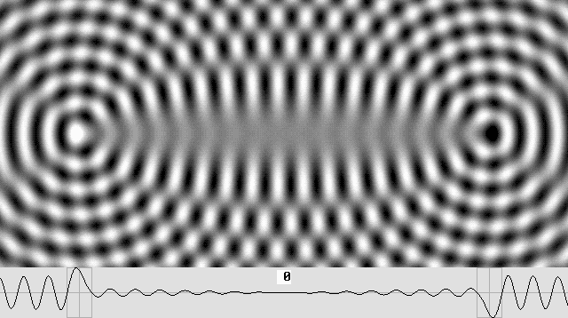

# PHASE 1: Electric Force — FAR-FIELD (1D Sandbox only)

## Table of Contents

- [The Problem](#the-problem)
- [Target Behavior (LaFreniere Reference)](#target-behavior-lafreniere-reference)
- [Force Regime Matrix](#force-regime-matrix)
- [Critical Issues Summary](#critical-issues-summary)
- [Tested and Ruled Out (10/10)](#tested-and-ruled-out-1010)
  - [Gradient Sampling / Gaussian Smoothing](#-gradient-sampling-radius-gaussian-smoothing)
  - [Smooth Envelope (Imposed Charge Sign)](#-smooth-envelope-interaction-imposed-charge-sign)
  - [Numerical Precision](#-numerical-precision)
  - [Inertia Filtering](#-inertia-filtering)
  - [Pressure/Velocity Gradient (90° Phase Shift)](#-pressurevelocity-gradient-90-phase-shift)
  - [Standing vs Traveling Wave Decomposition](#-standing-vs-traveling-wave-decomposition)
  - [Alternative Wave Equations (All 5 Forms)](#-alternative-wave-equations-all-5-forms)
  - [Signed Disturbance Model (Phase 1a)](#-signed-disturbance-model-phase-1a)
- [Emergence Criteria](#emergence-criteria)
- [Remaining Paths](#remaining-paths)
  - [Phase 1b: Base Wave + WC Energy Redistribution](#phase-1b-base-wave--wc-energy-redistribution)
  - [Phase 1c: Non-Linear Wave Equations](#phase-1c-non-linear-wave-equations)
  - [Phase 1d: Vector Wave Force](#phase-1d-vector-wave-force)
- [Summary](#summary)
- [Other Possible Solutions](#other-possible-solutions)
- [1D Sandbox & Test Configuration](#1d-sandbox--test-configuration)

---

## The Problem

The main blocker is the far-field oscillatory force: the sinc function sin(kr)/kr in the out-wave creates permanent nodes in the phasor RMS at all distances. Force direction flips every λ/2 of separation change, even where only smooth 1/r decay should exist. Confirmed in both 3D and 1D engines.

**Force computation**: F = -∇E where E(x) = ρ·V·(f·A(x))². Computing from ∇E directly (not chain-rule expansion) ensures future variable ρ(x), f(x), λ(x) are automatically captured. The same pattern applies across 1D sandbox, M3, and M4 engines.

**All linear candidates exhausted (10/10 ruled out).** The oscillatory force is a fundamental consequence of coherent wave interference — no linear wave equation or operation on the superposed field can eliminate it while preserving charge-dependent direction. Signed non-wave approaches (Phase 1a) bypass interference entirely but are "Coulomb with extra steps" — charge sign is imposed, not emergent.

**Validation targets**: plot E(x) along the axis connecting two particles at various separations, identify constructive/destructive interference locations, verify gradient direction and 1/r² magnitude scaling against Coulomb reference.

All task checklists are tracked in [00_roadmap.md](00_roadmap.md).

---

## Target Behavior (LaFreniere Reference)

**PRIMARY TARGET:** [Lafreniere Attraction](00a_equations.md#primary-reference-two-opposite-phase-wave-centers)



This animation shows the complete wave interaction for two opposite-phase WCs:

- **Near-field** (~1λ around each WC): fixed standing wave rings — the particle structure itself. Standing wave forces dominate
- **Far-field** (beyond ~1λ): only traveling waves, 1/r amplitude falloff. This is the electrostatic (Coulomb) regime
- **Between WCs**: amplitude visibly reduced — destructive interference from opposing phases → lower energy zone → attraction. Counter-propagating traveling waves from each source meet at midpoint, forming a standing wave pattern there
- **Key for simulation**: standing wave region is sharply localized (~1λ, matches steep weight rolloff), far-field is cleanly traveling (no oscillatory artifacts), and the 1D envelope profile is what the phasor RMS should reproduce

## Force Regime Matrix

| Regime     | Same Phase                        | Opposite Phase                                |
| ---------- | --------------------------------- | --------------------------------------------- |
| Near-field | Lock-in (quarks, orbits, bonding) | Attraction → annihilation (wave cancellation) |
| Far-field  | Constructive → repulsion          | Destructive → attraction                      |

## Critical Issues Summary

1. ❌ **Far-field oscillatory force (MAIN BLOCKER)** — Force direction flips every λ/2 of separation change. The sinc function sin(kr)/kr creates permanent nodes in the phasor RMS. These sinc nodes dominate over the charge-phase signal, making force direction depend on separation modulo λ instead of charge. Confirmed in both 3D and 1D engines
2. ❌ **Near-field opposite-phase monotonic attraction** — Opposite-charge WCs should always attract (to annihilation), not oscillate like same-charge lock-in. Same root cause as #1
3. ✅ **1/r² force law scaling (RESOLVED)** — Force between two particles comes from the **interaction energy** E_int ∝ |Z₁|·|Z₂| ∝ 1/r, whose gradient is ∝ 1/r². Confirmed numerically. See [00c_challenges.md](00c_challenges.md#-5-the-1r-force-law-resolved-in-theory)
4. ❌ **Dual-treatment boundary** — Near-field needs raw oscillatory phasor (for lock-in physics), far-field needs smoothed envelope (for Coulomb). Unimplemented

---

## Tested and Ruled Out (10/10)

### ✅ Gradient Sampling Radius (Gaussian Smoothing)

Gaussian smoothing of the phasor RMS before computing ∇E was tested with σ = 0.25λ, 0.5λ, 1.0λ, 2.0λ. Results:

- **Same-charge direction**: improves with larger σ (8/17 → 13/17 at σ=2λ)
- **Opposite-charge direction**: degrades with larger σ (8/17 → 3/17 at σ=2λ)
- **Root cause**: smoothing extracts the 1/r envelope (always-negative gradient) but destroys the charge-phase signal encoded in the oscillation

**Conclusion**: Gradient smoothing / wider sampling cannot resolve the oscillatory force because it removes the charge signal along with the oscillation.

### ✅ Smooth Envelope Interaction (Imposed Charge Sign)

Compute force from the product of individual WC phasor magnitudes |Z₁|·|Z₂| (each smooth 1/kr) with charge sign imposed from source_offset difference:

- **17/17 correct direction** for both charge configurations (2λ to 10λ)
- **1/r² scaling confirmed** (constant ratio to Coulomb across all separations)
- **But**: charge sign is imposed by hand (`-1` for opposite, `+1` for same), not emergent from wave interference — Coulomb with extra steps, not force emergence

### ✅ Numerical Precision

The 1D sandbox uses numpy f64 (15 decimal digits). All physical constants are in simulation-friendly units (am, rs, qg) with magnitudes in O(0.01)–O(10). The sinc zeros are exact zeros of sin(kr), not near-cancellation artifacts. **Conclusion**: the oscillatory force is a real mathematical feature, not a floating-point artifact.

### ✅ Inertia Filtering

The phasor RMS already IS the time-averaged amplitude — it gives the exact analytical result without simulating oscillation cycles. The oscillatory problem is in the *spatial* sinc structure, not in temporal high-frequency artifacts.

### ✅ Pressure/Velocity Gradient (90° Phase Shift)

A 90° phase shift does not resolve the oscillatory force:

- **Velocity (∂ψ/∂t)**: velocity RMS = ω × displacement RMS. Since ω is constant, ∇(ω·RMS) = ω·∇(RMS) — identical gradient direction, zero benefit
- **Pressure (∝ -∂ψ/∂x)**: gives d/dr[sin(kr)/kr] instead of sin(kr)/kr — different zeros, but still oscillates with the same λ/2 period, just shifted by λ/4

No phase rotation or derivative of a periodic function removes its periodicity.

**Note**: granule velocity is still physically significant — it relates directly to medium density ρ (see [Time Dynamics](06_time_dynamics.md): faster cycling = higher pressure/density). This connection is explored in the Non-Linear Wave Equations section (Phase 1c).

### ✅ Standing vs Traveling Wave Decomposition

**Single WC analysis**: each component individually is smooth:

- **Standing** (in-wave): RMS = A·w(r)/kr — smooth, dies off with weight function
- **Traveling** (out-wave): RMS = A/kr — smooth 1/r everywhere

**Two WC analysis**: even with traveling-wave-only (smooth 1/kr per source), coherent superposition creates oscillatory interference:

```text
E_interaction ∝ cos(k(r₁ - r₂) - (φ₁ - φ₂)) / (kr₁ · kr₂)
```

**The oscillation is intrinsic to coherent wave interference**, not to standing vs traveling character.

### ✅ Alternative Wave Equations (All 5 Forms)

| Equation | Spatial zeros | Zero spacing | Force direction flips? |
| --- | --- | --- | --- |
| #1 Wolff | sin(kr)/r | λ/2 | Yes |
| #2 LaFreniere-Marcotte | sin(kr)/(kr) + (1-cos(kr))/(kr) | λ | Yes |
| #3 Phase-warped Marcotte | sin(x_c)/x_c | ~λ (warped near core) | Yes |
| #4 Combined Wolff-LF | sin(kr)/r + (1-cos(kr))/r | λ/2 | Yes |
| #5 Weighted (current) | (w+1)sin(kr)/(kr) + (w-1)cos(kr)/(kr) | depends on w(r) | Yes |

**Confirms that the oscillation is intrinsic to coherent wave interference** regardless of spatial function.

### ✅ Signed Disturbance Model (Phase 1a)

Modeled WCs as signed amplitude modulators (not actual wave disturbances): `A_total = A₀ + Σ q·A_peak·δ(r)` with `q = cos(phase) = ±1`.

**Test results (equation #6 in wave_engine_1D_v2.py)**:

- **Same charge repulsion**: 9/9 correct direction, near-constant Coulomb ratio ✓
- **Opposite charge attraction**: 0/9 correct — asymmetric energy landscape, Newton's 3rd law violated (forces differ by ~40x)

**Root cause — the linear cross-term gives wrong charge dependence**:

```text
E = ρVf²(A₀ + q₁δ₁ + q₂δ₂)²

Expanding:
  A₀²              → constant, no gradient, no force
  2A₀·q₁δ₁         → force ∝ q₁ (individual charge, gravity-like)  ← DOMINANT
  2A₀·q₂δ₂         → force ∝ q₂ (individual charge, gravity-like)  ← DOMINANT
  q₁²δ₁²            → self-energy, zero gradient at WC center
  2q₁q₂·δ₁δ₂       → force ∝ q₁q₂ (charge product, Coulomb-like)  ← CORRECT but small
  q₂²δ₂²            → self-energy, zero gradient at WC center
```

The dominant force term `2A₀·q·∇δ` depends on the **individual** charge sign q, not the **product** q₁·q₂. This is equivalent to the previously ruled-out "smooth envelope with imposed charge sign" — the charge enters as a ±1 label, not through wave interference. It doesn't actually simulate a base wave — it's a signed potential, not a wave disturbance.

**The emergence test**: if you can replace `q = cos(phase)` with `q = +1` or `q = -1` as a manual input and get the same result, the charge sign is not emergent.

**Implementation**: equation #6 "Signed Disturbance" in `wave_engine_1D_v2.py` with `BASE_AMPLITUDE_RATIO` parameter. Kept for experimentation.

---

## Emergence Criteria

For force direction to emerge from wave physics (not be imposed):

1. The force must come from **wave interference** — the constructive/destructive pattern of actual oscillating waves
2. The charge sign must enter through the **phase relationship** between waves (how they interfere), not as a ±1 label on a smooth function
3. The force direction must depend on **both** charges' phases interacting, not on either one individually

The base wave concept is physically valid (the medium EXISTS, WCs DO redistribute energy). But the FORCE mechanism must involve actual wave scattering/reflection/interference — the WC reflects the base wave, the reflected wave interferes with the base wave and with other WCs' reflected waves, and the interference pattern creates the energy gradient that produces force.

**The open question**: can the reflected waves produce a far-field energy gradient that is smooth enough to avoid the sinc oscillation problem, while still being genuine wave interference?

---

### Remaining Paths

## Phase 1b: Base Wave + WC Energy Redistribution

### The Base Wave (Fundamental Energy Wave)

The medium is not empty. A pre-existing **isotropic energy wave field** fills all of space — the fundamental longitudinal energy wave described by EWT. Its properties are known:

- Amplitude: A₀ = 9.22 × 10⁻¹⁹ m (0.92 am)
- Wavelength: λ₀ = 2.85 × 10⁻¹⁷ m (28.5 am)
- Frequency: f₀ = 1.05 × 10²⁵ Hz (0.0105 rHz)
- Density: ρ₀ = 3.86 × 10²² kg/m³ (38.6 qg/am³)
- Energy density: E₀ = ρV(fA₀)² — uniform everywhere (without WCs)

**What we don't know**: how granules oscillate (displace) in time. The base wave is NOT a uniform oscillation where everything goes up and down together (like water level). It must represent waves coming from **all directions** — an isotropic field with constant amplitude and energy density, but with granule displacements in **multiple phases** at each point.

**Possible nature**: a standing wave field everywhere — a fixed universal background. The medium stores energy in these standing waves as potential for everything: matter, forces, EM waves, heat, and even time itself (the displacement cycle at each point IS the local rate of change — the local clock).

**Base wave oscillation scale**: base wave λ = 28 am, while electron radius is 2800 am (100× λ). Particles don't "feel" base wave oscillations directly; they oscillate too fast at 10²⁵ Hz. Particles may only respond to the averaged-out RMS amplitudes.

**With zero WCs**: the sandbox should display this uniform energy field — constant energy density, constant amplitude, but displacement oscillating with wave character (not flat).

**Why fundamentally different**: all 9 previous candidates modeled WCs as wave SOURCES emitting into empty space. The base wave model changes the paradigm — WCs are disturbers of an existing field, not sources.

**Prior art**: M1 (granule method) implemented base wave as background waves from 8 universe vertices (A·cos(kr - ωt)·direction / 8, no 1/r falloff, `BASE_WAVE_TOGGLE`). M2 (grid/Laplace) used boundary wall oscillators. Both used additive superposition (base_wave + source_waves), which still produces oscillatory interference. The true base wave + disturbance model must go beyond additive superposition.

### Wave Centers as Energy Redistributors

WCs do not emit waves. They do not inject energy. They create **disturbances** in the base wave field that **redistribute energy density**:

**Reflection / equilibrium (Jeff Yee on the mechanism)**:

> "Is the wave being reflected by a wave center, or is the wave center shifting to the point of equilibrium such that waves from the opposite side continue through at the same amplitude? The math for EWT would support #1 or #2, so it's hard for me to know if a wave center really does a reflection or it is just responding to the position of all waves (from all directions). In my writings, I favor #1, but it's still possible that those that believe a wave center is just the center point of where waves converge with equal amplitude."

Whether reflection (#1) or equilibrium positioning (#2), the result is the same: the base wave is disturbed, and the disturbance expands radially from the WC as a spherical wave of disturbed medium.

**Energy redistribution (globally conserved)**:

- **Near-field (inside particle radius, r < K²λ)**: energy is **concentrated** into the WC's own 3D spherical standing waves. These standing waves define the particle: its radius (K²λ), its mass (energy contained in standing waves, E = mc²), its identity. Core size depends on particle type via wave center count K: neutrino K=1 (1λ core), electron K=10 (100λ core). The particle's standing waves are radially oriented disturbances on the base wave — different from the base wave standing waves
- **Far-field (outside particle radius)**: energy is **drained** from the surrounding base wave field to supply the near-field concentration. This far-field energy deficit is the mechanism behind force and gravity

Both near-field and far-field are waves with oscillatory displacement (standing and traveling respectively). The disturbance decays with distance and restores to the undisturbed base wave far from the WC.

**How WC phase affects the far-field drainage**: the phase (source_offset: 0 = positron, π = electron) must affect the spatial pattern of the far-field energy drainage. But NOT via a simple ±1 sign multiplier — that was Phase 1a, and it's not emergent. The actual mechanism is **unknown and must be discovered**. This is the central open question of Phase 1b.

### Force Emergence from Energy Redistribution

1. WC1 disturbs the base wave → concentrates energy in its standing wave core → creates a far-field energy deficit (drainage) that radiates outward
2. This drainage reaches WC2's location and **disturbs WC2's standing waves** — warping the energy field around WC2
3. The warped energy field creates an **energy gradient at WC2's position**
4. F = -∇E → WC2 moves toward lower energy density → **force and motion**

The force direction depends on HOW WC1's drainage pattern interacts with WC2's standing waves — and this must depend on the phase relationship between the two WCs.

### Connections

**EWT / LaFreniere**: the base wave IS the "isotropic in-wave from all matter in the universe." LaFreniere's model describes WCs as reflecting incoming waves — the reflection creates local energy redistribution (standing waves near WC) and a far-field amplitude deficit.

**Gravitational shading**: the far-field amplitude deficit from energy redistribution IS the gravitational shading mechanism. WCs absorb/redirect base wave energy, creating a "shadow" in the far field. This connects to Smoliński's push-out / buoyancy model.

**WC disturbance scope**: the disturbance affects not just amplitude but also **wavelength λ** and potentially **density ρ** near the WC. This connects to the multi-variable energy gradient (∇A + ∇f + ∇ρ) and to non-linear wave equations (Phase 1c).

**Scalar base → vector emergence**: the fundamental base wave is scalar (longitudinal only). Vector (transverse) waves emerge from **spin** — the WC's toroidal wave rotation converts longitudinal to transverse.

**Emergent wave hierarchy**:

- **Matter** = standing electromagnetic waves (concentrated base wave energy near WC)
- **Photons / EM waves** = traveling wave disturbances
- **Heat** = standing wave concentrated energy, related to spinning/magnetic momentum

**Dual-phase speculation**: the base wave may consist of two complementary phase modes. WCs lock onto one mode or the other (source_offset = 0 or π), creating the two charge states.

**Spin as longitudinal → transverse converter**: spin converts longitudinal base wave energy into transverse wave components (720° spherical rotation = spin-1/2). The conversion ratio may be the fine-structure constant α. This connects to Smoliński's toroidal Energy Domain and Butto's vortex electron model.

### Open Questions

- What is the correct time-domain representation of the isotropic base wave in 1D?
- How does a WC's reflection/scattering produce the radial disturbance?
- What is the spatial structure of the far-field energy drainage?
- How does WC phase (0 vs π) modify the drainage pattern?
- Does the drainage itself oscillate (wave-like) or is it smooth?
- Can the drainage-drainage interaction between two WCs produce charge-dependent force direction?
- Does spin convert longitudinal to transverse at a fixed rate? Is the ratio α?

## Phase 1c: Non-Linear Wave Equations

**Rationale**: All linear operations on the sinc function preserve its λ/2 periodicity. Only a non-linear wave equation — where the spatial structure itself is no longer a pure sinc — can break the oscillatory pattern.

**Smoliński's Non-linear Soliton Wave Equation** (MagnetismGravity_v2, Sec 6.1, Eq. 18-19):

```text
(∂²/∂t² - c²∇²) Ψ(r,t) + F(Ψ, ε_G, |ε_M|, N_ν) = 0

where F = k(|ε_M|) · Ψ³    (NLS cubic non-linearity)
```

The Ψ³ term prevents wave dispersion and creates soliton stability. The coefficient k(|ε_M|) describes the non-linear elasticity of the medium, depending explicitly on the magnetic deficit. Solutions are NOT pure sin(kr)/kr — the soliton spatial structure differs from a sinc, potentially breaking the periodic zero pattern. This is a well-studied form (Non-linear Schrödinger solitons) with known analytical solutions.

**Three energy gradient variables** — currently only A varies spatially; making ρ and f spatial variables turns E = ρV(fA)² into a multi-variable field:

- **A** (amplitude): current phasor RMS — carries sinc oscillation
- **f / λ** (frequency): Yee & Hauger discrete wavelength shells give λ(r) = 2(K-n)λ per shell. WKB phase integral replaces kr with ∫k(r')dr', breaking sinc periodicity. **Smoliński r⁵ decomposition**: E ∝ r⁵ = r³ (volume) × r¹ (A ∝ r) × r¹ (f ∝ 1/r)
- **ρ** (density): granule velocity determines local medium density/pressure. **Smoliński density function**: `ρ(r) = ρ₀(1 - (r/r_ν)^k)^P · Θ(r_ν - r)`. ∇ρ may carry force information that ∇A alone cannot provide

Computing F = -∇E means these additional variables are automatically included when implemented — no force logic changes needed.

**Smoliński's Push-out Operator** (Eq. 90): `P̂Φ = -∇·(η_stat/η_soliton)∇Φ` — force from gradient of potential weighted by local density mismatch, formalizing F = -∇E with variable ρ(x).

**Connection to dual-treatment boundary**: Smoliński's Isotropy Operator acts as a **geometric low-pass filter** at the Degraded EMC Wall boundary. Inside → non-linear toroidal dynamics (r⁵), outside → isotropic spherical push-out (r³).

## Phase 1d: Vector Wave Force

**Problem**: F = -∇(|ψ|²) uses scalar magnitude, which discards vector direction information. On-axis, vector reduces to scalar — no help for the standard test case.

**Opportunity**: vector displacement carries information beyond magnitude — ellipse rotation direction (handedness), divergence, curl, energy flux direction. These are **signed quantities** that could recover charge-phase information.

Force must be computed from a **different quantity** than |ψ|²:

- **Divergence** (∇·ψ): compression/rarefaction — scalar but signed
- **Curl** (∇×ψ): rotational displacement — vector, related to magnetic field
- **Energy flux** (ψ × ∂ψ/∂t or similar): directional energy flow
- **Per-component amplitude** (A_x, A_y, A_z separately): preserves directional structure

**One force, different directions**: F = -∇E is one force — electric (longitudinal), magnetic (transverse), gravitational (density deficit) are projections onto different components. Scalar collapses all directional information into magnitude — correct scaling (1/r²) but wrong direction (charge sign). See [04_magnetic_vector.md](04_magnetic_vector.md#why-scalar-is-insufficient-monopole--longitudinal-only) for full analysis.

**Connection to non-linear equations (Phase 1c)**: non-linear Ψ³ soliton, toroidal wave flows (r⁵), spin-as-vortex all require vector displacement. Phases 1c and 1d may converge.

Maybe this path needs 3D simulation, definitely 1D is not enough, but possibly 2D is not enough either. On the force unification concept, there is only ONE force, but at human scale (inertial frame / mass scale / frequencies that this scale of mass can experience), this single force appears at defined conditions that makes us perceive them as separate forces, so we named and describe them as so, but if they are a single 3D elliptical behavior that can be decomposed into 2 major amplitudes (90 degrees apart) and this elliptical form can be oriented in multiple orders in 3D space, this opens up the possibility. 2D simulation won't capture that.

---

## Summary

Three remaining paths, all connected:

1. **Base wave + WC energy redistribution** ([Phase 1b](#phase-1b-base-wave--wc-energy-redistribution)) — model the actual base wave and how WCs redistribute its energy. Central open question: how WC phase determines the drainage pattern
2. **Non-linear wave equations** ([Phase 1c](#phase-1c-non-linear-wave-equations)) — variable λ(r), ρ(x), Ψ³; breaks sinc periodicity while keeping genuine wave interference
3. **Vector wave force** ([Phase 1d](#phase-1d-vector-wave-force)) — divergence/curl/flux from M4 vector displacement; recovers charge sign from rotation direction

The base wave (1b) provides the energy field that WCs disturb; non-linear equations (1c) describe how the disturbance propagates; vector displacement (1d) may carry the charge information that scalar magnitude discards. They may ultimately converge into a single solution.

**The base wave concept is not just context — it is the energy source.** The medium has stored energy (standing waves) as potential for matter, forces, EM waves, heat, and time. WCs redistribute this energy, and the redistribution pattern (affected by WC phase) creates the gradients that produce force.

---

## Other Possible Solutions

### Energy Flux (Radiation Pressure)

Force can also arise from **energy flux** — the directional flow of energy through the medium:

- **Energy density** (current: `F = -∇E`): energy *stored* per voxel. Force from the energy landscape shape
- **Energy flux** (`S = E · v_group`): energy *flowing* through a surface per unit time (W/m²). Has direction
- **Radiation pressure** (`P_rad = S/c`): force per unit area from wave momentum transfer (LaFreniere's mechanism)

For constant c: `∇P_rad = ∇E` — both approaches give the same force. They diverge when c varies spatially or waves are directional.

Energy flux could **naturally separate standing wave (near-field) from traveling wave (far-field) contributions** — standing waves have zero net flux, traveling waves have nonzero flux.

---

## 1D Sandbox & Test Configuration

### Sandbox Status

✅ The 1D wave engine sandbox (`wave_engine_1D_v2.py`) is built and operational with:

- Weighted partial standing wave equation + phasor superposition
- Energy density (Joules) and force field (Newtons) panels
- Interactive controls: WC on/off toggles, separation slider, phase offset toggle
- Coulomb reference comparison with direction-match detection
- Force annotations at each WC position with attraction/repulsion labels

### Confirmed Issue

The same behavior seen in the 3D Taichi engine appears in the 1D sandbox:

- For both phase deltas (0° and 180°), force direction (attraction/repulsion) depends on WC separation distance
- Every λ/2 change in separation flips the force direction
- The wave interference between WCs creates a standing wave pattern in the phasor RMS that oscillates with separation
- At some separations the wave force matches Coulomb direction, at others it shows `WRONG DIRECTION`

This confirms the issue is in the wave equation / phasor physics, not in the 3D simulator implementation.

**Near-field opposite-phase issue**: Opposite-phase WCs at near-field separations should show **monotonic attraction** — always pulling together until annihilation. Instead, the simulator shows the same oscillatory lock-in behavior as same-phase WCs. The sinc node structure is overriding the charge-phase signal.

### Test Configuration

Standard test setup for reproducing LaFreniere reference animations:

- 2 wave centers separated by ~5-10λ
- Same charge test: both source_offset = π (or both = 0)
- Opposite charge test: source_offset = 0 and π
- Weighted partial standing wave with transition = 1.25λ
- Visualize: displacement + phasor RMS overlay, energy density, force field
- Compare 1D profiles against animation cross-sections
- Compute force from phasor RMS gradient at each WC position

**Two-regime tests:**

- Near-field (Test A): 2 particles within 1-2λ — observe oscillatory lock-in, measure stability, test Verlet integrator and f64 precision
- Far-field (Test B): 2 particles at 5λ, 10λ, 15λ, 20λ — measure force vs distance, compare against Coulomb 1/r²
