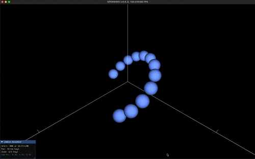

# KEY CHALLENGES

## ✅ 1. The Envelope Problem (Phasor Superposition)

The force equation requires amplitude and its gradient. Particles respond to time-averaged energy density, not instantaneous displacement — their inertia acts as a low-pass filter at ~10²⁵ Hz. This means we need the envelope (amplitude), not the oscillation itself. But what "amplitude" means depends on interpretation:

- **Instantaneous displacement**: oscillates at 10²⁵ Hz — particles can't respond to this
- **EMA-RMS**: tracks time-averaged energy but requires observation window, has lag and smoothing artifacts
- **Phasor RMS**: exact analytical amplitude per frame — no lag, no artifacts. This is the current best approach
- **Signed envelope**: preserves charge information but requires careful treatment of constructive vs destructive interference

### Previous Envelope Attempts (wave_engine.py)

Multiple envelope models were tried and archived as commented blocks:

- **Spiked 1/r**: Raw 1/r with center clamp to k·2
- **Smoothed 1/r**: k/√((kr)² + 1) — smooth transition at center
- **Damped smoothed 1/r**: k/√((kr)² + (2π)²) — heavier damping
- **Wolff-original envelope**: sin(kr)/r near-field, 1/r far-field
- **ABS Wolff near-field**: |sin(kr)|/r — removes negative lobes
- **Damped+offset variants**: Various combinations with golden ratio offsets
- **Flat near-field**: Constant amplitude within 1.25λ, 1/r beyond

None produced correct force scaling across all test configurations.

## ✅ 2. Standing vs. Traveling Wave Contribution to Energy

Standing waves store energy locally (nodes don't move, energy doesn't flow). Traveling waves transport energy radially. The force field likely depends on how these two components interact:

- Between same-charge particles: constructive interference → amplitude increase between them → higher energy zone → repulsion (particles pushed away from high-energy region)
- Between opposite-charge particles: destructive interference → amplitude decrease between them → lower energy zone → attraction (particles fall into the energy well)

**Open question**: Is the force from the gradient of the standing wave envelope, the traveling wave envelope, or the total superposition? The phasor gives the total — but separating standing and traveling contributions might reveal the force mechanism.

## ✅ 3. Scalar ψ vs Vector ψ — Which Forces Need Which?

The simulation has two methods with fundamentally different displacement models:

- **m3 (Wolff-LaFreniere)**: Scalar displacement — each voxel stores a single amplitude value. Waves are longitudinal pressure oscillations in the medium
- **m4 (Vector Wave)**: Vector displacement — each voxel stores a 3D displacement vector (ψ_x, ψ_y, ψ_z). Waves displace the medium in all three spatial directions

**Insight**: This distinction maps naturally onto the force hierarchy:

| Force         | Wave type          | Displacement                          | Method        |
| ------------- | ------------------ | ------------------------------------- | ------------- |
| Electric      | Longitudinal       | Scalar (along propagation)            | m3 sufficient |
| Magnetic      | Transverse         | Vector (perpendicular to propagation) | m4 required   |
| Gravitational | Shading/screening  | Scalar envelope reduction             | m3 sufficient |

**The electric force is purely longitudinal** — amplitude variations along the wave propagation direction. A scalar ψ captures this completely. This means m3 is the right starting point for electric force validation.

**The magnetic force requires transverse displacement** — when longitudinal waves hit a spinning wave center, energy transfers into transverse oscillation (90° to propagation). This transverse component can only be represented with vector ψ. The m4 vector wave method naturally produces this.

**The ellipse connection**: In m4's phasor superposition research, we showed that the combined vector displacement from multiple wave sources always traces an ellipse at each voxel, fully described by 6 numbers (P_x, Q_x, P_y, Q_y, P_z, Q_z). This elliptical trajectory has:

- **Semi-major axis**: maximum displacement direction — the longitudinal/electric component
- **Semi-minor axis**: perpendicular displacement — the transverse/magnetic component
- **The two axes are 90° apart** — exactly the E-M field relationship

This is not imposed — it emerges mathematically from wave interference in 3D space. The ellipse geometry may be the natural representation of the electromagnetic field at each point.

**Strategy**: Start with scalar m3 to crack the electric force. Once that works, extend to vector m4 where the elliptical displacement geometry should naturally produce the magnetic component.

## ❌ 4. Constructive & Destructive Interference vs. Charge

The source_offset (0 or π) determines charge. Two electrons (both π) create a specific interference pattern. An electron-positron pair (π and 0) creates a different pattern. The phasor superposition captures this:

- Same charge: cos(φ₁) = cos(φ₂), so P contributions add → larger amplitude
- Opposite charge: cos(φ₁) = -cos(φ₂), so P contributions cancel → smaller amplitude

But the spatial structure of where constructive/destructive interference occurs relative to each particle is what creates the gradient → force.

## ❌ 5. The 1/r² Force Law

For the electric force to emerge, the amplitude gradient must produce a 1/r² dependence. With a single source giving A ∝ 1/r (sinc envelope), ∇A ∝ 1/r², and F ∝ A·∇A ∝ 1/r³. This is too steep.

For Coulomb's law (F ∝ 1/r²), we need either:

- A different amplitude envelope (not 1/r)
- A correction from the interference pattern between two sources
- A different force equation than F = -2ρVf²A·∇A

This is one of the critical open problems.

**Possible insight from Smoliński**: His "Degraded EMC Wall" concept proposes a structural interface in the lattice that allows the discrete BCC structure to manifest as a perfectly smooth, spherical 1/r² pressure gradient. This addresses exactly how a structured medium (with oscillatory wave nodes) produces an isotropic force that is uniform in all directions. If applicable to our simulator, it could explain how the sinc oscillation in the phasor RMS averages out to smooth 1/r² at macroscopic scales.
