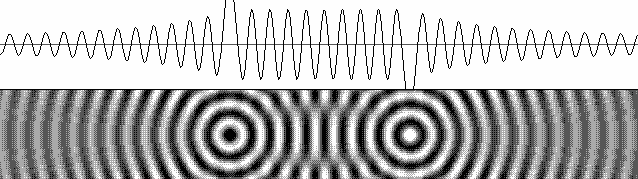
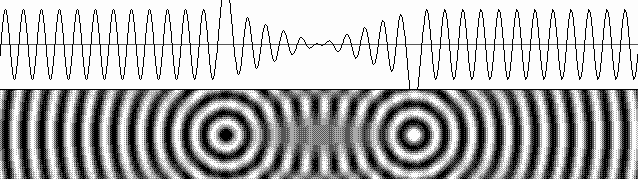

# Force Unification from Wave Interference

## Table of Contents

- [Goal](#goal)
- [Conceptual Overview](#conceptual-overview)
- [Theoretical Foundation](#theoretical-foundation)
  - [The Spacetime Medium](#the-spacetime-medium)
  - [Wave Centers and Particle Formation](#wave-centers-and-particle-formation)
  - [Energy and Force](#energy-and-force)
  - [Force Unification Hierarchy](#force-unification-hierarchy)
- [LaFreniere's Force Mechanisms](#lafrenieres-force-mechanisms-from-sa_mechanics-sa_fields-sa_magnetic)
  - [Radiation Pressure as the Force Carrier](#radiation-pressure-as-the-force-carrier)
  - [The Diffractive Lens Effect](#the-diffractive-lens-effect)
  - [Phase Relationships and Charge](#phase-relationships-and-charge)
  - [Fundamental Wave Interference Principle](#fundamental-wave-interference-principle)
  - [Magnetic Fields as Hyperboloid Wave Patterns](#magnetic-fields-as-hyperboloid-wave-patterns)
  - [The Lorentz Force](#the-lorentz-force)
  - [Standing Waves Modify the Medium](#standing-waves-modify-the-medium)
  - [Fields Contain Energy (Mass)](#fields-contain-energy-mass)
  - [Maxwell's Equations — LaFreniere's Reinterpretation](#maxwells-equations--lafrenieres-reinterpretation)
- [Current Implementation Status](#current-implementation-status)
  - [Wave Equations Explored](#wave-equations-explored-wave_enginepy)
  - [Phasor Superposition (Analytical Amplitude)](#phasor-superposition-analytical-amplitude)
  - [Force Computation](#force-computation-force_motionpy)
- [Key Challenges](#key-challenges)
  - [The Envelope Problem](#1-the-envelope-problem)
  - [Standing vs. Traveling Wave Contribution](#2-standing-vs-traveling-wave-contribution-to-energy)
  - [Constructive vs. Destructive Interference](#3-constructive-vs-destructive-interference-and-charge)
  - [Scalar ψ vs Vector ψ](#4-scalar-ψ-vs-vector-ψ--which-forces-need-which)
  - [The 1/r² Force Law](#5-the-1r²-force-law)
  - [Previous Envelope Attempts](#5-previous-envelope-attempts-wave_enginepy)
- [Attack Plan](#attack-plan)
  - [Decision: Weighted Partial Standing Wave](#decision-weighted-partial-standing-wave-as-primary-equation)
  - [Next Step: 1D Wave Engine](#next-step-1d-wave-engine-for-rapid-equation-testing-sandbox-environment)
  - [Phase 1: Validate Phasor Amplitude](#phase-1-validate-phasor-amplitude-against-known-solutions)
  - [Phase 2: Energy Density Gradients](#phase-2-analyze-energy-density-gradients)
  - [Phase 3: Isolate Force Mechanism](#phase-3-isolate-the-force-mechanism)
  - [Phase 4: Standing/Traveling Contributions](#phase-4-separate-standing-and-traveling-contributions)
  - [Phase 5: Multi-Particle Validation](#phase-5-multi-particle-validation)
- [Target: Wave Interference Patterns](#target-wave-interference-patterns-lafreniere-reference-animations)
  - [Primary Reference Animation](#primary-reference-two-opposite-phase-wave-centers)
  - [Constructive/Destructive Animations](#constructive-and-destructive-reference-animations)
  - [Force Depends on Phase AND Separation](#key-insight-force-depends-on-both-phase-and-separation)
  - [Two Force Regimes](#two-force-regimes-standing-wave-lock-vs-electrostatic-force)
  - [Electron-Proton Interaction](#electron-proton-interaction-future-research)
  - [Lock-In Instability Status](#current-status-lock-in-instability)
  - [Wave Equation Analysis for m3](#analysis-what-wave-equation-reproduces-this-in-m3)
  - [Test Configurations](#key-test-configuration)
- [Notes](#notes)
- [Future Directions](#future-directions-post-force-unification)
  - [Matter Formation](#matter-formation-from-force-equilibrium)
  - [Photons](#electromagnetic-wave-packets-photons)
  - [Thermal Energy Hypothesis](#thermal-energy-as-wave-dynamics-hypothesis)
  - [Spin and Magnetic/Thermal Phenomena](#spin-as-the-key-to-magnetic-and-thermal-phenomena)
- [Broader Impact](#broader-impact)

## Goal

Provide numerical evidence that all fundamental forces (electric, magnetic, gravitational) emerge from energy wave interference patterns in a spacetime medium — validating Energy Wave Theory (EWT) through simulation.

## Conceptual Overview

Spacetime is a fluid medium vibrating in harmonic oscillations, at extremely high frequencies. Everything emerges from disturbances in this wave field:

- **Particles (wave centers)**: localized disturbances that reflect and re-emit waves, changing the wave character and shifting energy spatially. The standing wave structure near a wave center IS the particle
- **Forces**: energy gradients created by wave interference between wave centers. These gradients generate all known forces — electric, magnetic, gravitational — and hold matter together at every scale
- **Photons**: traveling wave packets — disturbances propagating through the medium. Unlike static force fields, photons are discrete packets of energy that travel through space and can apply force on distant particles upon absorption
- **Heat**: disturbances in standing wave form — thermal energy may be encoded in the amplitude or frequency modulation of standing waves within particle structure, rather than in bulk kinetic motion (see Thermal Energy Hypothesis below)

All of these are proposed concepts within Energy Wave Theory. OpenWave's goal is to **numerically validate** them through computational analysis and rendered simulations — starting with force emergence from wave interference, then extending to matter formation, photon emission, and thermal dynamics.

## Theoretical Foundation

### The Spacetime Medium

An unknown but fluid-like substance permeates all of space and penetrates all matter. This medium vibrates in harmonic oscillations, forming longitudinal waves that travel through space at the speed of light (c). The medium has measurable properties:

- Density: ρ = 3.86 × 10²² kg/m³ (38.6 qg/am³ in simulation units)
- Wave speed: c = 2.998 × 10⁸ m/s (0.3 am/rs)
- Fundamental amplitude: A₀ = 9.22 × 10⁻¹⁹ m (0.92 am)
- Fundamental frequency: f₀ = 1.05 × 10²⁵ Hz (0.0105 rHz)
- Fundamental wavelength: λ₀ = 2.85 × 10⁻¹⁷ m (28.5 am)

### Wave Centers and Particle Formation

Wave centers are points where waves reflect and change character. Key properties:

- **Reflection**: An isotropic base energy wave is always present at any point in space — the result of reflections from all matter in the universe, reaching every point from all directions (Huygens wavelet principle)
- **Re-emission**: Every wave center reflects this base wave outward radially, changing its phase and character
- **Phase offset (source_offset)**: Each wave center has a phase offset that determines its charge signature. `cos(0) = +1` (positron), `cos(π) = -1` (electron). This is the origin of particle charge
- **Standing waves**: Near the wave center, reflected in-waves and emitted out-waves superpose to form standing waves — the structure of the particle itself

### Energy and Force

The EWT energy equation for a volume of medium:

```text
E = ρ · V · (f · A)²
```

Where ρ is medium density, V is volume, f is frequency, A is displacement amplitude.

Since ρ, V, and f are constant in the monochromatic case:

```text
F = -∇E = -2 · ρ · V · f² · A · ∇A
```

Force emerges from the **gradient of amplitude** — wherever wave interference creates a spatial variation in amplitude, there is a force. Wave centers (which have mass) move toward lower energy configurations via F = ma. In essence, particles fall into low-energy valleys in the energy density landscape shaped by wave interference.

This may be the physical mechanism behind what Einstein described as "curvature in spacetime" — not a geometric bending of an abstract manifold, but a real energy density landscape sculpted by wave interference in the medium. The "curvature" is the shape of the energy valleys and hills created by constructive and destructive interference. Particles follow geodesics not because space is curved, but because they roll downhill in the energy density field.

### Force Unification Hierarchy

The theory proposes that all forces are manifestations of the same wave interference:

1. **Electric force** (longitudinal): The fundamental force. Arises from constructive/destructive interference of energy waves between wave centers with different phase offsets. Opposite charges (0 vs π offset) create destructive interference between them → lower amplitude in the gap → particles fall into the energy well → attractive force. Same charges create constructive interference → higher amplitude between them → particles repelled from the high-energy zone → repulsive force

2. **Magnetic force** (transverse): When longitudinal energy waves hit a spinning wave center, the energy required for spin is converted into a transverse wave component (90° to longitudinal). This reduces the longitudinal (electric) wave energy. Magnetic force emerges from the transverse wave interference

3. **Gravitational force** (shading): When many wave centers cluster together (large bodies), they collectively absorb/scatter incoming energy waves. The region behind the body has reduced wave amplitude — a "shadow". Another body in this shadow region experiences a net force toward the first body because the energy density gradient points inward. Gravity is a residual effect of large-scale electric wave shading

## LaFreniere's Force Mechanisms (from sa_mechanics, sa_fields, sa_magnetic)

### Radiation Pressure as the Force Carrier

Forces are not abstract — they arise from **radiation pressure** of waves propagating through the medium. When waves superpose to create standing wave patterns between particles, the standing waves exert radiation pressure on both sides, resulting in opposite motion (action-reaction). The force mechanism is purely mechanical: wave pressure pushing on wave centers.

### The Diffractive Lens Effect

Standing wave fields between particles act as **diffractive lenses**. Each amplitude zone (antinode) functions as a lens element:

- Zones with λ/2 phase shifts between them block or diffract out-of-phase wavefronts
- In-phase wavelets converge at focal points via Huygens' principle
- This focuses and **amplifies** wave energy along the axis connecting the particles
- The amplification is what makes the electrostatic force strong — the field acts like thousands of stacked lenses concentrating wave energy
- Radiated energy is transmitted to the opposite side with much more intense pressure

### Phase Relationships and Charge

The interaction type depends on the phase relationship between wave centers:

- **Full wavelength (λ) phase difference** → central standing wave field pushes outward → **repulsion**
- **Half wavelength (λ/2) phase difference** → inverted field pattern pulls inward → **attraction**
- This maps directly to source_offset: 0 vs π offset = half-wavelength phase difference

### Fundamental Wave Interference Principle

A critical distinction from LaFreniere:

- Waves traveling in the **same direction** can cancel (destructive interference)
- Waves traveling in **opposite directions never cancel** — they **always produce standing waves**

This means counter-propagating waves (in-wave + out-wave) always create standing wave structure. The standing waves periodically appear and disappear everywhere simultaneously, but the energy is never lost — it redistributes locally.

### Magnetic Fields as Hyperboloid Wave Patterns

Two concentric spherical wave systems (e.g., two electrons in proximity) produce interference on **hyperboloid** and ellipsoidal surfaces. LaFreniere's key insights:

- Two shifted sets of hyperboloids produce the well-known **magnetic lines of force**
- Magnetic poles are emitters/receivers of **one-way waves** (traveling in one direction only)
- Same poles (identical one-way systems): no standing wave field → radiation pressure → **repulsion**
- Opposite poles (inverted one-way systems): standing wave amplification → wave focusing → **attraction**
- Three or more emitters regularly spaced produce complex magnetic field line patterns


### The Lorentz Force

Arises from particle motion through hyperboloid wave patterns:

- Charged particles moving on orthogonal planes to existing field patterns constantly change direction
- The mechanism involves secondary fields created by electron waves within complex force fields
- Particles undulating on hyperboloid surfaces experience the classical Lorentz force

### Standing Waves Modify the Medium

Standing waves alternately compress and dilate the medium at antinodes:

- Compressed medium transmits waves faster (higher pressure → higher wave speed)
- Dilated medium transmits waves slower
- The wave is progressively scattered as it propagates through density variations
- This creates a local variation in the speed of light — another interpretation of "spacetime curvature"

### Fields Contain Energy (Mass)

Fields of force are not abstract constructs — they contain real energy:

- Field energy follows E = mc², contributing to the system's total mass
- "Canned" kinetic energy stored in fields is responsible for nuclear energy
- The resulting energy must be considered as additional mass in all calculations

### Maxwell's Equations — LaFreniere's Reinterpretation

A controversial but relevant claim:

- Pure electromagnetic traveling waves do not exist in vacuum
- Light and radio waves are regular longitudinal traveling waves in the medium
- They can induce electric and magnetic fields when interacting with matter
- Maxwell's equations describe field behavior around material devices (antennas, conductors), not wave propagation in vacuum
- Fields cannot exist far from matter in vacuum — only traveling waves persist

## Current Implementation Status

### Wave Equations Explored (wave_engine.py)

Five wave equation forms have been implemented, each representing different physical models:

#### 1. Wolff-Original

```text
ψ = A · e^(iωt) · sin(kr)/r
  = A · [cos(ωt) + i·sin(ωt)] · sin(kr)/r
```

- Pure standing wave (sin(kr)/r sinc envelope at all distances)
- Complex oscillator from e^(iωt) expansion
- quadrature_term = 1.0 gives full complex rotation (√2 boost)
- quadrature_term = 0.0 gives real part only: cos(ωt)·sin(kr)/r
- **Limitation**: No traveling wave component — standing wave everywhere, no energy radiation

#### 2. LaFreniere-Marcotte Original

```text
Phase:      sin(kr) / (kr)      → 1 as r→0
Quadrature: (1-cos(kr)) / (kr)  → 0 as r→0

ψ = A · [cos(ωt)·Phase + sin(ωt)·Quadrature]
```

- Partially standing/traveling wave (LaFreniere's "partially standing wave")
- sinc-normalized (1/kr not 1/r): center amplitude = 1 regardless of wavelength
- Quadrature term (1-cos(kr))/(kr) provides the traveling wave character
- Near center: Phase dominates → standing behavior
- Far from center: both Phase and Quadrature contribute → traveling character
- **Limitation**: Standing-to-traveling transition is inherent in the math, not independently controllable

#### 3. LaFreniere-Marcotte Phase-Warped (Corrected)

```text
x = kr
If x < π:  x_c = x + (π/2)·(1 - x/π)²   (core correction)
Else:       x_c = x

ψ = sin(x_c - ωt) / x_c
```

- Marcotte Wave Generator equation from sa_spherical.html
- Single outgoing traveling wave with nonlinear phase correction near origin
- Core correction warps phase forward by up to π/2 at center
- Creates standing-wave-like appearance without explicit in-wave
- Produces the partial_standing.gif behavior below
- **Decomposed for phasor**: Phase = sin(x_c)/x_c, Quadrature = -cos(x_c)/x_c


#### 4. Combined Wolff-LaFreniere

```text
ψ(r,t) = A · [sin(ωt - kr) - sin(ωt)] / r
Expanded:
ψ(r,t) = A · [-cos(ωt) · sin(kr)/r - sin(ωt) · (1 - cos(kr))/r]
```

- Combines Wolff's sin(kr)/r spatial envelope with LaFreniere's quadrature term
- Phase term: sin(kr)/r → k as r→0 (Wolff normalization, amplitude scales with k)
- Quadrature term: (1-cos(kr))/r → 0 as r→0 (provides traveling wave character)
- The -sin(ωt) uniform pulsation term creates a "breathing" effect at all distances
- Uses 1/r normalization (not 1/kr) — center amplitude depends on wavelength
- **Limitation**: standing wave nodes (zeros of sin(kr)) persist at all distances, and the uniform pulsation term doesn't match LaFreniere's reference animations

#### 5. Weighted Partial Standing Wave

```text
ψ = A · [w(r)·sin(kr + ωt) + sin(kr - ωt)] / kr

w(r) = 1 / (1 + (r / (transition·λ))^8)    (sharp Lorentzian)
```

- Explicit in-wave + out-wave superposition
- Weight function controls standing → traveling transition independently
- transition = 1.25λ: standing waves stable within 1.25 wavelengths
- Power 8 gives near-step-function rolloff
- Standing limit (w=1): 2·sin(kr)·cos(ωt)/kr — fixed nodes at kr = nπ
- Traveling limit (w=0): sin(kr - ωt)/kr — nodes move outward
- **Most physically motivated**: reflects actual in-wave/out-wave dynamics

### Phasor Superposition (Analytical Amplitude)

All five wave forms have been decomposed into phasor components for exact amplitude computation:

```text
ψ_total(t) = P·cos(ωt) + Q·sin(ωt)

Peak amplitude = √(P² + Q²)
RMS amplitude  = Peak / √2
```

Per wave center n, coefficients C_n and S_n are computed from the spatial wave function, then rotated by source_offset φ_n to a shared cos(ωt)/sin(ωt) basis:

```text
P += C_n·cos(φ_n) + S_n·sin(φ_n)
Q += -C_n·sin(φ_n) + S_n·cos(φ_n)
```

This replaces the EMA-RMS tracking with an exact, instantaneous result — no observation window, no smoothing artifacts.

### Force Computation (force_motion.py)

Current approach:

```text
F = -2 · ρ · V · f² · A · ∇A
```

- Samples phasor RMS amplitude at wave center position and ±R neighbors
- Central difference gradient: ∇A = (A[+R] - A[-R]) / (2R·dx)
- Scale correction: F_real = F_scaled / S⁴ (universe scaling)
- Units: computed in qg·am/rs², converted to Newtons

## Key Challenges

### 1. The Envelope Problem

The force equation requires amplitude and its gradient. Particles respond to time-averaged energy density, not instantaneous displacement — their inertia acts as a low-pass filter at ~10²⁵ Hz. This means we need the envelope (amplitude), not the oscillation itself. But what "amplitude" means depends on interpretation:

- **Instantaneous displacement**: oscillates at 10²⁵ Hz — particles can't respond to this
- **EMA-RMS**: tracks time-averaged energy but requires observation window, has lag and smoothing artifacts
- **Phasor RMS**: exact analytical amplitude per frame — no lag, no artifacts. This is the current best approach
- **Signed envelope**: preserves charge information but requires careful treatment of constructive vs destructive interference

### 2. Standing vs. Traveling Wave Contribution to Energy

Standing waves store energy locally (nodes don't move, energy doesn't flow). Traveling waves transport energy radially. The force field likely depends on how these two components interact:

- Between same-charge particles: constructive interference → amplitude increase between them → higher energy zone → repulsion (particles pushed away from high-energy region)
- Between opposite-charge particles: destructive interference → amplitude decrease between them → lower energy zone → attraction (particles fall into the energy well)

**Open question**: Is the force from the gradient of the standing wave envelope, the traveling wave envelope, or the total superposition? The phasor gives the total — but separating standing and traveling contributions might reveal the force mechanism.

### 3. Constructive vs. Destructive Interference and Charge

The source_offset (0 or π) determines charge. Two electrons (both π) create a specific interference pattern. An electron-positron pair (π and 0) creates a different pattern. The phasor superposition captures this:

- Same charge: cos(φ₁) = cos(φ₂), so P contributions add → larger amplitude
- Opposite charge: cos(φ₁) = -cos(φ₂), so P contributions cancel → smaller amplitude

But the spatial structure of where constructive/destructive interference occurs relative to each particle is what creates the gradient → force.

### 4. Scalar ψ vs Vector ψ — Which Forces Need Which?

The simulation has two methods with fundamentally different displacement models:

- **m3 (Wolff-LaFreniere)**: Scalar displacement — each voxel stores a single amplitude value. Waves are longitudinal pressure oscillations in the medium
- **m4 (Vector Wave)**: Vector displacement — each voxel stores a 3D displacement vector (ψ_x, ψ_y, ψ_z). Waves displace the medium in all three spatial directions

**Insight**: This distinction maps naturally onto the force hierarchy:

| Force         | Wave type          | Displacement                          | Method        |
| ------------- | ------------------ | ------------------------------------- | ------------- |
| Electric      | Longitudinal       | Scalar (along propagation)            | m3 sufficient |
| Magnetic      | Transverse         | Vector (perpendicular to propagation) | m4 required   |
| Gravitational | Shading/screening  | Scalar envelope reduction             | m3 sufficient |

**The electric force is purely longitudinal** — amplitude variations along the wave propagation direction. A scalar ψ captures this completely. This means m3 is the right starting point for electric force validation.

**The magnetic force requires transverse displacement** — when longitudinal waves hit a spinning wave center, energy transfers into transverse oscillation (90° to propagation). This transverse component can only be represented with vector ψ. The m4 vector wave method naturally produces this.

**The ellipse connection**: In m4's phasor superposition research, we showed that the combined vector displacement from multiple wave sources always traces an ellipse at each voxel, fully described by 6 numbers (P_x, Q_x, P_y, Q_y, P_z, Q_z). This elliptical trajectory has:


- **Semi-major axis**: maximum displacement direction — the longitudinal/electric component
- **Semi-minor axis**: perpendicular displacement — the transverse/magnetic component
- **The two axes are 90° apart** — exactly the E-M field relationship

This is not imposed — it emerges mathematically from wave interference in 3D space. The ellipse geometry may be the natural representation of the electromagnetic field at each point.

**Strategy**: Start with scalar m3 to crack the electric force. Once that works, extend to vector m4 where the elliptical displacement geometry should naturally produce the magnetic component.

### 5. The 1/r² Force Law

For the electric force to emerge, the amplitude gradient must produce a 1/r² dependence. With a single source giving A ∝ 1/r (sinc envelope), ∇A ∝ 1/r², and F ∝ A·∇A ∝ 1/r³. This is too steep.

For Coulomb's law (F ∝ 1/r²), we need either:

- A different amplitude envelope (not 1/r)
- A correction from the interference pattern between two sources
- A different force equation than F = -2ρVf²A·∇A

This is one of the critical open problems.

### 5. Previous Envelope Attempts (wave_engine.py)

Multiple envelope models were tried and archived as commented blocks:

- **Spiked 1/r**: Raw 1/r with center clamp to k·2
- **Smoothed 1/r**: k/√((kr)² + 1) — smooth transition at center
- **Damped smoothed 1/r**: k/√((kr)² + (2π)²) — heavier damping
- **Wolff-original envelope**: sin(kr)/r near-field, 1/r far-field
- **ABS Wolff near-field**: |sin(kr)|/r — removes negative lobes
- **Damped+offset variants**: Various combinations with golden ratio offsets
- **Flat near-field**: Constant amplitude within 1.25λ, 1/r beyond

None produced correct force scaling across all test configurations.

## Attack Plan

### Decision: Weighted Partial Standing Wave as Primary Equation

Based on the analysis above, the **weighted partial standing wave** is selected as the primary wave equation for force unification research. The other four forms (Wolff-original, LaFreniere-Marcotte original, phase-warped Marcotte, combined Wolff-LaFreniere) remain in the code as commented reference implementations for comparison testing.

### Next Step: 1D Wave Engine for Rapid Equation Testing (sandbox environment)

The full 3D Taichi simulator (m3) is powerful but slow to iterate on — each equation change requires running the GPU kernel, waiting for convergence, and visually inspecting 3D fields. A lightweight **1D wave engine** using matplotlib would dramatically accelerate equation development.

**Purpose**: A standalone Python script for rapid prototyping and validation of wave equations, phasor superposition, and force computation — without the overhead of the 3D simulator.

**Features**:

- 1D spatial domain (single axis through wave centers) with configurable resolution
- Arbitrary number of wave centers with controllable parameters:
  - Position along the axis
  - Phase offset (source_offset) for charge
  - Amplitude
- All 5 wave equation forms available as selectable options
- Real-time matplotlib animation showing:
  - Instantaneous displacement ψ(x, t) — oscillating wave
  - Phasor RMS envelope — steady-state amplitude profile
  - Energy density E(x) = ρ·V·(f·A)² profile
  - Force field F(x) = -∇E gradient
- Interactive parameter controls (sliders or keyboard):
  - WC separation distance
  - WC phase offsets
  - Weight function transition distance and sharpness
  - Wave equation selection
- Direct comparison overlays:
  - Phasor RMS vs EMA-RMS (validation)
  - Simulated force vs analytical Coulomb force (1/r² reference line)
  - Near-field vs far-field regime boundary marker

**Benefits**:

- **Fast iteration**: change equation, see result instantly — no GPU compile, no 3D rendering
- **Clean 1D profiles**: directly comparable to the 1D cross-sections in LaFreniere's reference animations
- **Isolated testing**: test each component (wave equation, phasor, force) independently without the full simulation chain
- **Parameter sweeps**: easily sweep separation distance to plot force vs distance curves for 1/r² validation
- **Debugging**: verify that phasor coefficients, weight functions, and force gradients produce correct values before deploying to the 3D engine

**Location**: `openwave/xperiments/m3_wolff_lafreniere/research/wave_engine_1D_v2.py`, inspired by the similar scrip v1, and old 1D wave engine test. Lets reuse variable naming, layout conventions and some other standards as a template, but start the equations logic from scratch, there is lot to be optimized.

**Physics invariant tests**: Alongside the 1D engine, build a pytest test suite that validates each wave equation form against known physical properties before any formula changes are deployed to the 3D engine:

- Dimensional consistency of all force/field equations
- Boundary behavior: correct limits at r→0 (center voxel) and r→∞ (far-field decay)
- Energy conservation: total energy in the field should be constant for a static configuration
- Phasor equivalence: phasor RMS must match EMA-RMS after convergence
- Near-field/far-field transition: envelope must be continuous across the weight function boundary
- Charge symmetry: same-charge pair must produce repulsion, opposite-charge pair must produce attraction in the far-field

The 1D engine is ideal for these tests — fast execution, no GPU overhead, and deterministic results.

### Phase 1: Validate Phasor Amplitude Against Known Solutions

Before chasing force emergence, confirm the phasor gives correct amplitude patterns:

- [ ] Two same-charge (electron-electron) particles: verify destructive interference pattern between them
- [ ] Two opposite-charge (electron-positron) particles: verify constructive interference between them
- [ ] Single particle: verify sinc-like amplitude envelope matches wave equation choice
- [ ] Compare phasor RMS against EMA-RMS to confirm equivalence (they should match after EMA converges)

### Phase 2: Analyze Energy Density Gradients

With confirmed amplitude fields, study the energy density landscape:

- [ ] Plot E = ρV(fA)² along the axis connecting two particles at various separations
- [ ] Identify where constructive vs destructive interference occurs relative to particle positions
- [ ] Verify that the energy gradient (∇E) points in the expected direction (attractive for opposite charges, repulsive for same charges)
- [ ] Check whether the gradient magnitude follows 1/r² scaling with separation distance

### Phase 3: Isolate the Force Mechanism

Test which wave equation form produces the correct force behavior:

- [ ] Run each of the 5 wave equations with same test configuration (2 electrons, 2 positrons, electron-positron pair)
- [ ] Measure force magnitude vs separation for each
- [ ] Compare against Coulomb's law: F = ke·q₁q₂/r²
- [ ] Identify which equation (if any) produces the correct scaling
- [ ] Investigate whether standing wave nodes play a role (does the force depend on whether particles sit at nodes or antinodes?)
- [ ] Test non-linear wave equations where wavelength λ(r) varies with distance from wave center — the Yee & Hauger model predicts discrete wavelength shells: r_n = 2(K-n)λ, which changes the interference pattern and may correct the force scaling (see phasor_superposition.md, WKB/eikonal phase integral approach)

### Phase 4: Separate Standing and Traveling Contributions

The phasor can be extended to track standing and traveling components independently:

- [ ] Decompose the weighted partial standing wave phasor into standing-only and traveling-only amplitudes
- [ ] Compute force from each component separately
- [ ] Determine which component (or combination) produces the correct force law
- [ ] Test if the standing wave component alone gives the electric force

### Phase 5: Multi-Particle Validation

Scale up to test gravitational shading:

- [ ] Cluster of same-charge particles: does the combined wave field show reduced amplitude behind the cluster (shading)?
- [ ] Two clusters separated by distance: does a net force emerge between them?
- [ ] Compare cluster-cluster force against single-particle-pair force — is there a residual (gravitational) component?

---

### Target: Wave Interference Patterns (LaFreniere reference animations)

These animations from LaFreniere's site show the interference effects we need to reproduce in OpenWave to validate force emergence.

#### Primary Reference: Two Opposite-Phase Wave Centers


This animation is the most important reference for our research. It displays the complete wave interaction picture for two wave centers with opposing phase:

**Near-field (within ~1λ of each wave center):**

- Clear standing wave rings visible around each WC core — fixed concentric nodes that don't move
- This is the near-field regime where standing wave forces dominate
- The standing wave structure IS the particle — its spatial extent is ~1λ

**Far-field (beyond ~1λ from each wave center):**

- Only traveling waves — rings move outward from each WC
- Amplitude should fall off as 1/r to conserve energy for 3D radial spherical waves (hard to tell from 2D animation, but physically required)
- This is the electrostatic regime where Coulomb-like forces operate

**Between the wave centers:**

- Amplitude is visibly **reduced** in the gap — destructive interference from opposing phases
- This amplitude reduction creates a lower energy zone → attraction force (exactly as expected for opposite charges)
- The 1D cross-section at bottom confirms: the envelope dips between the WCs

**Traveling waves inside the gap:**

- Between the WCs, traveling waves from each source propagate inward (toward the center of the image)
- As they approach the midpoint equidistant from both WCs, they superpose into a **standing wave pattern** at the center of the gap
- This midpoint standing wave forms because counter-propagating traveling waves from each source meet head-on

**Key observations for simulation:**

- The standing wave region is sharply localized (~1λ around each WC) — this matches a steep weight function rolloff
- The far-field is cleanly traveling — no residual standing wave character
- The interference pattern in the gap is smooth — no oscillatory artifacts
- The 1D envelope shows the exact profile the phasor RMS should reproduce

#### Constructive and Destructive Reference Animations

**Constructive interference (opposite charge, separation = nλ → repulsion):**

- Top (1D cross-section): amplitude envelope is HIGHER between the two particles — the peaks grow in the midpoint region
- Bottom (2D view): concentric standing wave rings around each particle, with a bright structured "biconvex" standing wave field between them
- At this separation, the standing wave antinodes from each source align → constructive superposition → higher energy between → repulsive force



**Destructive interference (opposite charge, separation = (n+½)λ → attraction):**

- Top (1D cross-section): amplitude envelope DROPS between the two particles — near-cancellation at midpoint
- Bottom (2D view): concentric rings around each particle, but the region between them shows reduced/flattened wave structure
- At this separation, antinodes of one source align with nodes of the other → destructive superposition → lower energy between → attractive force



**Critical observation**: Both animations show particles in **opposing phase** (opposite charge) — the concentric rings are inverted relative to each other (dark vs light at same radius). The difference between the two patterns is a **spatial shift of λ/2** in the particle separation distance.

#### Key Insight: Force Depends on Both Phase AND Separation

The interference pattern at any point depends on the **total phase difference**, which combines two contributions:

```text
Δφ_total = source_offset_difference + k · separation_distance
         = (φ₁ - φ₂) + k · d
```

This means:

- The same charge pair can produce either constructive or destructive interference depending on their exact separation in units of λ
- The force has an **oscillatory component** with spatial period λ, modulated by the 1/r amplitude decay
- At separations where antinodes align: higher energy between → repulsion
- At separations where antinodes meet nodes: lower energy between → attraction
- The **net force** (averaged over oscillation) should still give the correct sign (attractive for opposite charge, repulsive for same charge), but individual wavelength-scale positions create alternating force zones
- This oscillatory behavior may correspond to the quantum mechanical standing wave shells that determine electron orbital positions in atoms

#### Two Force Regimes: Standing Wave Lock vs Electrostatic Force

The weighted partial standing wave equation naturally creates **two distinct force regimes** based on distance:

**Near-field (within standing wave distance, r < transition·λ):**

- Both in-wave and out-wave are present with comparable amplitude
- The interference creates alternating constructive/destructive zones at every λ/2
- Force direction **oscillates** — attraction at some separations, repulsion at others
- Behavior depends on charge phase:
  - **Same phase**: standing wave interference creates stable lock-in positions — particles are trapped in energy wells, wiggling but unable to escape. This is the regime where quarks lock together (gluon field), electron orbital shells form, and particle bonding occurs at all scales
  - **Opposite phase**: standing wave interference also occurs, but in this case the net force is attractive — particles are drawn together until they share the same point in space and **annihilate**. Their waves have opposite phase, so when wave centers overlap, total destructive interference eliminates both wave centers entirely. The particles cease to exist, and their wave energy is released (as photons/radiation)
- **Candidate theory for matter structure**: same-phase particles stabilize in energy wells where they oscillate but can't escape — the basic bonding mechanism from subatomic to atomic scales. Opposite-phase particles annihilate — explaining matter-antimatter annihilation as complete wave cancellation

**Far-field (beyond standing wave distance, r > transition·λ):**

- Only the traveling out-wave remains (in-wave has decayed away)
- The interference between traveling waves from two sources creates a smooth amplitude modulation
- Behavior depends on charge phase:
  - **Same phase**: constructive interference between particles → higher amplitude in the gap → repulsive force
  - **Opposite phase**: destructive interference between particles → lower amplitude in the gap → attractive force
- No oscillatory lock-in — this is the **electrostatic (Coulomb) regime**
- Force should decay as 1/r² with distance
- This is the classical electric force that operates between distant charged particles

**Open question**: Does the transition between these two regimes happen cleanly at the standing wave boundary (transition·λ), or is there a gradual crossover? The `weight` function controls this — a sharp weight rolloff (power 8) should create a relatively clean boundary, but this needs simulation validation.

#### Summary: Force Regime Matrix

| Regime     | Same Phase                        | Opposite Phase                                |
| ---------- | --------------------------------- | --------------------------------------------- |
| Near-field | Lock-in (quarks, orbits, bonding) | Attraction → annihilation (wave cancellation) |
| Far-field  | Constructive → repulsion          | Destructive → attraction                      |

#### Electron-Proton Interaction (Future Research)

The electron (-) "orbiting" a proton (+) is not an orbit in the planetary sense. In EWT, the proton is proposed to be a **composite particle**: quarks formed by electrons (-) locked together in standing wave wells, with a positron (+, an electron with π phase offset) at the center. This structure has both attraction and repulsion forces that create regions where the net force on a nearby electron is zero.

The result is that an electron near a proton **wiggles** rather than orbits — it experiences a messy, non-deterministic motion as the standing wave force field constantly shifts it between attraction and repulsion zones. This is analogous to a ping-pong ball suspended in an air stream: it wiggles up and down as air pressure force alternates with gravitational force, never settling into a fixed path.

This behavior directly corresponds to the **probability cloud of quantum orbitals** — the electron doesn't have a predictable trajectory, but rather a statistical distribution of positions determined by the standing wave force landscape around the proton. The discrete orbital shells emerge as the stable wiggle-zones where the time-averaged force is zero but the restoring force prevents escape.

#### Current Status: Lock-In Instability

The standing wave lock-in behavior **is observed in the simulator** — particles do oscillate in potential wells created by wave interference. However, they eventually escape, indicating the system is not yet stable enough to validate the theory. Possible causes:

- **Numerical precision**: f32 floating-point errors accumulate over many timesteps, introducing drift that eventually overwhelms the shallow energy wells
- **Force equation calibration**: the force scale factor, unit conversions, or S⁴ scaling correction may introduce systematic errors
- **Euler integration**: first-order integration is known to add or remove energy from oscillatory systems — symplectic integrators (Verlet, leapfrog) conserve energy better
- **Grid resolution**: if the standing wave wells are only a few voxels wide, the finite-difference gradient may not resolve the force accurately
- **Weight function tuning**: the transition sharpness and position may not match the physical model — too sharp creates numerical artifacts, too gradual washes out the lock-in wells

These are solvable engineering problems, not fundamental physics issues. The fact that lock-in is observed at all is encouraging.

**Note**: The wiggling/oscillatory force behavior is currently observed even at large separations (far-field), where it should not occur. Particles beyond the standing wave distance should experience a smooth, monotonic electrostatic force — but instead they still behave as if inside each other's standing wave field. This suggests one or more of:

- The phasor RMS envelope still contains standing wave node structure at large r (the sinc `sin(kr)/kr` zeros persist in the phasor coefficients even in the far-field)
- The weight function rolloff may not be sharp enough, or the transition distance needs recalibration
- The force gradient sampling radius may be too small relative to wavelength, aliasing the standing wave oscillations into the force calculation
- The amplitude field itself may need spatial smoothing or low-pass filtering beyond the standing wave boundary to extract only the 1/r envelope trend

**Root cause analysis**: The weight function successfully kills the in-wave in the far-field, but the out-wave itself (`sin(kr - ωt) / kr`) still carries the `sin(kr)/kr` sinc oscillation. The phasor coefficients for the out-wave are `C_n = A·sin(kr)/kr` — this has zeros at every `kr = nπ` regardless of distance. So the phasor RMS inherits the standing wave node structure from the out-wave's spatial function, even though the wave is purely traveling.

**Possible solution — dual-treatment force computation**: The force calculation may need different amplitude treatments for each regime:

- **Near-field** (r < transition·λ): use the raw phasor RMS with full oscillatory structure. The standing wave nodes create the energy wells that produce lock-in forces. The oscillation IS the physics here
- **Far-field** (r > transition·λ): use a spatially smoothed or analytically derived envelope of the phasor amplitude, extracting only the 1/r decay trend. The oscillatory nodes are an artifact of the sinc spatial function, not physically meaningful for the electrostatic force at this scale

The `transition` parameter in the weight function could serve double duty — controlling both the standing-to-traveling wave transition AND the raw-to-smoothed amplitude transition for force computation.

Resolving this is critical — without clean far-field electrostatic behavior, the Coulomb force cannot be validated. The near-field lock-in and the far-field electrostatic force are both needed, but they require different amplitude field treatments

#### Analysis: What Wave Equation Reproduces This in m3?

Both animations share key features that constrain which wave equation form can reproduce them:

1. **Clear standing wave rings near each particle center** — concentric circles with fixed nodes. This requires a standing wave component near the core (rules out pure traveling wave forms)

2. **Traveling waves far from center** — the outer rings move outward. The wave transitions from standing to traveling character with distance

3. **Interference happens in the traveling wave region** — the force-producing pattern occurs where the traveling waves from both sources overlap between the particles. The standing wave region near each core remains relatively undisturbed

4. **The 1D envelope modulation** — the amplitude envelope (what the phasor RMS captures) shows a smooth modulation that increases (constructive) or decreases (destructive) between particles. This is the energy density landscape whose gradient produces force

#### Implications for m3 Wave Equation Choice

The **weighted partial standing wave** form is the best candidate:

```text
ψ = A · [w(r)·sin(kr + ωt) + sin(kr - ωt)] / kr
```

Why it matches the animations:

- **Standing waves near center** (w ≈ 1): produces the fixed concentric rings visible around each particle in both animations
- **Traveling waves far out** (w → 0): the out-wave `sin(kr - ωt)/kr` propagates outward, exactly like the moving rings in the animations
- **Interference between particles**: the traveling out-waves from each source overlap in the gap. Their phase relationship (same offset = constructive, opposite offset = destructive) creates the amplitude modulation visible in the 1D cross-sections
- **Phasor captures the envelope**: the phasor RMS field should show higher values between same-charge particles and lower values between opposite-charge particles — matching the 1D profiles

The other wave equations have limitations for reproducing these patterns:

- **Wolff-original**: standing wave everywhere — no traveling component to create interference between distant particles
- **LaFreniere-Marcotte original**: transition is inherent, not sharp enough — standing character persists too far
- **Phase-warped Marcotte**: single traveling wave with core correction — no true standing wave nodes near center

#### Key Test Configuration

To reproduce these animations in m3:

- [ ] Place 2 wave centers separated by ~5-10λ
- [ ] Same charge test: both source_offset = π (or both = 0)
- [ ] Opposite charge test: source_offset = 0 and π
- [ ] Use weighted partial standing wave with transition = 1.25λ
- [ ] Visualize: displacement field (oscillating) + phasor RMS field (envelope)
- [ ] Compare 1D cross-section along particle axis against the animation profiles
- [ ] Verify: phasor RMS shows constructive/destructive patterns matching the reference animations
- [ ] Compute force from phasor RMS gradient at each particle position — confirm direction matches expected attraction/repulsion

#### Two-Regime Force Tests

**Test A — Near-field lock-in (standing wave regime):**

- [ ] Place 2 opposite-charge particles within 1-2λ of each other
- [ ] Observe oscillatory force behavior — does force direction alternate with λ/2 separation shifts?
- [ ] Identify stable equilibrium positions (energy wells) where particles lock in
- [ ] Measure lock-in stability: how many timesteps before escape?
- [ ] Test with Verlet/leapfrog integrator instead of Euler to check if energy conservation improves stability
- [ ] Test with f64 precision to check if numerical drift is the escape cause

**Test B — Far-field electrostatic (traveling wave regime):**

- [ ] Place 2 particles separated by 5λ, 10λ, 15λ, 20λ (well beyond standing wave transition)
- [ ] Measure force magnitude at each separation
- [ ] Plot force vs distance — does it follow 1/r² (Coulomb's law)?
- [ ] Verify force direction: opposite charges attract, same charges repel (consistently, no oscillation)
- [ ] Compare measured force against analytical Coulomb force: F = ke·q₁q₂/r²

## Notes

- The elliptical displacement path was first observed empirically from granule motion animations in the m4 vector wave method, before being confirmed mathematically via phasor analysis. The animation showed granules tracing ellipses with both longitudinal and transverse components — the transverse component may represent magnetic field emergence, though more research is needed to confirm whether this is truly magnetic/transverse waves or an artifact of the simulation geometry
- Phasor superposition serves a dual role: (1) it analytically computes combined wave field amplitudes from multiple sources without brute-force per-timestep simulation, and (2) it directly reveals the elliptical motion geometry at each point in space. One technique, two critical insights — amplitude for force computation and ellipse geometry for electromagnetic field structure
- The phasor superposition is the most important recent development — it gives exact, analytical amplitude per voxel per frame, enabling clean force computation without EMA artifacts
- The choice of wave equation (Wolff vs LaFreniere vs weighted partial) may be critical — each produces different interference patterns
- The weighted partial standing wave form is the most physically motivated because it explicitly models the in-wave/out-wave dynamics with controllable transition
- source_offset (charge phase) creates the constructive/destructive interference that should drive electric forces — this is the most direct path to force emergence

## Future Directions (Post Force Unification)

### Matter Formation from Force Equilibrium

Once force unification is demonstrated, matter formation can be explained as the natural consequence of attraction/repulsion forces reaching equilibrium — keeping or separating particles to form the chain of material bonding. The same wave interference forces that create energy gradients would drive the assembly of increasingly complex structures: subatomic particles → electrons → protons/neutrons → atoms → molecules → bulk matter. Each level of organization emerges from force balance at the level below.

### Electromagnetic Wave Packets (Photons)

The same fundamental wave field and medium that supports standing waves (particles) can also be disturbed to create packets of traveling waves — photons. Electromagnetic waves may emerge as coherent disturbances propagating through the medium, with the photon's electric and magnetic field components corresponding to the longitudinal and transverse wave displacements identified in the scalar/vector ψ analysis above.

### Thermal Energy as Wave Dynamics (Hypothesis)

**Hypothesis**: Thermal energy is wave-based rather than kinetic-based at the fundamental level, reframing heat entirely.

**Background**: Thermal energy is conventionally described as molecular vibrations (kinetic energy). OpenWave explores an alternative: thermal energy may originate from wave dynamics within particle standing wave structures, not bulk matter motion.

**Research goal**: Investigate thermal energy's true nature — kinetic vs wave-based. The hypothesis that heat relates to standing wave dynamics within particle radius is testable in simulation by comparing predictions between the two models. If thermal energy is encoded in standing wave amplitude or frequency modulation rather than particle velocity, the wave-based model should produce different (and potentially more accurate) predictions for phenomena like specific heat, thermal conductivity, and blackbody radiation.

### Spin as the Key to Magnetic and Thermal Phenomena

**Spin** may be the unifying concept connecting magnetic force and thermal energy:

- **Magnetic moment from spin**: When longitudinal energy waves hit a wave center, part of the wave energy drives the wave center into rotation (spin). This rotational motion converts longitudinal wave energy into transverse wave emission — the magnetic component. The magnetic moment of a particle is directly tied to its spin rate and axis
- **Thermal energy from spin**: If thermal energy is wave-based (standing wave dynamics within the particle), then spin modulation — changes in spin rate or precession — could be the mechanism by which thermal energy is stored and transferred. Higher temperature = higher spin modulation = more energetic transverse wave emission
- **The connection**: Both magnetic fields and thermal energy may emerge from the same physical process (spin), manifesting differently depending on whether the spin is coherent (magnetic: aligned spins produce net transverse wave field) or incoherent (thermal: random spin axes produce isotropic energy distribution)

This research direction requires the m4 vector wave method, as spin and transverse waves cannot be represented in the scalar m3 framework.

## Broader Impact

If OpenWave succeeds in providing numerical evidence for force unification from wave interference, the implications extend far beyond theoretical physics:

### Scientific Understanding

A mathematical unification of all fundamental forces from a single wave mechanism would represent a leap in our understanding of nature. Instead of four separate force theories with different mediators and coupling constants, there would be one: energy waves in a medium, with forces emerging from interference patterns. This would provide a concrete, computable foundation for phenomena that quantum mechanics currently describes probabilistically.

### Energy Technology

Understanding how energy is stored, transferred, and converted at the fundamental wave level could transform energy technology. If thermal energy is wave-based (standing wave dynamics rather than kinetic), and if electromagnetic energy emerges from the same medium disturbances, then new pathways for energy conversion become conceivable — potentially more efficient than current methods that rely on intermediate conversions between thermal, mechanical, and electrical energy.

### Transportation and Gravity

If gravitational force is demonstrated to emerge from wave shading effects, and the mechanism is understood at the wave equation level, it opens the door to investigating whether gravity can be modulated by manipulating the wave field — with profound implications for transportation and propulsion technology.

### Medical and Imaging Technology

Fundamental understanding of subatomic wave mechanics could advance medical imaging and diagnostics. Current technologies (MRI, ultrasound, PET) already exploit wave phenomena — a deeper understanding of how waves interact with matter at the most fundamental level could enable new imaging modalities with higher resolution, lower energy requirements, or new contrast mechanisms.

### Engineering and Materials

Wave-based understanding of matter formation and bonding could inform materials science — designing materials with specific properties by engineering their wave interference patterns at the subatomic level, rather than relying on empirical discovery.
