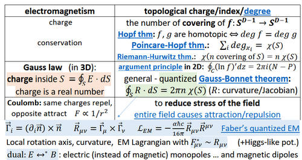
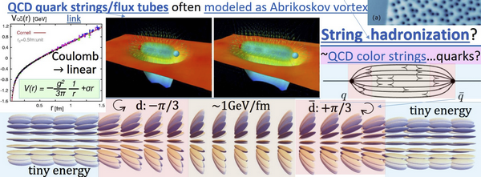
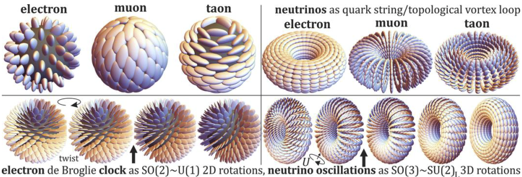

# LAGRANGIAN FRAMEWORK

A research phase evaluating whether a Lagrangian formulation could replace OpenWave's empirical wave-equation search with a first-principles derivation.

> **📍 Status — sandbox COMPLETE** (2026-04-17): all 8 M5 sandbox experiments run. **4 ✅** (Exps 1, 2, 3, 4) + **3 ⚠️** (Exps 5, 6, 7) + **1 ❌** (Exp 8).
>
> **Net verdict**: topology is the load-bearing ingredient (Exps 2, 3 confirmed charge quantization and far-field Coulomb); pure nonlinearity alone is insufficient (Exp 8 falsified Smolinski Ψ³ K-selectivity); Close's actual vector wave equation (Exp 7 v2) gives valid massless transverse wave dynamics consistent with his Dirac-equation factoring; Klein-Gordon dispersion `ω² = c²k² + m²` validated to R² = 0.999982 (Exp 4, the mass-from-potential mechanism).
>
> **Winning M5 recipe** (detailed in [1c § Winning Approach](1c_lagrangian_experiments.md#winning-approach-for-m5)): topology from Exps 2/3 + Klein-Gordon from Exp 4 + Close's Eq. 19 from Exp 7 v2 + M3 near-field standing-wave lock-in + Skyrme stabilizer + (long-term) LdG biaxial potential for lepton masses.
>
> **Documentation correction from Exp 5**: the docs' Combined W-L product form `2A·sin(kr/2)·cos(kr/2−(ωt+φ))/r` is NOT a free-wave solution — its quadrature term leaves a residual `−c²k²·sin(ωt+φ)/r ≠ 0`. The M4 code's equivalent *sum form* `A·[sin(kr+ωt+φ)+sin(kr−ωt−φ)]/(kr)` IS valid. M5 uses the sum form.
>
> This document is the **experimental plan & spec** — written before the sandbox; preserved for context. For live results see [1c_lagrangian_experiments.md](1c_lagrangian_experiments.md); conceptual walk-through in [0b_overview.md](0b_overview.md); topology / time-crystal / Zitterbewegung deep-dive in [1b_topological_defect.md](1b_topological_defect.md); M5 implementation plan in [2a_path_to_m5.md](2a_path_to_m5.md); current phase status in [0c_roadmap.md](0c_roadmap.md).

---

## WHY WE'RE DOING THIS

### The Problem

Even if OpenWave's M2 / Laplacian-Propagation Method already used a Lagrangian — implicitly. M2's PDE solver evolves `∂²ψ/∂t² = c²∇²ψ`, which IS the Euler-Lagrange equation of the simplest possible field Lagrangian: `L = ½(∂ψ/∂t)² - ½c²(∇ψ)²` (the free wave Lagrangian, V=0). So we've already done Lagrangian field theory — just with the most basic version, and on a scalar field.

M2 produced a self-stabilized standing-wave background, but the wave centers (modeled as Dirichlet ψ=0 boundary points) were invisible to the field — the wave passes through without reorganizing. Three structural limitations explain this:

- (1) the linear Lagrangian has no soliton solutions,
- (2) the scalar field has no topological structure (no winding numbers),
- (3) WCs as boundary conditions are passive constraints rather than active features built into the field.

The new approach fixes all three:

- non-linear potentials V(ψ) create solitons,
- vector fields enable topology,
- and topological defects (hedgehogs) ARE part of the field configuration rather than imposed externally.

See [`0_WAVE_EQUATION.md`](../../m3_wolff_lafreniere/research/0_WAVE_EQUATION.md) for the full M2/Lagrangian analysis.

OpenWave's M3 scalar method tested 5 wave equation candidates empirically (Wolff, LaFreniere-Marcotte, Phase-warped, Combined W-L, Weighted PSW). The best candidate (Combined Wolff-LaFreniere) produces particle lock-in and K=10 tetrahedron stability at perfect placement, but fails under perturbation and cannot produce far-field Coulomb (sinc barriers flip the force direction every λ/2).

We've been searching for the perfect wave equation as the **goal** of our research. A Lagrangian formulation inverts this: the wave equation becomes the **consequence** of a deeper choice (the Lagrangian itself, chosen from symmetries and physical principles).

### What a Lagrangian Would Give Us

If a valid Lagrangian for OpenWave can be found, it would tell us:

- **The exact wave equation** — derived from Euler-Lagrange, not guessed empirically
- **The exact energy functional** — from the Hamiltonian `H = T + V`, possibly different from our current `E = ρV(fA)²`
- **Conservation laws for free** — via Noether's theorem (energy, momentum, angular momentum automatically conserved)
- **Why charge is quantized** — as a topological invariant of the Lagrangian's symmetry group
- **What conservation laws hold** — and which don't, under which conditions
- **Connection to established physics** — QFT, GR, Standard Model formalisms

This is exactly the gap Duda identified when he asked OpenWave to commit to a canonical Lagrangian.

### The Three Challenges from Dr Duda

1. **The Lagrangian request** — Dr. Duda asked for a canonical Lagrangian / PDE for OpenWave, arguing that empirical wave-equation testing is insufficient for cross-model collaboration; a first-principles variational derivation is needed
1. **Charge quantization is required for particle stability** — without an integer-quantization mechanism, a charged particle would fragment rather than hold together. Our imposed `cos(source_offset) = ±1` label is not a physical mechanism; topology forces integer charges naturally via Gauss-Bonnet
1. **Particles as topological defects, vs. standing-wave interference patterns** — Dr. Duda's framing contrasts topologically protected defects (hedgehogs in a director field) against our current standing-wave-interference model

### The Unification Insight

Duda explicitly confirmed that **topology and standing waves are NOT mutually exclusive** — both are needed:

- **Topology** → charge and spin (integer-valued conserved quantities)
- **Standing waves** → orbit quantization (validated by Couder bouncing droplet experiments)

So OpenWave's M3 results (lock-in, K=10 tetrahedron, annihilation) stay valid as the dynamical content — topology adds the geometric skeleton that handles charge. This is additive, not replacement.

### The Approach

We will implement 8 numpy research scripts in `research/scripts/sandbox_lagrangian/` (same pattern as Phase 1 vector/scalar scripts) to test the core ideas before committing to any architecture change. None of these tests require refactoring M3 or M4 — they're standalone exploration scripts that can validate (or rule out) the Lagrangian framework quickly.

See the [What We Can Test in OpenWave](#what-we-can-test-in-openwave) section below for the full test plan.

---

## KEY PEOPLE

- **Jarek Duda** (Jagiellonian University) — inventor of ANS data compression (zstd, JPEG XL, LZFSE). Works on liquid crystal particle analogs and topological field theory. Argues OpenWave needs (1) a Lagrangian, (2) topological charge quantization to prevent the electron from "exploding". Author of *Framework for liquid crystal based particle models* (arxiv:2108.07896 v7) — the canonical reference Lagrangian for M5.
- **Robert Close** (Clark College, retired) — author of *Plane Wave Solutions to a Proposed "Equation of Everything"* (Foundations of Physics, 2025). Derives the Dirac equation from classical wave mechanics in an ideal elastic solid. Has a constructed Lagrangian with classical interpretation.
- **Manfried Faber** (Vienna University of Technology) — long-running topological-charge-as-electric-charge research program (~30 years). Faber's regularization scheme is the baseline for M5.5/M5.6 V(M) activation; recent *Universe* 2025 paper cited by Duda as canonical.
- **Yves Couder** (deceased) and team — bouncing droplet experiments showing orbit quantization, diffraction, and tunneling in classical wave-particle systems. The closest physical analog to what OpenWave simulates.
- **John Bush** (MIT) — leads the modern walking droplet research program. His *Pilot-wave hydrodynamics* (Annual Review of Fluid Mechanics, 2015) is the canonical review of the field.
- **Paul Werbos** (former NSF) — author of the Ouroboros Lagrangian / chaoiton papers (2025–2026). His chaoiton framing (time-periodic stability via Derrick's theorem) provided the third independent confirmation that static stable solitons don't exist in this framework — alongside Duda's paper and Close's correspondence.

---

## EMAIL THREAD — SUMMARY

The Lagrangian framework collaboration took place on the private "Models of Particles" Google Group with Dr. Jarek Duda (Jagiellonian University), Dr. Robert Close (Clark College, retired), and Jeff Yee between April 7–19, 2026. **Original verbatim replies have been paraphrased here to respect the private nature of the exchange, since this repository is open-source.** Attribution, dates, paper references, image links, and the full technical substance are preserved so the research thread remains.

### 2026-04-07 — Initial post (Jeff Yee)

Jeff introduced OpenWave to the group as an open-source classical-wave simulator of particle emergence in an aether-like medium, already supporting wave propagation, standing-wave formation, and attraction/repulsion/annihilation behaviors. Linked the overview video and the repository, and invited feedback from anyone working on similar models.

- Overview video: <https://www.youtube.com/watch?v=m51-OQ4mJ_Q>
- Repository: <https://github.com/openwave-labs/openwave>

### 2026-04-07 — Dr. Duda's first reply

Dr. Duda welcomed the outreach but argued that durable cross-model collaboration requires a common mathematical language. Specifically asked for OpenWave's Lagrangian / PDE so candidate forms could be discussed, and asked how the model resolves **charge quantization**. Raised the group's general position that **nuclei correspond to topological vortex knots** and asked whether OpenWave agrees.

### 2026-04-07 — Jeff's reply

Jeff responded that OpenWave operates at the PDE / field-evolution level (scalar + vector approaches) but is not yet framed around a single canonical Lagrangian — convergence toward one is an explicit in-progress goal. On charge quantization, clarified that charge is not imposed as a discrete input; the working hypothesis is that it emerges from stable standing-wave phase-opposed configurations, with quantization as a stability constraint, though a rigorous derivation remains pending. Agreed the nuclei-as-vortices direction is worth exploring if stable configurations turn out to carry topological invariants.

### 2026-04-07 — Dr. Duda (pushing on the Lagrangian)

Dr. Duda reiterated that a Lagrangian is ultimately required and drew a sharp distinction: standing-wave orbit quantization is not the same mechanism as **charge quantization of vacuum excitations with Coulomb interaction**. Highlighted that topological charge quantization — experimentally obtained in liquid-crystal particle analogs together with Coulomb interaction — is the only charge-quantization mechanism he has seen that works. Reference: <https://en.wikipedia.org/wiki/Draft:Liquid_crystal_particle_analogs>.


### 2026-04-08 — Jeff's reply

Jeff acknowledged the Lagrangian point and deferred the Lagrangian-candidate discussion to Rodrigo as the implementation lead. Confirmed that charge magnitude and rigorous Coulomb derivation remain open problems for OpenWave, and recognized that stable configurations with topological invariants could be a useful connection point to Dr. Duda's framework.

### 2026-04-07 — Dr. Duda (charge quantization is required for particle stability)

Dr. Duda argued that without charge quantization, a charged particle like the electron would fragment and dissipate. Noted that the only charge-quantization mechanisms he has seen are **topological** — used in liquid-crystal analogs and easy to formalize via Faber's approach: define the curvature of a deeper field as the electric field, which turns Gauss's law into the Gauss-Bonnet theorem, counting topological integer charges. References: liquid-crystal analogs (above) and <https://en.wikipedia.org/wiki/Gauss%E2%80%93Bonnet_theorem>. Offered to collaborate on this direction.



### 2026-04-08 — Jeff's acknowledgement

Jeff thanked Dr. Duda and reiterated the open-source motivation for OpenWave as a shared testing platform for both wave-based and topological approaches.

### 2026-04-07 — Dr. Duda's concrete entry point

Dr. Duda proposed a concrete starting experiment: recreate the Coulomb interaction for quantized topological charges as in liquid crystals, by integrating the Hamiltonian for two charges at various separations (his paper, Figure 2: <https://arxiv.org/pdf/2108.07896>). Outlined his wider Lagrangian program:

- **Landau–de Gennes** framework, with twists as the low-energy mode that behaves like quantum phase (Klein-Gordon-like equation, unifying EM and QM). Reference: <https://en.wikipedia.org/wiki/Landau%E2%80%93de_Gennes_theory>
- Natural **4D extension via teleparallelism** — adding boosts produces a second set of Maxwell equations for gravity (gravitoelectromagnetism). References: <https://en.wikipedia.org/wiki/Teleparallelism>, <https://en.wikipedia.org/wiki/Gravitoelectromagnetism>
- Beside point topological charges (elementary electric), **topological vortices** correspond to quark strings / gluon flux tubes (e.g. in string hadronization, <http://www.scholarpedia.org/article/Parton_shower_Monte_Carlo_event_generators#String_model>) — various-size knots correspond to various-size nuclei
- Also issued an open challenge to Dr. Robert Close about his own charge-quantization mechanism

### 2026-04-08 — Dr. Robert Close (introduces his equation)

Dr. Close joined the thread, offering his **nonlinear vector wave equation for the evolution of spin density** (and the equivalent first-order Dirac equation) as a candidate, consistent with relativistic QM's dynamical operators. Defined spin density as the vector field whose curl equals twice the intrinsic (aether) momentum density. Linked his paper ("Plane Wave Solutions to a Proposed 'Equation of Everything'", *Foundations of Physics* 55:27, 2025, <https://doi.org/10.1007/s10701-025-00839-0>) and recommended starting from a spherical-harmonic linear wave solution and observing what evolves.

### 2026-04-09 — Rodrigo (status update + proposed tests)

Rodrigo replied with OpenWave's current status, open challenges, 5 proposed test ideas, and a compatibility assessment between standing waves and topological defects. (Full content in the [What We Can Test in OpenWave](#what-we-can-test-in-openwave) sections below.)

### 2026-04-09 — Dr. Duda (endorses the dual approach, adds new directions)

Dr. Duda confirmed that **both topological quantization (charge, spin) and standing-wave quantization (orbits) are needed**, citing the Couder walking-droplet experiments as the classical macroscopic analog:

- Fort, Couder et al. (2010): <http://www.pnas.org/content/107/41/17515.short>
- Perrard, Couder et al. (2014): <https://www.nature.com/articles/ncomms4219>

Argued that the oscillation of resting electrons and neutrinos should be **derived** from a deeper theory, not assumed — pointing to the **time-crystal mechanism** (toy model: <https://arxiv.org/pdf/2501.04036>). Endorsed the 5 proposed experiments. Noted that the simple Coulomb calculation is missing **regularization**, which produces the running-coupling effect (reference: <https://www.mdpi.com/2076-3417/16/2/1030>). Clarified that **Klein-Gordon is an effective theory** (probability-distribution level) — the deeper model should *average to* it; his Fig. 9 in arxiv:2108.07896 shows this derivation around the electron. Stated his Lagrangian choice: **Landau–de Gennes field with Skyrme-like kinetic term** (for Lorentz covariance), with an open question about the Higgs-like potential. Confirmed the **three-lepton-family mechanism**: in 3D, three distinguishable axes give three families of topological defects — each a hedgehog of one axis, same electric field but different mass; heavier ones can decay to the lightest by field rotation, matching electron/muon/tau.

### 2026-04-09 — Dr. Duda (pedagogical path)

Dr. Duda outlined a concrete learning sequence:

1. **Walking-droplet hydrodynamical quantum analogs** for QM intuition — but these need to be combined with stable localized field configurations, e.g. topological defects as in the liquid-crystal analogs
2. **Sine-Gordon equation** as the entry point for stable massive particles with pair creation/annihilation and special relativity (Wikipedia, with mechanical coupled-pendula demo: <https://www.youtube.com/watch?v=nl5Qq5kUbEE>)
3. To combine defects with oscillation, **propulsion** is required (the electron's Zitterbewegung, <https://en.wikipedia.org/wiki/Zitterbewegung>, experimentally confirmed in Gerritsma et al., <https://link.springer.com/article/10.1007/s10701-008-9225-1>)
4. **Faber's 4D approach** automatically generates this propulsion (<https://arxiv.org/pdf/2501.04036>)

### 2026-04-17 — Rodrigo (sandbox complete, M5 plan drafted)

Rodrigo reported that all 8 sandbox experiments were complete and that the M5 / Lagrangian-Field Method build plan was drafted based on the group's directions. Summary of results:

- ✅ 4 Passed (Sine-Gordon kinks, Hedgehog Coulomb, Winding quantization, Klein-Gordon dispersion)
- ⚠️ 3 Partial (Lagrangian derivation + docs correction, biaxial lepton mechanism, Close's vector wave equation)
- ❌ 1 Failed (Smolinski Ψ³ K-selectivity)

Proposed M5 recipe combined: topological hedgehog defects + Klein-Gordon wave dynamics + Close's Eq. 19 base vector wave + retained M3 near-field lock-in + Skyrme stabilizer + LdG biaxial potential. Asked three targeted questions — to Dr. Duda about the extreme biaxial eigenvalue hierarchy needed for lepton ratios (~3477:1), to Dr. Close about fidelity of the Eqs. 19 & 21 implementation and what test would best exercise his nonlinear terms, and to Jeff about any concern with keeping M3 near-field physics alongside topology in the same engine.

Full tables, scorecards, and architectural summary are preserved in [1c_lagrangian_experiments.md](1c_lagrangian_experiments.md) and [2a_path_to_m5.md](2a_path_to_m5.md).

### 2026-04-17 — Dr. Duda's substantive feedback

Dr. Duda acknowledged that the sandbox results confirm his arxiv:2108.07896 calculations and identified two additional directions needed for a complete model:

1. **Cornell potential recreation** for quarks — quarks as excitations of a topological vortex string, with fractional charges adding to the Coulomb term a linear ~1 GeV/fm confinement-energy contribution produced by the fractional-charge conflict. Reference: <https://en.wikipedia.org/wiki/Cornell_potential>
2. **De Broglie clock** of electron / neutrino oscillation — the 1+1D toy model (<https://arxiv.org/pdf/2501.04036>) shows the mechanism, but needs to be extended to full LdGS (Landau–de Gennes + Skyrme) for electron and neutrino

On the biaxial-hierarchy question specifically: the main mass contributions for leptons come from the LdG-like potential **in regularization**, and this is the hardest part to include in simulation. The large mass separations should come primarily from axis lengths `0 < δ ≪ 1 ≪ g`, where `δ ~ ℏ` corresponds to the QM scale and `g` to gravity. The exact potential shape should be chosen using traces of powers as in standard Landau–de Gennes theory.





*(Attached images, visual summary)*: (a) QCD quark strings / flux tubes modeled as Abrikosov vortex with the Cornell potential transitioning from Coulomb to linear confinement at ~1 GeV/fm; (b) electron / muon / tau and neutrino topological vortex loops, with the de Broglie clock visualized as SO(2)~U(1) 2D rotations and neutrino oscillations as SO(3)~SU(2) 3D rotations.

### 2026-04-17 — Jeff's feedback

Jeff said he was still digesting the full message but directly answered the M3-topology coexistence question: no concern — M3 is already solving for both near-field and far-field, and he expects the two mechanisms to eventually merge. Added an important scope note: the near-field standing waves that hold particles together also hold nucleons together as the **strong force**, and further extend beyond the nucleus as the **orbital force** in EWT. That third regime will matter once M5 reaches composite-particle and atomic-scale simulations.

### 2026-04-18 — Dr. Close's feedback

Dr. Close responded positively to the results and provided a crucial architectural pointer: in his paper, the most likely candidate for a **particle equation is Equation 23**, not Eq. 21 (the Dirac factorization). Eq. 23 preserves **zero divergence of spin density** (`∇·s = 0`). Even with the nonlinear term, he expected dispersion in most cases, but suggested that certain amplitudes of certain harmonic waves could produce longer-lived localized energy — an unstable particle or resonance. Recommended exploring a **wide range of amplitudes**, with `l = 1` as the most interesting harmonic mode, and maximum displacement comparable to the wavelength (or half / twice). Cautioned that truly stable non-radiating solutions likely require infinite-domain modeling.

### 2026-04-19 — Rodrigo (integrating feedback)

Rodrigo confirmed the M5 build-plan updates driven by the three replies:

- Adopted Dr. Close's **Eq. 23** as the particle equation (replacing Eq. 21), with `∇·s = 0` enforced at each time step, and the `l = 1` amplitude-sweep protocol for M5.2 resonance-hunting. Success criterion reframed to long-lived resonance with measurable lifetime
- Adopted the biaxial hierarchy `0 < δ ≪ 1 ≪ g` as the M5.6 lepton-mass parameterization. Added **M5.7** (Cornell potential via topological vortex string) and **M5.8** (de Broglie clock / Zitterbewegung validation) as new phases
- Retained M3's near-field physics in M5 based on Jeff's note that it covers three force regimes (intra-particle, strong, orbital)

Asked one targeted pre-implementation clarification to Dr. Close (exact interpretation of Eq. 23 — direct form vs. vector-potential `s = ∇×A` vs. divergence-cleaning projection; and whether the amplitude sweep should span the full `m ∈ {−1, 0, +1}` dipole family), plus an optional follow-up to Dr. Duda about whether an existing regularization scheme from his arxiv papers should be ported directly.

### 2026-04-19 — Dr. Duda (follow-up on calibration and regularization)

Dr. Duda clarified two points refining M5.6:

1. The `δ, g` axis-length parameters describe QM and gravity contributions to the Lagrangian, but their **exact values require numerical simulation** — there is no analytical form to pull from; treat them as calibration parameters
2. On regularization: the specific form is still an open research question, but **Manfried Faber's existing scheme (slightly different potential, demonstrably produces the running-coupling effect) is the recommended starting point**. Papers:
    - *Universe* 11 (2025) 113: <https://www.mdpi.com/2218-1997/11/4/113>
    - arXiv preprint: <https://arxiv.org/pdf/2604.12021>

### Open questions (as of 2026-04-19)

- Dr. Close's confirmation of the exact implementation form of Eq. 23 (direct / vector-potential / divergence-cleaning) — pending

---

## REPLY ANALYSIS — KEY INSIGHTS FOR M5 (2026-04-19)

Three replies, three distinct action items for M5. These refinements are incorporated into [2a_path_to_m5.md](2a_path_to_m5.md) § "Group Feedback (2026-04-17/18)".

### From Jarek Duda

1. **Cornell potential recreation for quarks** — concrete validation target beyond leptons. Quarks are excitations of a *quark string / topological vortex*; fractional charges add to Coulomb a **linear ~1 GeV/fm confinement energy** from the conflict produced by fractional charges. This is the topological analog of QCD confinement — the `V(r) = −α/r + σ·r` form — and becomes a **Phase M5.7 headline target** (composite-particle / strong-force validation on M5)
2. **De Broglie clock (Zitterbewegung) in full LdGS** — the 1+1D phi-4 kink toy-model from arxiv 2501.04036 shows the mass-driven oscillation mechanism; for electron and neutrino we'd need to run it in full Landau-de Gennes + Skyrme dynamics. This is a direct validation target for Exp 6.1 / M5.6
3. **LdG regularization is where lepton masses come from, and it is the hardest part to include** — flags the specific numerical challenge: implementing the singular / divergent parts of V(Q) without destabilizing the leapfrog PDE
4. **Biaxial hierarchy has a physical origin**: masses differ via axis lengths `0 < δ << 1 << g`, where `δ ~ ℏ` (QM scale) and `g` (gravity scale). **This is a physics-motivated explanation for the ~3477:1 ratio the sandbox required** — it's not ad-hoc tuning; it's the natural hierarchy of three widely-separated physical scales (QM, unity, gravity). Use traces of powers in original LdG theory to pick the exact potential shape
5. **Validation**: Jarek explicitly endorsed that our sandbox results confirm his arxiv:2108.07896 calculations

### From Jeff Yee

1. **M3 + topology coexistence is fine** — direct confirmation of the M5 architectural choice; Jeff expects the near-field and far-field mechanisms to eventually converge
2. **Orbital force insight (new scope)**: the same standing waves that bind K=1 neutrinos into electrons, and later bind quarks into nucleons (strong force), **also extend beyond the nucleus as the orbital force** (electron-nucleus binding in atoms). This is a unified standing-wave mechanism spanning *three* force regimes: intra-particle (lock-in), intra-nucleus (strong), and atomic (orbital). Strong argument for **keeping M3's near-field physics intact in M5** — it's not a stopgap, it's the physics for composite particles and atoms

### From Robert Close

1. **Use Eq. 23, not Eq. 21, as the particle equation** — preserves zero divergence of spin density (∇·s = 0), which is a physical invariant our current Exp 7 implementation doesn't enforce. **Direct M5 architectural refinement**: M5.2 should implement Eq. 23 for particle dynamics, keep Eq. 19 as the free-field linear limit, and enforce ∇·s = 0 at each leapfrog step
2. **Expect dispersion, search for resonances** — even with the nonlinear term, most initial conditions will disperse. The particle-like solutions are **unstable resonances at specific amplitude/wavelength combinations**, not generic solitons. This reframes the search: we're hunting for resonances, not static solitons
3. **Concrete amplitude-sweep recipe**: probably `l = 1` harmonic wave, maximum displacement comparable to wavelength (or half / twice). **This becomes a concrete M5.2+ test protocol**: sweep amplitude `A ∈ {0.25λ, 0.5λ, 1.0λ, 2.0λ}` with `(l, m) = (1, 0)` seed and look for extended-lifetime localization
4. **Infinite-domain caveat**: fully stable non-radiating solutions may require infinite-domain modeling. Implication for M5: we expect to see *long-lived resonances* (measured lifetime) rather than stable fixed points, even in the best case — set our M5.4 success criterion accordingly (lifetime thresholds, not perfect stability)

### Compact M5 Plan Refinements (applied to 3c)

| Area | Change | Source |
| --- | --- | --- |
| M5.2 Wave dynamics | Implement Close's **Eq. 23** as particle equation; enforce `∇·s = 0` per step; Eq. 19 as linear limit | Robert |
| M5.2 Validation | Add amplitude-sweep protocol: Y_1^0 seed at A ∈ {0.25, 0.5, 1.0, 2.0}·λ; measure resonance lifetime | Robert |
| M5.4 Headline test | Success criterion = long-lived resonance (measured lifetime), not perfect stability | Robert |
| M5.6 Biaxial LdG | Axis hierarchy `0 < δ << 1 << g` with δ~ℏ is the physics-motivated source of lepton-mass separation — implement this way, not as free tuning | Jarek |
| **New M5.7** (Cornell / quark confinement) | After M5.4 succeeds: seed fractional-charge topological vortex string; measure `V(r) = −α/r + σ·r` with `σ ≈ 1 GeV/fm` | Jarek |
| **New M5.8** (de Broglie clock) | Drive a single defect; measure intrinsic oscillation frequency; compare to `ω = 2mc²/ℏ` (Zitterbewegung) for electron and neutrino | Jarek |
| M5 retention of M3 | M3 near-field standing waves stay because they carry *three* force regimes: intra-particle, strong (intra-nucleus), and orbital (atomic) | Jeff |

### Follow-up from Jarek Duda (2026-04-19) — on δ, g calibration and regularization scheme

In response to our follow-up question about δ, g values and LdG regularization, Jarek clarified two points that refine M5.6:

1. **δ, g require numerical simulation, not ab-initio derivation.** Jarek clarified that while these axis-length parameters describe the Lagrangian contributions of QM and gravity respectively, their exact values can only be determined by numerical simulation — there is no closed-form analytical derivation. **M5 implication**: treat (δ, g) as **calibration parameters** — the plan in M5.6 was already aimed this way; Jarek confirms there is no pre-solved analytical form to pull from. We will iterate them against observed lepton-mass ratios and other measurable physics
2. **LdG regularization — port Manfried Faber's scheme as the starting point.** Jarek noted that while the specific regularization form is still an open research question, Manfried Faber has already worked out a scheme for a closely-related (slightly simpler) potential that demonstrably produces the running-coupling effect. Jarek pointed to Faber's two papers:
    - Manfried Faber et al., *Universe* 11 (2025) 113: <https://www.mdpi.com/2218-1997/11/4/113>
    - arxiv preprint: <https://arxiv.org/pdf/2604.12021>

   Faber's scheme uses a simpler potential than full biaxial LdG but produces the **running-coupling effect** — the same phenomenon Jarek flagged in his April 9 reply as what our simple Coulomb calculation would be missing. **M5 implication**: M5.6 imports Faber's regularization approach as the baseline, adapts it to LdG-with-Skyrme, and uses running-coupling recovery as a validation target. This converts the "hardest numerical step" from "invent something new" to "port + adapt an existing working scheme"

**Net status after Jarek's follow-up**: the precise regularization form remains an open research question, but we now have a concrete starting point (Faber's two papers) rather than starting from scratch. This derisks M5.6 meaningfully.

---

## DR DUDA'S FIRST REPLY — KEY INSIGHTS

### 1. Both Topological AND Standing Wave Quantization Are Needed

Duda explicitly agrees: topological quantization handles charge and spin, but standing wave quantization handles **orbit quantization** — different mechanisms for different physics. This validates our dual approach.

He cites two landmark experiments showing orbit quantization in classical wave-particle systems (bouncing droplets on vibrating fluids):

- **Fort, Couder et al. (2010)**: bouncing droplets on a vibrating fluid surface generate quantized orbital states when the wave-field "memory" spans the full trajectory. Macroscopic angular momentum quantization from path memory.
- **Perrard, Couder et al. (2014)**: walking droplets confined in a harmonic potential self-organize into discrete stable orbits with quantized spatial extent and angular momentum — quantum-like eigenstates from classical wave-particle dynamics.

**Connection to OpenWave**: these experiments are the closest physical analog to what we simulate — wave centers (droplets) interacting with their own wave field (standing waves on fluid surface) and exhibiting quantized behavior. Our sinc lock-in wells ARE orbit quantization. The topological charge (Duda) and orbit quantization (our standing waves) are complementary, not competing.

### 2. Time Crystals — Why Resting Particles Oscillate

Duda points out that we *assume* oscillations (our wave centers oscillate at frequency f₀) but we should *derive* them from a deeper theory. His time crystal mechanism provides this: a scalar field with curvature coupling naturally produces mass-driven periodic oscillations (kinks that oscillate without external driving).

- **Duda (2025)**: "Time crystal phi-4 kinks by curvature coupling as toy model for mechanism of oscillations propelled by mass" — a phi-4 field `V(ψ) = k·(ψ²-1)²` with curvature coupling creates kinks that oscillate with frequency proportional to mass. This is the *origin* of the oscillation, not an assumption.

**Connection to OpenWave**: this directly addresses our M5 Time Dynamics question: "why does the medium oscillate?" In our framework, we take f₀ = 10²⁵ Hz as given. Duda's time crystal mechanism would *derive* this frequency from the field's potential. The phi-4 potential `(ψ²-1)²` is closely related to Smolinski's quartic potential `k·ψ⁴` — both are non-linear potentials that come from valid Lagrangians.

### 3. Coulomb Calculation Needs Regularization

Duda frames the hedgehog energy vs distance calculation as the natural first step but warns the simple calculation is missing **regularization** leading to the **running coupling effect** — the effective charge strength changes with distance (energy scale). This is a known QFT phenomenon (the fine-structure constant α is not truly constant — it "runs" with energy).

**Connection to OpenWave**: our energy `E = ρV(fA)²` with variable λ(r) from Yee & Hauger shells already has a form of regularization (the wavelength changes near the core, modifying the effective coupling). The running coupling may be the topological equivalent of our variable-λ(r) profile.

### 4. Klein-Gordon Is Effective, Not Fundamental

Duda clarifies: Klein-Gordon describes the *probability distribution* of particles (effective/averaged behavior), not the deeper field dynamics. The deeper model should *average to* Klein-Gordon — see his Fig. 9 in arXiv:2108.07896 for the derivation around an electron.

**Implication for Test 4**: we should not expect the twist dynamics to exactly reproduce Klein-Gordon. Instead, we should check whether the time-averaged twist behavior statistically converges to Klein-Gordon — a weaker but more physically correct test.

### 5. Lagrangian: LdG + Skyrme Kinetic Term, Open Potential

Duda's specific Lagrangian choice: **Landau-de Gennes field with Skyrme-like kinetic term** (for Lorentz covariance). The open question is the Higgs-like potential V(M) — its specific form is not yet determined. This is where our simulation experiments could contribute: test different potentials and see which produces the correct physics.

### 6. Three Lepton Families — Confirmed

Duda confirms the mechanism: 3 distinguishable axes in 3D → 3 families of topological defects. Each is a hedgehog of one axis. Same electric field (same topology), different mass (different axis energy). The heavier ones can decay to the lightest by field rotation — exactly electron/muon/tau behavior.

---

## DR DUDA'S SECOND REPLY — KEY INSIGHTS

### 7. Sine-Gordon Equation as Starting Point

Duda recommends the **Sine-Gordon equation** as the entry point for stable massive particles:

```text
∂²φ/∂t² - c²∂²φ/∂x² + (m²c²/ℏ²)·sin(φ) = 0
```

This equation is remarkable because it produces:

- **Soliton (kink) solutions**: stable, localized, particle-like structures that maintain their shape during propagation — the kind of stable localized field configurations Duda identifies as the essential ingredient
- **Pair creation/annihilation**: kink + anti-kink collisions can annihilate or create new pairs — directly analogous to our electron-positron annihilation simulations
- **Entire special relativity**: solitons experience Lorentz contraction and time dilation naturally — relativistic behavior emerges from the wave equation, not imposed
- **Mechanical model**: a lattice of coupled pendula reproduces Sine-Gordon physics visually (Duda's YouTube link) — the closest macroscopic analog to what we simulate

**Connection to OpenWave**: the Sine-Gordon equation is a non-linear wave equation with a sinusoidal potential `V(φ) = 1 - cos(φ)`. This sits between:

- Our free wave equation `V = 0` (Combined W-L, linear, sinc nodes)
- Smolinski's quartic `V = k·ψ⁴/4` (cubic non-linearity)
- Close's nonlinear vector equation (Dirac from elastic solid)

The Sine-Gordon potential creates TOPOLOGICALLY PROTECTED solitons — the kink connects two different vacuum states (φ = 0 and φ = 2π), and you cannot continuously deform it away. This is **exactly Duda's topological charge quantization** realized in 1D.

**Key insight**: the coupled pendulum mechanical model could be our simplest Test 1 — implement Sine-Gordon in 1D, verify kink stability, pair creation/annihilation, and Lorentz contraction. This would give us intuition before tackling the full 3D hedgehog tests.

### 8. Zitterbewegung — Electron Trembling Motion

Duda points to **Zitterbewegung** ("trembling motion") as the physical mechanism that needs to emerge: the electron oscillates at frequency `2mc²/ℏ ≈ 1.6 × 10²¹ Hz` even at rest. This is the origin of the electron's spin and magnetic moment.

- **Wikipedia**: <https://en.wikipedia.org/wiki/Zitterbewegung>
- **Experimental confirmation**: Gerritsma et al. (2010) observed Zitterbewegung in a trapped-ion simulation of the Dirac equation (<https://link.springer.com/article/10.1007/s10701-008-9225-1>)

**Connection to OpenWave**: our wave centers oscillate at f₀ = 10²⁵ Hz — but we ASSUME this frequency. Zitterbewegung says the electron's oscillation frequency is `2mc²/ℏ` — DERIVED from its mass. This connects to Duda's time crystal mechanism: the oscillation is propelled by mass, not assumed.

Our f₀ is the medium's fundamental frequency. The electron's Zitterbewegung frequency is different (10²¹ vs 10²⁵ Hz). The relationship between the two frequencies (ratio ~ 10⁴) may relate to the electron's K=10 structure or the fine-structure constant.

### 9. Faber's 4D Approach → Automatic Propulsion

Duda points to Faber's approach (his own 4D extension to teleparallelism, arXiv:2501.04036) as automatically producing this propulsion — the Zitterbewegung oscillation emerges naturally from the 4D field dynamics without being imposed. The kink in the phi-4 field oscillates because of the curvature coupling, and this oscillation IS the electron's trembling motion.

### Duda's Recommended Learning Path

Duda is giving us a clear pedagogical sequence:

1. **Walking droplets** → intuition for QM from classical waves (Couder experiments)
1. **Sine-Gordon equation** → stable massive particles, pair creation, special relativity (1D first)
1. **Liquid crystal particle analogs** → topological charge quantization (3D hedgehogs)
1. **Zitterbewegung** → why particles oscillate (mass-driven trembling)
1. **Faber's 4D approach** → combines all of the above (LdG + Skyrme + teleparallelism)

This maps to a test sequence for OpenWave:

- **Test 1**: Sine-Gordon 1D — kink solitons, pair creation, Lorentz contraction
- **Tests 2-3**: Hedgehog energy + topological charge (3D director field)
- **Test 4**: Klein-Gordon from twist dynamics
- **Test 5**: Lagrangian derivation
- **Test 6**: Three lepton families
- **Test 7**: Close's nonlinear vector wave equation
- **Test 8**: Smolinski's non-linear Ψ³ — direct K-selectivity test on familiar scalar setup

---

## Dr Duda's Three Challenges to OpenWave

### Challenge 1: The Lagrangian request

**The problem**: OpenWave currently operates at the PDE / field evolution level, testing candidate wave equations empirically (5 wave equations tested in M3, selected by best K=10 stability). We do NOT have a canonical Lagrangian from which our wave equations are derived.

**Why it matters**:

- A Lagrangian DERIVES the equations of motion via Euler-Lagrange equations — instead of testing 5+ equations empirically, the correct one would emerge from first principles
- Noether's theorem automatically provides conservation laws (energy, momentum, angular momentum) — we currently check these manually
- It constrains which PDEs are physically valid — not all PDEs come from a valid Lagrangian
- It connects to established physics formalisms (QFT, GR, Standard Model) — making OpenWave's results interpretable by the broader physics community
- It enables variational methods and stability analysis — deriving which configurations are stable minima of the action

**Our current state**: the Combined Wolff-LaFreniere equation `ψ = 2A·sin(kr/2)·cos(kr/2-(ωt+φ))/r` was selected empirically for K=10 tetrahedron stability. Its phase component (`A·sin(kr)/r`) *is* a free-wave solution — it's equivalent to a pure standing wave `2A·sin(kr)·cos(ωt+φ)/(kr)`, which decomposes into in-wave + out-wave spherical solutions of `∂²ψ/∂t² = c²∇²ψ`. **But its quadrature component `A·(1-cos(kr))/r·sin(ωt+φ)` is NOT a free-wave solution** — verified by sympy in Experiment 5. The full Combined W-L produces a residual `-A·c²k²·sin(ωt+φ)/r ≠ 0` when substituted into the d'Alembertian, meaning the formula implicitly includes an external source term or comes from a non-trivial Lagrangian we have yet to identify. This is an important empirical fact: the LaFreniere quadrature piece is a modeling choice, not a free-field solution. Boundary conditions, source terms, and nonlinear extensions are also modeling choices, not derived from a Lagrangian.

### Challenge 2: Charge quantization is required for particle stability

**The problem**: in our model, `charge_sign = cos(source_offset)` is imposed as ±1. Nothing in the wave physics FORCES charge to be integer-valued. A standing wave configuration could in principle have any phase offset (not just 0 or π), which would give fractional charge. There's no topological protection preventing the particle from dissipating.

**Why it matters**:

- Quantized modes from standing waves explain orbit quantization (electron shells), but NOT charge quantization
- Without a mechanism that FORCES charge to be exactly ±1 (or 0), the model can't explain why all electrons have exactly the same charge
- A charged particle held together only by standing wave interference has no protection against perturbations that would spread the charge out — it would "explode"
- This is distinct from K-selectivity (which K values form stable particles) — even if K=10 is stable, the charge on that particle needs to be quantized

**Our current state**: charge is imposed via source_offset (0 = positron, π = electron). Phase 1 confirmed charge is NOT emergent from wave interference in the scalar model. Phase 1c found L→T spin conversion distinguishes charges but doesn't quantize them. This is an unsolved fundamental problem.

### Challenge 3: Particles as topological defects vs. standing waves

**The problem**: Duda argues particles should be understood as topological defects (hedgehogs, vortices) in a field, similar to defects in liquid crystals — not as standing wave configurations.

**Key distinction**:

- **Standing waves** (our model): particles are localized interference patterns. Stability comes from constructive interference at nodes. Can be disrupted by perturbation (as we demonstrated — K=10 breaks under perturbation)
- **Topological defects** (Duda's model): particles are field configurations with integer winding numbers. Stability comes from topology — you CANNOT continuously deform a hedgehog into a smooth field. Protected against ALL perturbations, not just small ones

**Our current state**: we model particles as standing wave structures. But several of our observations hint at topological structure:

- The dual vs non-dual geometry (K=1,8,20 neutral vs K=10,28,50 charged) has a topological flavor — it's about the SYMMETRY of the configuration, not its amplitude
- Smolinski's winding number classification of particles (sphere S² vs torus T²) is explicitly topological
- Butto's vortex electron model (toroidal flow, spin-1/2 from differential rotation) is a topological vortex

---

## Dr Duda's Framework — The Mathematics

### The Field: Director Field n(x)

Instead of a scalar displacement ψ(r,t), the fundamental object is a **unit vector field** `n(x)` at every point in space — a "director" that specifies the local orientation of the medium. This is the order parameter of a nematic liquid crystal.

More generally, Duda uses a **symmetric matrix field** `M(x) = O·D·O^T` where O is orthogonal (rotation) and `D = diag(λ₁, λ₂, λ₃)` encodes the ellipsoid shape — directly analogous to our 6-phasor ellipse model in M4.

### The Lagrangian (LdGS model)

```text
L = -Σ F_μν_αβ · F^μν_αβ  -  V(M)

where:
  F_μν_αβ = [∂_μ M, ∂_ν M]_αβ     (matrix commutator of spacetime derivatives)
  V(M) = Landau-de Gennes potential  (prefers specific eigenvalue set)
```

The potential in Landau-de Gennes form:

```text
V_LdG = a·Tr(M²) - b·Tr(M³) + c·(Tr(M²))²
```

This has the same structure as the Higgs potential — it regularizes singularities to finite energy. The minima of V define the "vacuum state" (undisturbed medium).

### Topological Charge = Winding Number

A **hedgehog** defect is a field configuration where `n(x) = x̂` (director points radially outward from a center). The topological charge is the winding number:

```text
Q = (1/4π) ∮_S (∂_u n × ∂_v n) · n  du dv
```

This integral over any closed surface S surrounding the defect returns an **integer** — guaranteed by the Gauss-Bonnet theorem. Q = +1 for hedgehog (positive charge), Q = -1 for anti-hedgehog (negative charge). No fractional charges possible.

This is Duda's answer to charge quantization: define the electric field as the curvature of the director field, then Gauss's law `∮ E·dA = Q/ε₀` becomes the Gauss-Bonnet theorem counting topological winding numbers.

### Coulomb Potential from Topology (no sinc!)

From Duda's paper (arXiv:2108.07896, Figure 2): integrating the total field energy (Hamiltonian) for two hedgehog defects at various distances gives:

```text
E(d) ≈ 1590 + 25.6/d
```

This is a clean **1/r Coulomb potential** — no sinc oscillation, no cos(k·Δr) barriers. The Coulomb interaction emerges from the **global topological structure** of the field, not from pairwise wave interference.

**Why no sinc**: the sinc oscillation in our model comes from coherent monochromatic wave interference. The topological approach doesn't use wave superposition for the Coulomb mechanism — it uses the field curvature around defects. Different mathematical structure, different result.

### Three Forces from Three Degrees of Freedom

The vacuum state `D = diag(g, 1, δ, 0)` with `g >> 1 >> δ > 0` separates curvature into three energy scales:

| Degree of freedom | Energy scale | Physics | Governing equation |
| --- | --- | --- | --- |
| Tilts (field direction) | High | Electromagnetism | Maxwell equations |
| Twists (field rotation) | Low | Quantum phase | Klein-Gordon equation |
| Boosts (0th time axis, 4D) | Very low | Gravity | GEM (2nd Maxwell set) |

**EM from tilts**: the two tilt degrees of freedom of the director field satisfy Maxwell's equations. Electric field = tilt curvature. Magnetic field = tilt curl. Charge = topological winding number of tilts.

**QM from twists**: the twist degree of freedom (rotation of the director around its own axis) satisfies the **Klein-Gordon equation**. This is the quantum mechanical wave equation for a massive scalar field. The twist phase IS the quantum phase ψ = e^(iφ).

**Gravity from boosts**: extending from 3D SO(3) to 4D SO(1,3) by adding a time axis (Einstein's teleparallelism), perturbations of the 0th axis satisfy gravitoelectromagnetic (GEM) equations — a second copy of Maxwell's equations with G replacing 1/ε₀.

---

## Connection to OpenWave's Existing Framework

| OpenWave concept | Duda's equivalent | Notes |
| --- | --- | --- |
| M4 vector displacement (ψ_x, ψ_y, ψ_z) | Director field n(x) | Both are 3D vector fields on a grid |
| 6-phasor ellipse (R, Φ per axis) | Order parameter tensor Q_ij | Both encode ellipsoidal shape + orientation |
| L→T spin conversion | Tilt → twist conversion | Both are mode coupling in the vector field |
| Standing wave particle | Topological defect (hedgehog) | Different stability mechanism (interference vs topology) |
| Phase offset (0 vs π) | Winding number (+1 vs -1) | Imposed ±1 vs topologically quantized ±1 |
| Smolinski's Degraded EMC Wall | Defect core boundary | Both separate internal dynamics from external field |
| K=10, K=28, K=50 hierarchy | Lepton families from biaxial hedgehog | 3 distinguishable axes → 3 mass scales |
| Sinc nodes → lock-in | Not present in topological Coulomb | Fundamentally different force mechanism |
| Energy `E = ρV(fA)²` | LdG free energy `F = elastic + V(Q)` | Both compute energy from field configuration |
| `F = -∇E` force | Same: `F = -∇H` from Hamiltonian | Same variational principle |

**Key compatibility**: Duda's framework does NOT contradict standing waves — it adds a **topological layer** on top. The standing wave structure could be the internal dynamics of a topological defect. The defect's core has complex wave dynamics (our near-field), while the far-field is governed by topology (giving clean Coulomb). This maps to Smolinski's two-domain model: Energy Domain (internal, toroidal, non-linear) vs EMC Domain (external, spherical, topological).

---

## What We Can Test in OpenWave

### Test 1: Sine-Gordon 1D Solitons (intuition foundation)

Added after Duda's second reply. Simplest entry point into the topological soliton framework — 1D Sine-Gordon equation with kink/anti-kink solutions. Build intuition before tackling 3D hedgehogs.

```text
Setup:
  - 1D grid with field φ(x,t)
  - Sine-Gordon equation: ∂²φ/∂t² - c²∂²φ/∂x² + (m²c²/ℏ²)·sin(φ) = 0
  - Initial condition: kink solution φ(x,0) = 4·arctan(exp((x-x₀)/L))
  - Time evolution: leapfrog or RK4
  - Tests:
    1. Verify kink stability (no dispersion over many periods)
    2. Kink + anti-kink collision: pair annihilation or pass-through
    3. Two kinks moving toward each other: Lorentz contraction visible?
    4. Compute kink rest energy E = 8·m·c² and verify
    5. Mechanical analog: implement coupled pendula chain, verify same physics

Reference: coupled pendula visualization https://www.youtube.com/watch?v=nl5Qq5kUbEE
```

**Success criteria**:

- Kink propagates without dispersing (topologically stable)
- Kink + anti-kink can annihilate (pair annihilation analog)
- Moving kinks show Lorentz-like contraction (relativistic kinematics from wave equation)

**Why this matters**: Sine-Gordon is the simplest equation that produces all of: stable particles (kinks), pair creation/annihilation, and special relativity. It's the closest 1D analog to what we want in 3D. If we can reproduce this, we have a solid foundation for the 3D hedgehog tests.

**Infrastructure**: standalone numpy script in `sandbox_phase3_lagrangian/`, ~200 lines. 1D grid, simple PDE evolution. No M3/M4 refactor.

### Test 2: Hedgehog Energy vs Distance (Coulomb verification)

Implement two hedgehog defects in a 3D director field on M4's grid. Compute total field energy as a function of separation. Verify E(d) ~ const + C/d (1/r Coulomb) without sinc oscillation.

```text
Setup:
  - 3D grid (existing M4 infrastructure)
  - Director field n(x) = unit vector at each voxel
  - Hedgehog 1 at position r₁: n = (x-r₁)/|x-r₁|
  - Hedgehog 2 at position r₂: n = (x-r₂)/|x-r₂|
    (or anti-hedgehog: n = -(x-r₂)/|x-r₂|)
  - Relax field to minimize elastic energy (gradient descent or conjugate gradient)
  - Measure total energy at separations from 2λ to 20λ
  - Compare: E(d) vs 1/r reference

Hamiltonian: H = Σ_voxels [ K₁(∇·n)² + K₃(n×(∇×n))² ]  (Frank elastic energy)
  where K₁ = splay, K₃ = bend elastic constants
  (one-constant approximation: K₁ = K₃ = K → H = K·Σ|∇n|²)
```

**Success criterion**: E(d) fits const + C/d with R² > 0.99 across all separations, no oscillation.

### Test 3: Topological Charge Quantization

Compute the winding number integral on closed surfaces surrounding defects. Verify it returns integers only.

```text
Q = (1/4π) ∮_S (∂_u n × ∂_v n) · n  du dv

Discretized on a spherical mesh surrounding the defect center.
Should return Q = +1 for hedgehog, Q = -1 for anti-hedgehog, Q = 0 for no defect.
Test: perturb the field (noise, deformation) and verify Q remains integer.
```

**Success criterion**: Q returns integer ±1 regardless of surface shape or field perturbation.

### Test 4: Klein-Gordon from Twist Dynamics

In the uniaxial limit (one distinguished axis), evolve the twist degree of freedom dynamically. Verify it satisfies the Klein-Gordon equation `(∂²/∂t² - c²∇² + m²)φ = 0` where φ is the twist angle.

```text
Setup:
  - Director field with small twist perturbation
  - Evolve using Euler-Lagrange equations from LdG Lagrangian
  - Measure dispersion relation ω²(k)
  - Klein-Gordon predicts: ω² = c²k² + m²  (massive dispersion)
  - Mass m related to the potential curvature (eigenvalue splitting δ)

Compare with our standing wave: ω = ck (massless dispersion).
The mass term would come from the Landau-de Gennes potential.
```

**Success criterion**: dispersion relation fits ω² = c²k² + m² with measurable mass gap.

### Test 5: Can Our Combined W-L Equation Be Derived from a Lagrangian?

Check whether our empirically-selected wave equation is the Euler-Lagrange equation of a known Lagrangian. If yes, that Lagrangian is our candidate. If no, our equation may not conserve energy properly.

```text
Standard wave equation Lagrangian:
  L = ½(∂ψ/∂t)² - ½c²(∇ψ)²
  → Euler-Lagrange: ∂²ψ/∂t² = c²∇²ψ  ✓  (our Combined W-L is a solution)

With Landau-de Gennes potential V(ψ):
  L = ½(∂ψ/∂t)² - ½c²(∇ψ)² - V(ψ)
  → Euler-Lagrange: ∂²ψ/∂t² = c²∇²ψ - V'(ψ)

With Smolinski's cubic non-linearity:
  V(ψ) = k·ψ⁴/4  →  V'(ψ) = k·ψ³
  → Euler-Lagrange: ∂²ψ/∂t² = c²∇²ψ - k·ψ³  (Smolinski's soliton equation!)
```

**Key insight**: Smolinski's non-linear wave equation `(∂²/∂t² - c²∇²)Ψ + k·Ψ³ = 0` DOES come from a valid Lagrangian with quartic potential. This connects our existing non-linear research (Phase 1d) directly to the Lagrangian framework Duda is asking for.

### Test 6: Three Lepton Families from Biaxial Hedgehog

A biaxial nematic hedgehog (3 distinguishable axes instead of 1) should produce 3 types of hedgehog configurations with the same topological charge but different energy/mass. Compute their energy ratios and compare to electron/muon/tau mass ratios.

```text
Setup:
  - Biaxial order parameter: D = diag(λ₁, λ₂, λ₃) with λ₁ ≠ λ₂ ≠ λ₃
  - Three hedgehog types: defect aligned with axis 1, 2, or 3
  - Each has Q = ±1 (same charge) but different energy (different mass)
  - Compute energy of each type
  - Compare ratios to: m_e = 0.511 MeV, m_μ = 105.7 MeV, m_τ = 1776.8 MeV

EWT comparison: K=10 (electron), K=28 (muon), K=50 (tau).
Duda's approach: same topology, different axis orientation → different mass.
```

---

## Implementation Feasibility

All 8 tests are **doable without refactoring M4 or M3**. The director field / liquid crystal / non-linear scalar physics is fundamentally different from our wave propagation — they live as standalone numpy research scripts (same pattern as `sandbox_phase1_vector/`, `sandbox_phase1_scalar/`). Scripts go in `research/scripts/sandbox_lagrangian/`.

| Test | Approach | Effort | M4 refactor? |
| --- | --- | --- | --- |
| 1. Sine-Gordon 1D solitons | Standalone numpy. 1D Sine-Gordon PDE, kink/anti-kink creation, pair annihilation, Lorentz contraction | Low-Medium (~200 lines) | No |
| 2. Hedgehog energy vs distance | Standalone numpy. 3D grid with unit vector field `n(x)`, Frank elastic energy `H = K·Σ\|∇n\|²`, gradient descent relaxation, energy vs separation sweep | Medium (~300 lines) | No |
| 3. Topological charge quantization | Function inside Test 2 script. Discretize sphere, compute winding number integral, verify integer under perturbation | Low (~50-100 lines on top of Test 2) | No |
| 4. Klein-Gordon from twist | Standalone numpy. Initialize twist perturbation, evolve with LdG Euler-Lagrange (leapfrog), FFT for dispersion ω(k) | Medium (~200 lines) | No |
| 5. Lagrangian derivation | Math + optional sympy. Verify Combined W-L is Euler-Lagrange of standard wave Lagrangian. Check Smolinski Ψ³ connection | Low (pen-and-paper + ~50 lines sympy) | No |
| 6. Three lepton families | Extension of Test 2 with 3x3 matrix field. Most complex — 6 independent components per voxel, more complex energy functional | Medium-High (~400 lines) | No |
| 7. Close's nonlinear vector wave eq | Standalone numpy. 3D vector spin density field, seed with spherical harmonic, time-domain PDE evolution | Medium (~300-400 lines) | No |
| 8. Smolinski's non-linear Ψ³ | Standalone numpy. 3D scalar grid, time-domain PDE with `-k·Ψ³` term, multiple WCs, direct K-selectivity test | Medium (~300 lines) | No |

**Decision strategy**: Run all 8 numpy script tests first. After reviewing the results, select the winning equation/approach and implement it in M4 (or a new M5 method if the architecture change is significant).

**Recommended order**: Test 1 (Sine-Gordon 1D, build intuition) → Tests 2+3 together (hedgehog energy + topological charge — Coulomb from topology vs our sinc Coulomb) → Test 5 (math, informs everything) → Test 8 (Smolinski Ψ³, direct K-selectivity test on familiar scalar M3-like setup) → Test 4 (Klein-Gordon dynamics) → Test 6 (three lepton families, most complex) → Test 7 (Close's equation).

**Future scaling**: if a test validates and we want GPU-accelerated 3D visualization, that would mean new Taichi kernels (possibly a new method M5 alongside M3/M4) — but that's a future decision based on results, not a prerequisite.

---

## Compatibility Assessment: Standing Waves vs Topological Defects

**Not mutually exclusive.** The two frameworks may describe different aspects of the same physics:

| Aspect | Standing waves (EWT/OpenWave) | Topological defects (Duda) |
| --- | --- | --- |
| What IS the particle? | Interference pattern of in/out waves | Winding number of director field |
| What stabilizes it? | Constructive interference at nodes | Topological protection (integer winding) |
| What is charge? | Phase offset (imposed ±1) | Winding number (quantized by topology) |
| What is Coulomb force? | Sinc-modulated interference (problematic) | Field curvature around defect (clean 1/r) |
| What is spin? | L→T wave conversion | Handedness of the defect |
| What is mass? | Energy in standing waves (E=mc²) | Total field energy of the defect |
| Near-field behavior | Sinc wells → lock-in (strong force) | Core structure of defect |
| Far-field behavior | Sinc barriers (problematic) | Clean 1/r Coulomb |

**Possible unification**: the standing wave structure IS the internal dynamics of a topological defect. The near-field (where sinc wells create lock-in) is the defect core. The far-field (where we need clean Coulomb) is governed by the topological structure of the surrounding field. This would explain:

- Why sinc is correct for near-field (lock-in, annihilation) but fails for far-field (Coulomb)
- Why charge needs to be integer (topology) but phase offset determines matter/antimatter
- Why K-selectivity exists (only certain winding configurations are topologically stable)

---

## Dr DUDA EXPLICITLY CONFIRMS: Both Topology AND Standing Waves Needed

A critical clarification from Duda's first reply:

Duda explicitly agreed that both topological-type quantization (for charge and spin) AND standing-wave-type quantization (for orbits) are needed — pointing to the Fort/Couder (2010) and Perrard (2014) bouncing-droplet experiments as the evidence for the standing-wave side.

This is not "topology REPLACES standing waves" — it's "topology PLUS standing waves." Two different physical phenomena requiring two different mechanisms:

| Quantization type | Mechanism | What it explains |
| --- | --- | --- |
| **Charge / spin** | Topology (winding numbers) | Why charge is exactly ±1, why spin is ±½ (integer-valued conserved quantities) |
| **Orbits / energy levels** | Standing waves (interference) | Why electron orbitals have discrete radii, Couder droplet eigenstates (discrete bound states) |

Duda points to the Couder droplet experiments (Fort 2010, Perrard 2014) as the proof: those experiments show **classical wave-particle systems exhibiting orbit quantization from standing wave dynamics**, not from topology. So orbit quantization doesn't need quantum mechanics OR topology — it emerges from wave interference alone.

**Why this matters for OpenWave**: this validates our entire approach so far. The standing wave physics we've been demonstrating (lock-in wells, sinc nodes, K=10 tetrahedron) IS doing useful work — it's the right mechanism for one of the two quantization types. We just need to ADD the topological layer to handle charge.

> Duda's message (paraphrased): OpenWave's standing-wave physics is valid for what it explains (orbits); topology needs to be added on top to handle what it cannot (integer charge and spin).

This is additive, not replacement. OpenWave's current M3 results stay valid. The Lagrangian sub-project is about extending — not abandoning — the standing wave foundation.

---

## PHYSICAL MAPPING: WL Standing Waves ↔ Hedgehog Topology

How exactly do Wolff-LaFreniere standing waves and Duda's hedgehog defects relate? They describe **different layers of the same particle**.

### Two Layers of One Particle

| Layer | Quantity | Behavior | Time-dependence | What it explains |
| --- | --- | --- | --- | --- |
| **Topology** (Duda) | Vector direction `n(x)` | Field winds around center | Static | Charge, winding number, integer quantization, topological protection |
| **Wave** (Wolff-LaFreniere) | Scalar amplitude `ψ(r,t)` | In-wave + out-wave interfere | Oscillates at ω | Lock-in wells, energy storage, far-field traveling waves, orbit quantization |

```text
TOPOLOGY LAYER (Duda)              WAVE LAYER (Wolff-LaFreniere)
─────────────────────             ─────────────────────────────
n(x) = r̂  (hedgehog)              ψ(r,t) = sin(kr)·cos(ωt)/r

Static structure                   Dynamic oscillation
WHERE the defect is                HOW it vibrates
WHAT kind of charge (winding)      ENERGY content (amplitude)
Topologically protected            Lock-in wells from interference
Cannot be deformed away            Can interact via wave interference
```

Both apply to the same particle simultaneously. The hedgehog provides the topological skeleton, and the standing waves are the dynamical content living on top of it.

### Visualizing the Combination

A hedgehog defect has director arrows pointing radially outward. Now imagine those arrows OSCILLATING in length around their equilibrium radial directions. The oscillation pattern around the hedgehog is what produces the WL standing wave structure:

```text
Hedgehog (static):       Hedgehog + WL oscillation (dynamic):

    ↑                         ↑       (long arrow at antinode)
  ↖ ↑ ↗                     ↖ ↑ ↗     (medium)
  ←•→                       ← • →     (short arrow at node)
  ↙ ↓ ↘                     ↙ ↓ ↘     (medium)
    ↓                         ↓       (long arrow)

Topology only             Topology + standing wave amplitude
```

The arrows still point radially (hedgehog), but their MAGNITUDE varies with r following the WL sinc envelope — antinodes where the arrows are long, nodes where the arrows are short.

### The In+Out Wave Connection

In WL, the standing wave is in-wave + out-wave:

- **In-wave**: spherical wave traveling toward the center (k vector points inward)
- **Out-wave**: spherical wave traveling outward (k vector points outward)

For a longitudinal wave, the **displacement** is along the propagation direction. So:

- In-wave granules oscillate **inward** (negative radial direction)
- Out-wave granules oscillate **outward** (positive radial direction)

When you superpose them, the time-averaged DIRECTION pattern of granule displacement IS radial — that's a hedgehog-like structure. The standing wave's spatial envelope (sinc nodes) is overlaid on a fundamentally radial vector field.

**Key insight**: WL's in+out spherical waves naturally create a hedgehog topology in their displacement field, and the standing wave nodes are the secondary structure on top. We just never noticed because M3's scalar field collapses the directional info into magnitude.

### Why M3 Can't See This

Our M3 stores a **scalar** ψ at each voxel — there's no direction, so there's no hedgehog to have. M3 has the wave layer but is missing the topology layer entirely. M4 stores a **vector** (ψ_x, ψ_y, ψ_z) at each voxel — this CAN represent both the direction (hedgehog) AND the oscillation magnitude (WL). That's why Duda's framework requires M4 architecture.

### Practical Implication for Test 2

When we implement Test 2 (hedgehog energy vs distance), we have a choice:

1. **Pure static hedgehog**: seed `n(x) = r̂` everywhere, relax field, measure energy vs separation
2. **Hedgehog + WL dynamics**: seed `n(x) = r̂` with WL in+out spherical wave structure superposed (oscillating amplitude on top of radial direction), then measure

**Option 2 may be the unification**: not "topology vs waves" but "topology IS the geometry, waves ARE the dynamics" — combining both gives us:

- **Static hedgehog topology** → integer winding, charge quantization, Coulomb 1/r
- **WL standing wave dynamics** → lock-in wells, near-field interactions, energy

If this works, M3's K=10 tetrahedron lock-in physics would carry over directly to the topological framework — not as a replacement but as the dynamical content of the topological defect.

---

## Open Questions

1. Can standing wave configurations be reinterpreted as topological defects? What is the winding number of a K=10 tetrahedron?
1. Does the Landau-de Gennes potential reproduce the energy well structure we observe in M3?
1. Can the Klein-Gordon equation from twist dynamics reproduce our standing wave particle?
1. How does the topological framework handle K-selectivity? Do only certain winding numbers correspond to stable defects?
1. Is the sinc oscillation (near-field lock-in) compatible with topological Coulomb (far-field)? Can both coexist in one framework?
1. How does Duda's 4D extension (teleparallelism → GEM) connect to our gravity-from-spin-deficit model?
1. Can we implement the LdGS Lagrangian on our existing M4 Taichi grid infrastructure?

---

## References

Dr Duda's papers and references:

- Duda, J. (2021). "Four-dimensional understanding of quantum mechanics and Bell violation." <https://arxiv.org/pdf/2108.07896> — core paper: Coulomb from topological charges (Fig. 2), Klein-Gordon derivation around electron (Fig. 9), LdGS Lagrangian
- Duda, J. (2025). "Time crystal phi-4 kinks by curvature coupling as toy model for mechanism of oscillations propelled by mass." <https://arxiv.org/pdf/2501.04036> — derives WHY resting particles oscillate (time crystal mechanism), phi-4 potential with curvature coupling
- Duda, J. (2026?). Running coupling / regularization for Coulomb. <https://www.mdpi.com/2076-3417/16/2/1030> — (URL may be pre-publication or incorrect, verify with Duda)

Orbit quantization in classical wave-particle systems (cited by Duda):

- Fort, E., Eddi, A., Boudaoud, A., Moukhtar, J., Couder, Y. (2010). "Path-memory induced quantization of classical orbits." PNAS 107(41). <http://www.pnas.org/content/107/41/17515.short> — bouncing droplets on vibrating fluid generate quantized orbital states from wave-field memory
- Perrard, S., Labousse, M., Miskin, M., Fort, E., Couder, Y. (2014). "Self-organization into quantized eigenstates of a classical wave-driven particle." Nature Communications 5:3219. <https://www.nature.com/articles/ncomms4219> — walking droplets in harmonic potential self-organize into discrete stable orbits with quantized angular momentum

Sine-Gordon, Zitterbewegung, and soliton physics (cited by Duda, second reply):

- Sine-Gordon equation: <https://en.wikipedia.org/wiki/Sine-Gordon_equation> — soliton kinks, pair creation/annihilation, special relativity from wave equation
- Coupled pendula mechanical model (Sine-Gordon visualization): <https://www.youtube.com/watch?v=nl5Qq5kUbEE>
- Zitterbewegung (electron trembling motion): <https://en.wikipedia.org/wiki/Zitterbewegung> — electron oscillates at 2mc²/h even at rest
- Zitterbewegung experimental confirmation: <https://link.springer.com/article/10.1007/s10701-008-9225-1>

Dr Robert Close:

- Close, R.A. (2025). "Plane Wave Solutions to a Proposed 'Equation of Everything'." Foundations of Physics 55, 27. <https://doi.org/10.1007/s10701-025-00839-0> — Dirac equation from classical elastic solid waves, Lagrangian with classical interpretation, nonlinear vector wave equation for spin density

Wikipedia / background:

- Liquid crystal particle analogs: <https://en.wikipedia.org/wiki/Draft:Liquid_crystal_particle_analogs>
- Landau-de Gennes theory: <https://en.wikipedia.org/wiki/Landau%E2%80%93de_Gennes_theory>
- Teleparallelism: <https://en.wikipedia.org/wiki/Teleparallelism>
- Gravitoelectromagnetism: <https://en.wikipedia.org/wiki/Gravitoelectromagnetism>
- String hadronization: <http://www.scholarpedia.org/article/Parton_shower_Monte_Carlo_event_generators#String_model>

## INTEGRATING THE LAGRANGIAN CONCEPT IN OPENWAVE

## Impact on Force & Motion (xforce_motion.py) — None

Lagrangian mechanics does NOT replace `F = -∇E` and `F = ma`. It's the layer **above** them that *derives* them.

```text
LAGRANGIAN (top — defines the physics)
    L = T - V = ½m·v² - V(x)
           │
           ▼
EULER-LAGRANGE EQUATION (variational calculus)
    d/dt(∂L/∂v) = ∂L/∂x
           │
           ▼
NEWTON'S LAWS (what falls out)
    m·a = -∇V  →  F = -∇E  →  F = ma
           │
           ▼
LEAPFROG INTEGRATOR (numerical solution)  ← xforce_motion.py lives HERE
    v(t+½dt) = v(t-½dt) + a·dt
    x(t+dt)  = x(t) + v(t+½dt)·dt
```

What we have now (xforce_motion.py): we compute `E = ρV(fA)²` from the wave field, then `F = -∇E` via finite differences, then integrate with leapfrog. This is correct Newtonian mechanics. The force-motion script stays.

What a Lagrangian adds: it tells us *what E should be*. Right now we chose `E = ρV(fA)²` from EWT reasoning and our wave equation empirically. A Lagrangian would derive both:

1. The wave equation itself (what ψ does in space and time)
1. The energy functional (what E looks like)
1. Conservation laws for free (energy, momentum — via Noether's theorem)

| What | Current (no Lagrangian) | With Lagrangian |
| --- | --- | --- |
| Wave equation | Chosen empirically (Combined W-L) | Derived from Euler-Lagrange |
| Energy formula | `E = ρV(fA)²` (EWT postulate) | Derived from Hamiltonian `H = T + V` |
| Force | `F = -∇E` (correct) | Same — `F = -∇E` falls out automatically |
| Integration | Leapfrog (correct) | Same — leapfrog is still the numerical method |
| Conservation | Checked manually | Guaranteed by Noether's theorem |

So `xforce_motion.py` doesn't change. What changes is the **justification** for why we compute energy the way we do, and the **wave equation** that feeds into it. The Lagrangian sits upstream of everything in that script.

The real payoff: if Duda's LdG Lagrangian is correct, it would tell us:

- The exact wave equation (no more testing 5 candidates)
- The exact energy functional (possibly different from `ρV(fA)²`)
- Why charge is quantized (topological invariant of the Lagrangian's symmetry group)
- What conservation laws hold (and which don't under which conditions)

The force-motion code is the engine. The Lagrangian is the fuel specification.

---

## Impact on Wave Engine (wave_engine.py) — This Is What Changes

wave_engine.py is exactly what a Lagrangian would affect. This is the script that lives at the Euler-Lagrange level:

```text
LAGRANGIAN
    L = ½(∂ψ/∂t)² - ½c²(∇ψ)² - V(ψ)
           │
           ▼
EULER-LAGRANGE  →  wave_engine.py lives HERE
    ∂²ψ/∂t² = c²∇²ψ - V'(ψ)
           │
           ▼
FORCE & MOTION  →  xforce_motion.py lives HERE
    F = -∇E,  leapfrog
```

Right now, wave_engine.py has 5 wave equations chosen empirically — and most of the research effort has been finding which one "works best." A Lagrangian would tell us which one is *correct*:

| Lagrangian | V(ψ) | Euler-Lagrange → wave equation | What it gives |
| --- | --- | --- | --- |
| Free wave | 0 | `∂²ψ/∂t² = c²∇²ψ` | Our Combined W-L is a solution. But no mass, no soliton stability |
| Quartic (Smolinski) | `k·ψ⁴/4` | `∂²ψ/∂t² = c²∇²ψ - k·ψ³` | Soliton stability, non-linear. Changes spatial structure from pure sinc |
| LdG (Duda) | `a·Tr(M²) - b·Tr(M³) + c·(Tr(M²))²` | Maxwell + Klein-Gordon + GEM | Topological charges, Coulomb, mass gap |

**What would change in wave_engine.py**:

- The oscillator equation itself — instead of `2A·sin(kr/2)·cos(kr/2-(ωt+φ))/r`, the spatial function could be different (non-sinc from the V(ψ) potential term)
- The energy computation — instead of `E = ρV(fA)²`, the Hamiltonian `H = ½(∂ψ/∂t)² + ½c²(∇ψ)² + V(ψ)` would define energy
- The phasor superposition might not apply — if V(ψ) is non-linear (like ψ³), superposition breaks and we'd need actual time-stepping (like M2's Laplacian mode)
- The signed envelope logic — topology could replace it entirely (charge from winding number, not from imposed sign)

**What would NOT change**:

- Grid infrastructure (Taichi fields, voxel layout)
- Rendering / visualization
- xforce_motion.py (`F = -∇E`, leapfrog)
- xparameters / experiment design
- The launcher

**The key tension**: our current wave_engine.py uses **analytical phasor precomputation** (fast, exact, GPU-friendly). A non-linear Lagrangian (ψ³ or LdG) would require **time-domain PDE evolution** (like M2's Laplacian mode) because superposition doesn't hold for non-linear equations. That's not a refactor — it's a different computation strategy. We already have both patterns in the codebase (M2 = PDE evolution, M3 = analytical phasor).

So the Lagrangian tests in `sandbox_phase3_lagrangian/` would first validate *which* Lagrangian is right, and only then would we port the winning equation into wave_engine.py — potentially as a new method (M5) rather than modifying M3.

---

## Impact on Base Wave Architecture — M2 vs M3 Philosophy

The Lagrangian / topological framework has a strong preference for HOW the background field is modeled. This maps differently to our existing methods:

### The Vacuum State IS the Base Wave

In Duda's liquid crystal model, the **vacuum state** (all directors aligned, minimum of V(M)) is the base wave equivalent. It's not empty space — it's a fully ordered field. A topological defect (hedgehog = particle) is a deformation OF this field. **The hedgehog cannot exist without the background field** — a winding number only makes sense relative to a vacuum state.

```text
Our base wave (M1/M2):  ψ_base(x,t) = A₀·cos(kx)·cos(ωt)  ← oscillating wave
Duda's vacuum:          n(x) = ẑ  (everywhere aligned)       ← static ground state

Perturbations of vacuum → propagating waves (Klein-Gordon)
Topological defects     → particles (hedgehogs)
Time crystal mechanism  → WHY defects oscillate (mass-driven, not assumed)
```

The oscillations we assume in M3 (f₀ = 10²⁵ Hz) would need to be *derived* from the time crystal phi-4 kink mechanism, not assumed. The base wave isn't waves from all matter in the universe (EWT concept) — it's the ground state of the field's potential.

### How Each OpenWave Method Maps

| Concept | M2 (Laplacian) | M3 (Wolff-LF) | Duda (LdG) |
| --- | --- | --- | --- |
| Background field | Standing wave from reflections | None — WCs emit into void | Ordered vacuum state (LdG minimum) |
| Particle | WC disturbance in field | Sum of in+out analytical waves | Topological defect (hedgehog) |
| Oscillations | Emerge from PDE evolution | Assumed at f₀ (phasor) | Derived from time crystal / phi-4 |
| Charge | Not emergent | Imposed ±1 from phase | Winding number (topological) |
| Stability | Energy conservation | Well depth (fragile) | Topological protection (robust) |
| Force | F = -∇E from Laplacian field | F = -∇E from phasor amplitude | F = -∇H from field curvature |

### M2 Is More Compatible Than M3

**M2's philosophy**: "the base wave exists, let it self-stabilize, WCs are disturbances" — defects in an existing field. This aligns with Duda's vacuum + hedgehog model.

**M3's philosophy**: "WCs ARE the field, no background" — there is no vacuum field to have topology in. A hedgehog requires a field to deform. M3 emits waves into nothing — there's no ordered state to measure winding numbers against.

But M2 has its own limitation (validated in 1D): PDE/Laplacian solvers with Dirichlet BC cannot create standing waves around absorber WCs. The wave passes through without reorganizing.

### The Resolution: Duda's Vacuum Is Static, Not Oscillating

The key difference from our M1/M2 base wave: Duda's vacuum is a **static ordered state**, not an oscillating wave field. The hierarchy is:

1. **Vacuum** (ordered director field, static) — the ground state
1. **Particles** (topological defects) — non-perturbative, large deformations, protected by topology
1. **Particle oscillations** (time crystal) — mass-driven kink oscillation, derived from phi-4 potential
1. **Waves** (perturbations of vacuum) — propagating disturbances, satisfy Klein-Gordon

Our M2 base wave oscillates at f₀. Duda's vacuum doesn't oscillate — the oscillations are a *consequence* of the defect's mass interacting with the field potential (time crystal mechanism). This is more fundamental: it explains WHY particles oscillate rather than assuming it.

### Practical Implication

All 5 Lagrangian tests (sandbox_phase3_lagrangian/) require a background vacuum field. They're inherently M2-like (field exists, defects are disturbances), not M3-like (no background). The scripts will initialize a uniform director field `n(x) = ẑ` as the vacuum, then create hedgehog defects as deformations.

This does NOT invalidate M3's results — lock-in, annihilation, K=10 stability are real near-field wave physics demonstrated in M3. But it suggests the far-field (Coulomb, charge quantization) may need a fundamentally different architecture: one where particles are topological features of a background field, not self-contained wave emitters.

### Vector Field Required — M4, Not M3

Duda's model requires a **vector field** (director `n(x)` = unit vector at every point). A scalar field has no direction, no winding number, no topology.

| Requirement | M3 (scalar) | M4 (vector) | Duda needs |
| --- | --- | --- | --- |
| Displacement per voxel | 1 f32 (scalar ψ) | 3 f32 (ψ_x, ψ_y, ψ_z) | 3 f32 minimum (n_x, n_y, n_z) |
| Can represent director n(x)? | No — no direction | Yes — 3 components = unit vector | Director field is fundamental |
| Can compute winding number? | No — scalar has no topology | Yes — vector field has winding | Topological charge = winding of n(x) |
| Can distinguish L/T? | No — scalar magnitude only | Yes — radial vs perpendicular | Tilts vs twists = EM vs QM |
| Full biaxial Q_ij tensor? | No | Partial — 3 components, needs 6 | 6 independent (3x3 symmetric matrix) |

**For initial tests** (hedgehog, uniaxial nematic): M4's 3-component vector field is sufficient. The director `n(x) = (nx, ny, nz)` maps directly to M4's `displacement_am` vector field.

**For full biaxial model** (Test 6, three lepton families): needs 6 independent components per voxel (symmetric 3x3 matrix). M4 stores 3 — but our 6-phasor model (R_x, R_y, R_z, Φ_x, Φ_y, Φ_z) already stores 6 numbers per voxel encoding an ellipsoidal shape. That IS the order parameter tensor Q_ij.

**For numpy research scripts** (sandbox_phase3_lagrangian/): infrastructure doesn't matter — we allocate whatever arrays we need. But for eventual GPU implementation (M5 on Taichi), it would extend M4's vector grid infrastructure.

#### Future M5 Method, or an upgrade to M4

If the Lagrangian tests validate, a future M4/M5 method would combine:

- **M2's philosophy**: background field exists, particles are disturbances
- **M3's near-field results**: standing wave lock-in, energy well structure
- **M4's vector infrastructure**: 3-component displacement → director field, extendable to 6-component for biaxial
- **Duda's topology**: charge quantization, clean Coulomb, topological stability
- **Time crystal dynamics**: derived oscillations, not assumed
- **Close's Lagrangian**: Dirac equation from elastic solid waves, classical interpretation of every term

---

## RELATED WORK: CLOSE (2025) — DIRAC EQUATION FROM ELASTIC SOLID

### Paper

Close, R.A. (2025). "Plane Wave Solutions to a Proposed 'Equation of Everything'." Foundations of Physics 55, 27. <https://doi.org/10.1007/s10701-025-00839-0> (open access)

**Note**: the "Robert" in Duda's thread (*"Robert, have you maybe finally got charge quantization — explained why your electron doesn't explode?"*) is almost certainly **Robert Close**, the author of this paper. He is in the same "Models of particles" mailing group. Duda is challenging him on the same charge quantization problem he challenged us on.

### Core Thesis

Close derives the **Dirac equation from classical wave mechanics in an ideal elastic solid** (an aether). Spin angular momentum density in this elastic medium obeys a nonlinear vector wave equation. When factored into first-order form, it produces the Dirac equation — with every term having a clear classical physics interpretation:

- **Wave propagation** term
- **Convection** term (medium flow)
- **Rotation of the medium** → rotational kinetic energy operator
- **Rotation of wave velocity relative to the medium** → conventional potential energy operator
- **Potential energy** = half the mass term of the free electron Dirac equation
- **Electron rest energy** = twice the conventional potential energy in the elastic solid model

### Key Results

#### The Medium Is Our Medium

Close models an "ideal elastic solid" — a vacuum/aether with density, elasticity, and angular momentum. His spin density is the angular momentum of this medium. This maps directly to our spacetime medium (ρ = 3.86 × 10²² kg/m³, wave speed c). He quotes Robert Laughlin: *"Relativity actually says nothing about the existence or nonexistence of matter pervading the universe, only that any such matter must have relativistic symmetry. It turns out that such matter exists."*

#### Lagrangian and Hamiltonian with Classical Interpretation

Close constructs a Lagrangian and Hamiltonian density where each term corresponds to a classical physical quantity:

- **Hamiltonian** = total energy = rotational kinetic energy + potential energy
- **Rotational kinetic energy**: associated with rotation of the wave function WITH the medium
- **Potential energy**: associated with wave propagation and rotation of wave velocity RELATIVE to the medium
- **Intrinsic momentum**: from the Belinfante-Rosenfeld stress-energy tensor, generator of translations

This is a **candidate Lagrangian** for OpenWave — directly answering Duda's "show me your Lagrangian" challenge, but from a different angle (elastic solid rather than liquid crystal).

#### Nonlinearity → Quantized Amplitudes

Close's wave equation is **nonlinear**. He argues this is WHY amplitudes are quantized — because multiplying a solution by a constant factor does not generally yield another solution (unlike linear equations where any scalar multiple is also a solution). Soliton/breather solutions exhibit particle-like behavior.

This provides a **second mechanism for quantization** alongside Duda's topology:

- **Duda**: charge is quantized because topology forces integer winding numbers (Gauss-Bonnet)
- **Close**: amplitudes are quantized because nonlinearity prevents continuous scaling

Both may be needed: topology quantizes the charge TYPE (integer), nonlinearity quantizes the charge MAGNITUDE (fixed amplitude).

#### Vector Wave Equation for Spin Density

Close uses a **second-order vector wave equation** for spin density — scalar fields cannot represent spin. This independently confirms our conclusion that M4 (vector field) is required, not M3 (scalar).

#### Phase Shifts as Interaction Potentials

Close proposes that interaction potentials arise from **phase shifts** between wave functions. For a phase shift `δ = (mφ - ωt)` with integer m, the derivatives correspond to a magnetic vector potential. This is a different approach to our Coulomb problem:

- **Our current approach**: forces from amplitude gradients `F = -∇E`
- **Close's approach**: forces from phase shift derivatives → vector potentials

This connects to LaFreniere's core phase shift concept: the electron core creates a λ/2 phase shift from medium compression. Close formalizes this as an interaction potential.

#### Pauli Exclusion from Wave Interference

Two classical wave functions superposed produce interference cross-terms:

```text
(ψ_A + ψ_B)†(ψ_A + ψ_B) = |ψ_A|² + |ψ_B|² + ψ_A†·ψ_B + ψ_B†·ψ_A
```

Phase shifts can cancel the interference terms without changing individual magnitudes. This cancellation is mathematically equivalent to anticommutation of wave functions — the **Pauli exclusion principle emerges from classical wave mechanics**. No quantum postulate needed.

#### Couder Droplet Foundation

Close cites the same Fort/Couder bouncing droplet papers that Duda cited (orbit quantization, pilot-wave hydrodynamics, tunneling). This research community is converging on the same experimental foundation: classical wave-particle systems exhibiting quantum-like behavior.

### Connection to OpenWave

| Close's approach | Our approach | Overlap |
| --- | --- | --- |
| Ideal elastic solid medium | Spacetime medium (EWT) | Same physical model |
| Vector spin density field | M4 vector displacement | Same field type needed |
| Nonlinear wave eq → Dirac | Nonlinear ψ³ (Smolinski) | Both need nonlinearity |
| Phase shifts → potentials | Sinc wells → lock-in | Different force mechanisms (complementary) |
| Lagrangian constructed | Lagrangian needed (Duda challenge) | Close has one we can evaluate |
| Dirac equation derived | Wave equations empirical | Close further along on formalism |
| Soliton/breather particles | Standing wave particles | Similar particle concept |
| Pauli exclusion from phases | Not yet addressed | New avenue for OpenWave |

### Two Lagrangian Candidates Now

| Source | Lagrangian type | Field | Quantization mechanism | Strength |
| --- | --- | --- | --- | --- |
| **Duda** | Landau-de Gennes + Skyrme kinetic | Director field M(x) | Topological (winding numbers) | Clean Coulomb, charge quantization |
| **Close** | Elastic solid spin density | Vector spin density | Nonlinear (fixed amplitudes) | Dirac equation, classical interpretation |

Both are valid candidates. They may address different aspects: Duda's topology handles charge quantization and far-field Coulomb; Close's nonlinearity handles amplitude quantization and the Dirac formalism. A complete theory may need both.

### Test 7: Close's Nonlinear Vector Wave Equation

Close explicitly invites others to solve his equation, noting that he does not expect to have time to work on solutions himself and suggests starting from a spherical-harmonic linear wave solution and observing what evolves.

```text
Setup:
  - Implement Close's nonlinear vector wave equation for spin density evolution
  - 3D grid with vector spin density field s(x) = (sx, sy, sz)
  - Seed with a spherical harmonic linear wave solution (Y_l^m)
  - Evolve using time-domain PDE (leapfrog or RK4)
  - Observe: do particle-like soliton/breather structures emerge?
  - Measure: does the evolved field match Dirac bispinor plane wave solutions?

Key equation (from Close's paper):
  Second-order vector wave equation for spin density where temporal changes
  are attributable to convection, rotation, and torque density.
  Factors into first-order Dirac equation for bispinor fields.
```

**Success criterion**: spherical harmonic initial condition evolves into a localized, stable, particle-like structure (soliton/breather) rather than dispersing. If so, this is particle formation from wave dynamics — exactly what OpenWave demonstrates with standing waves, but now derived from a formal Lagrangian.

**Infrastructure**: requires vector field (M4-like), time-domain PDE evolution (M2-like), nonlinear terms. Standalone numpy script in `sandbox_phase3_lagrangian/`, ~300-400 lines. No M4 refactor needed.

### Test 8: Smolinski's Non-linear Soliton Wave Equation (Direct K-Selectivity Test)

Directly address K-selectivity avenue #2 by numerically evolving Smolinski's non-linear Soliton Wave Equation with multiple wave centers on a 3D grid. Test whether the cubic non-linearity creates K-dependent stability that pure M3 (linear) cannot.

**The equation** — from Smolinski's *MagnetismGravity v2*, Section 6.1, Eq. 18-19 (page 18):

```text
General form (Eq. 18):
  (∂²/∂t² - c²∇²) Ψ(r,t) + F(Ψ, ε_G, |ε_M|, N_ν) = 0

Example NLS stabilizing term (Eq. 19):
  F = k(|ε_M|) · Ψ³

Variables:
  Ψ(r,t)  — Soliton wave function (the WC / particle)
  c²∇²     — standard d'Alembertian (linear wave operator)
  F        — nonlinear stabilizing functional (prevents dispersion)
  ε_G      — geometric parameter (Soliton internal geometry)
  |ε_M|    — Dynamic Magnetic Deficit ≡ 1/(N·π³)  (Eq. 22)
  N_ν      — effective volume deficit (≈ 4.66 × 10⁵⁴)
  k(|ε_M|) — nonlinear elasticity coefficient (depends on magnetic deficit)
```

The nonlinearity is explicitly called out as **NLS (Nonlinear Schrödinger) form** — the canonical soliton-supporting cubic term. Smolinski states: "Stability arises from geometric self-stabilization via internal magnetic/spin coherence."

**Boundary condition**: the topology parameter K acts as the boundary condition for the wave equation (Sec 8.1.2, p.21). The Soliton radius and packing volume are defined by K — this is potentially how K-selectivity could emerge naturally from the equation.

**Radial density profile** (Sec 5.6, p.15): `ρ(r) = ρ₀ · (1 - (r/r_ν)^k)^p · Θ(r_ν - r)` — with Heaviside truncation at the Soliton boundary.

**Test setup**:

```text
Setup:
  - 3D scalar grid with field Ψ(x,y,z,t)
  - Non-linear wave equation: ∂²Ψ/∂t² = c²∇²Ψ - k·Ψ³
  - Time-domain PDE evolution (leapfrog or RK4) — NOT phasor superposition
    (superposition breaks for non-linear equations)
  - Initial condition: K wave centers placed at geometric positions
    (K=2 line, K=3 triangle, K=10 tetrahedron, etc.)
  - Start with coefficient k as a free parameter (sweep its value)
  - Observe long-time stability under perturbation

Tests to run:
  1. Single WC: does it self-stabilize into a soliton? (breather solution)
  2. Two WCs (K=2): stable or decays?
  3. Tetrahedron (K=10): stable AND more stable than K=2..9?
  4. Perturbation test: does K=10 resist deformation?
  5. Sweep k values: find the coefficient range where K=10 is uniquely stable
  6. Compare with K=3, K=5 at same k values
```

**Success criterion**: K=10 tetrahedron is stable under perturbation AT SOME k value, while K=2..9 are not. If YES, this is **K-selectivity from nonlinearity alone** — no topology needed. If NO, it confirms that topology is required (Duda's position).

**Why this test is critical**:

- Directly tests K-selectivity avenue **#2** from our open avenues list
- Minimal extension of M3 — same scalar field, same grid, just add `-k·Ψ³` term
- Computation strategy changes: phasor superposition (M3) → time-domain PDE (M2-like) because superposition breaks for non-linear equations
- Can be compared head-to-head with M3's Combined W-L results
- Connects directly to the Lagrangian framework: Smolinski's equation comes from a quartic potential Lagrangian `V(ψ) = k·ψ⁴/4`, so this is also a partial Test 5 result

**Open questions**:

- What value of `k` should we use? It depends on `|ε_M|` (the Dynamic Magnetic Deficit) — we may need to sweep
- Should `Ψ` be real scalar, or do we need complex (to match NLS form)? Start with real, test complex if real fails
- Does the K boundary condition (from Sec 8.1.2) need to be explicitly imposed, or does it emerge from the dynamics?

**Infrastructure**: standalone numpy script in `sandbox_phase3_lagrangian/`, ~300 lines. Time-domain PDE evolution (like M2 Laplacian mode) on a 3D scalar grid. No M3/M4 refactor.

#### Smolinski's F Functional is a Placeholder

An important nuance about Smolinski's equation: the `F(Ψ, ε_G, |ε_M|, N_ν)` functional in Eq. 18 is a **placeholder**. Smolinski is being honest — he doesn't fully know the form, only that SOME nonlinear stabilizing term must exist.

```text
General form (Smolinski doesn't know the exact form):
  (∂²/∂t² - c²∇²) Ψ + F(Ψ, ε_G, |ε_M|, N_ν) = 0
                      ─────────────────────
                      "some nonlinear functional of these 4 things"

Specific example (Eq. 19, NLS form):
  F = k(|ε_M|) · Ψ³
      ─────────
      simplest non-trivial case borrowed from Nonlinear Schrödinger
```

Smolinski explicitly says the `Ψ³` form "is known from NLS equations" — meaning it's the canonical soliton-supporting term. It's the **simplest non-trivial nonlinear choice** that respects the expected ±Ψ symmetry (quadratic terms are usually excluded because the equation should be invariant under Ψ → −Ψ).

**What the four variables represent**:

| Variable | Physical meaning |
| --- | --- |
| **Ψ** | The wave function itself (self-interaction) |
| **ε_G** | Soliton internal geometry parameter (shape: spherical, tetrahedral, etc.) |
| **\|ε_M\|** | Dynamic Magnetic Deficit ≡ 1/(N·π³) — vacuum medium stiffness |
| **N_ν** | Effective volume deficit ≈ 4.66 × 10⁵⁴ — how much volume the soliton displaces |

**What the simplification hides**: when Smolinski writes `F = k(|ε_M|)·Ψ³`, he's making three assumptions:

1. **Only the cubic term matters** → ignoring Ψ⁵, Ψ⁷, and higher powers
2. **ε_G and N_ν are hidden inside k** → geometry and volume deficit might be absorbed into the coefficient
3. **No mixed terms** → F doesn't have things like `ε_G · Ψ²` that couple geometry to the wave function directly

The full F could be much richer — something like:

```text
F_full = k₁(|ε_M|)·Ψ³ + k₂(ε_G)·Ψ⁵ + k₃(N_ν)·(∇Ψ)²·Ψ + ...
         ───────────   ───────────   ──────────────────
         cubic NLS     quintic       gradient-coupled
```

**Think of F as a Taylor expansion** of an unknown nonlinear function:

```text
F(Ψ, ...) ≈ a·Ψ + b·Ψ² + c·Ψ³ + d·Ψ⁴ + e·Ψ⁵ + ...
            ─     ─     ─
            linear      ← first non-trivial nonlinear term that
            (already    respects ±Ψ symmetry — Smolinski's choice
            in wave eq)
            ─
            quadratic (usually excluded by symmetry)
```

So `k·Ψ³` is the **leading nonlinear term** in a perturbative expansion. It's what you try FIRST, and only add higher-order terms if the cubic alone doesn't capture the physics.

#### What Test 8 Should Look For — Progressive Complexity

Given that Smolinski's F is a placeholder, Test 8 should proceed through a **ladder of nonlinear forms**, starting simple and adding complexity only if simpler forms fail:

**Level 1 — Simplest form** (start here):

```text
F = k · Ψ³     (constant k, no dependence on other parameters)
```

- Sweep k values across multiple orders of magnitude
- Test K=2..10 tetrahedron stability under perturbation
- **Success criterion**: K=10 is stable AT SOME k value while K=2..9 are not

**Level 2 — Spatially varying k** (if Level 1 fails):

```text
F = k(r) · Ψ³    (k depends on distance from WC, encoding ε_M or ε_G implicitly)
```

- k could depend on local energy density, local wavelength, or distance to nearest WC
- Tests whether the K-selectivity emerges when k tracks the Yee & Hauger shells
- Connects to Phase 1d variable-λ research

**Level 3 — Higher-order terms** (if Level 2 fails):

```text
F = k₁·Ψ³ + k₂·Ψ⁵
```

- Add quintic term (next odd power preserving ±Ψ symmetry)
- Tests whether the cubic is just too weak to distinguish K values

**Level 4 — Mixed geometric coupling** (if Level 3 fails):

```text
F = f(ε_G) · g(Ψ)
```

- Explicitly encode the geometric parameter ε_G (could be the K-count itself)
- Test whether the K value needs to appear directly in the equation, not just emerge

**Level 5 — Fallback: topology required**:

If no scalar nonlinear form produces K-selectivity, the conclusion is that **topology (Tests 1-2) is the right answer, not nonlinearity alone**. Smolinski's cubic term might stabilize a soliton against dispersion, but it cannot discriminate K values without topological structure.

**The value of Test 8**: regardless of which level succeeds (or if none does), we learn something important:

- **Level 1 works** → K-selectivity comes from simple cubic nonlinearity (huge win, minimal complexity)
- **Level 2-3 works** → nonlinearity is the right mechanism but needs more structure
- **Level 4 works** → geometric coupling is required, hints at vector field structure
- **No level works** → topology is required, validates Duda's topological approach over scalar nonlinearity

Each negative result narrows the search space. Each positive result gives us a concrete equation to port to M4/M5.
