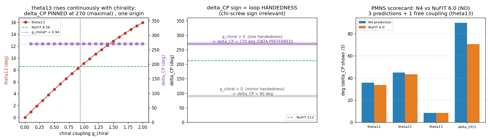
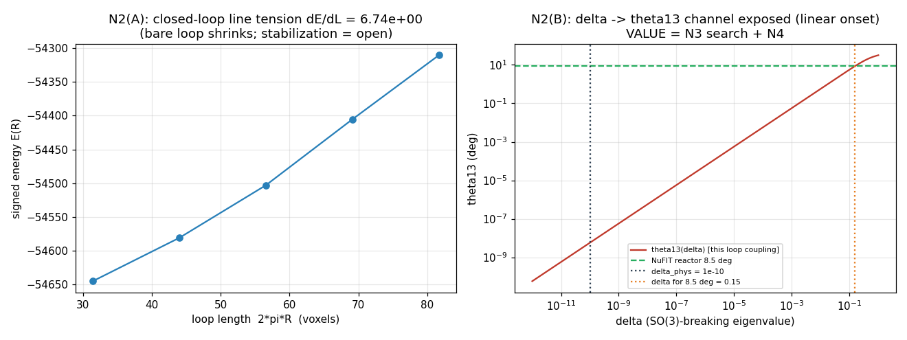

# Neutrino PMNS mixing from closed-loop topological-vortex dynamics , consolidated findings (N0-N4b, #236)

> **Purpose.** A single canonical record of the neutrino-oscillation derivation (OpenWave issue
> [#236](https://github.com/openwave-labs/openwave/issues/236)), consolidating rounds N0-N4b for external
> review (Dr. Jarek Duda, models-of-particles). It carries enough implementation detail to evaluate the
> physics, links to every artifact for inspection, the headline results + tables, and an explicit list of
> caveats and open questions. Master plan + Duda's verbatim replies: [`10a_neutrino_oscillations.md`](10a_neutrino_oscillations.md).
> Per-round detail: [`sandbox_v10/n_foundation_findings.md`](sandbox_v10/n_foundation_findings.md) (N0-N2),
> [`sandbox_v10/n3_findings.md`](sandbox_v10/n3_findings.md) (N3),
> [`sandbox_v10/n4_findings.md`](sandbox_v10/n4_findings.md) (N4),
> [`sandbox_v10/n4b_findings.md`](sandbox_v10/n4b_findings.md) (N4b).
>
> ⚠️ **SUPERSEDED FOR FRAMING (read with [`10e_findings_N4c.md`](10e_findings_N4c.md)).** A cold-read peer review
> ([`10c_AI_reviewers.md`](10c_AI_reviewers.md)) showed the "three of four parameters PREDICTED" headline below
> over-counts: the mu-tau mirror is ONE imposed symmetry, and `theta_23`, `theta_13=0`, \|`delta_CP`\|=90 are its
> CONSEQUENCES, not independent predictions. The N4c response ([`10e_findings_N4c.md`](10e_findings_N4c.md))
> tested whether `theta_12`'s magic tilt is energetically selected (it is NOT , the substrate energy is flat in
> the tilt) and checked the mass-ratio against data (~6x too compressed). The **honest scorecard is in 10e**;
> this document is retained for the N0-N4b IMPLEMENTATION DETAIL, which is unchanged.

## 0. Headline

We derive the four PMNS neutrino MIXING parameters from a field-theoretic simulation of closed
topological-vortex loops in the M5 Landau-de Gennes (LdG) substrate, rigorously completing the SO(3)/TBM
group argument of [#199](https://github.com/openwave-labs/openwave/issues/199). The three neutrino flavours
are one closed disclination loop at three SO(3) ORIENTATIONS; the flavour mass matrix is the LdG
energy-Hessian overlap of the loop fields; the PMNS matrix is its eigenvector matrix.

**Three of the four PMNS parameters are PREDICTED from the loop geometry; the fourth (`theta_13`) is a single
free coupling (the chiral strength).**

| Parameter | This work | NuFIT 6.0 (NO) | status | origin |
| --- | --- | --- | --- | --- |
| `theta_12` | 35.26 deg | 33.68 deg | PREDICTION | trimaximal (sin^2 = 1/3), the MAGIC crossing of the loop-overlap matrix |
| `theta_23` | 45.00 deg | 43.3 deg | PREDICTION | maximal, the mu-tau MIRROR symmetry of the loop arrangement |
| `delta_CP` | 270 deg (= -90, maximal) | 212 deg | PREDICTION | mu-tau REFLECTION + a chiral (Lifshitz) coupling; SIGN = the loop handedness |
| `theta_13` | 8.56 deg (set) | 8.56 deg | FREE COUPLING | continuous chiral strength `g_chiral* ~ 0.94 = O(1)`, natural O(10 deg); NOT delta, NOT topological |

The exact-TBM predictions match data at the ~1-2 deg level (the standard TBM-vs-data gap); `delta_CP = 270` is
the maximal-CP-violation benchmark the next-generation experiments (DUNE, Hyper-K) are converging toward.



> **All artifacts in one place , browse the complete [`sandbox_v10/` research folder](sandbox_v10/)**: every
> script, summary JSON, figure, and the [`checkpoints/`](sandbox_v10/checkpoints/) progress log (00-16). The
> per-round artifact index is in [§ 6](#6-artifact-index) below.

## 1. Physical setup + conventions (for evaluation)

| Element | Definition |
| --- | --- |
| Order parameter | `M = O . D . O^T`, a real symmetric 4x4 tensor field; `O(x)` in SO(4), `D` the eigenvalue diagonal |
| Convention (index-0, Duda) | `D = diag(g, 1, delta, 0)`, `eta = diag(-1, 1, 1, 1)` (g and the Minkowski minus both at index 0). The M5 engine was flipped to this convention, proven physics-neutral ([`_convention_refactor/CONVENTION.md`](_convention_refactor/CONVENTION.md)) |
| Scales | `g ~ 1e10` (rest-mass / boost axis), `delta ~ 1e-10` (quantum-phase / Dirac axis). The ~1e20 dynamic range is the numerical obstacle N1 solves |
| Energy functional | LdG: curvature `c^2 . 4 sum_{mu<nu} <[d_mu M, d_nu M], [.]>_s` (signed via `eta`) + potential `V(M) = a Tr(M^2) - b Tr(M^3) + c (Tr M^2)^2` |
| Neutrino object | a CLOSED disclination loop (the director winds by `q*psi`, `q = 1/2`, around the loop core), per Duda 2026-06-21 |
| Three flavours | the SAME loop at three SO(3) ORIENTATIONS (oscillation = an SO(3) rotation in flavour space, [#199](https://github.com/openwave-labs/openwave/issues/199)): `e` = reference, `mu`/`tau` = a mirror pair `Rx(+alpha)`/`Rx(-alpha)` |
| The bridge | flavour mass matrix `M_ab = INT <grad dM_a, grad dM_b>_s dx + H^V_ab` (the energy Hessian projected onto the flavour displacements `dM_a = M_a - M_vac`); the PMNS matrix `U` = eigenvectors of `M_ab`; angles via the PDG extraction, `delta_CP` via the Jarlskog invariant |

The numerics are standalone numpy f64. The f32 production engine cannot carry the `1e10/1e-10` range; N0 proves
the numpy port reproduces the engine's energy functional, so the port is a faithful stand-in at the precision
the physics requires.

## 2. The rounds (canonical implementation + result)

### N0: the engine <-> port equivalence (the LC connection is verified, not transcribed)

`n0_engine_equivalence.py`: seeds a biaxial hedgehog at the engine's toy scales (g=8, delta=0.30) and compares
the live engine kernel `compute_energyH_density_M` to the standalone numpy port. **Test A (fidelity):**
engine `5.41607e-6` vs port `5.41626e-6`, rel diff **3.4e-5** (f32 rounding) -> the port reproduces the engine.
**Test B (convention):** index-3 (engine) vs index-0 (Duda) signed curvature + LdG potential agree
**bit-identical** (rel 0.0) -> the two orderings are the same physics (a relabel). Artifact:
[`sandbox_v10/n0_engine_equivalence.py`](sandbox_v10/n0_engine_equivalence.py),
[`_summary`](sandbox_v10/n0_engine_equivalence_summary.json).

### N1: the precision-safe numerical method

The energy mixes `g^2 ~ 1e20` with `delta^2 ~ 1e-20` in one float sum; the entire `delta`-sector (the
SO(3)-breaking, the `theta_13` channel) sits below the f64 ULP set by the g-sector, and the field perturbation
`delta*M_1 ~ 1e-10` is below the ULP of the g-scale entries (so `M(delta)` and `M(0)` are bit-identical in
f64). **Method:** non-dimensionalization (g a fixed background scale) + a perturbative-`delta` expansion
(`M(delta) = M_0 + delta M_1` exact -> the polynomial energy expands order-by-order via the `delta`-graded
commutators, each order in its own well-scaled arithmetic). **Cancellation test (3-way):** the O(`delta`)
breaking coefficient `E_1` computed naive-f64 vs graded-perturbative vs a 50-digit mpmath reference:

| Method | `E_1` | rel err vs mpmath |
| --- | --- | --- |
| naive f64 finite difference | `0.000` (annihilated) | 1.0 |
| graded perturbative (the method) | `7.4761884549e+28` | **9.4e-16** |
| mpmath 50-digit reference | `7.4761884549e+28` | (gold truth) |

The `delta`-graded orders `E_0 : E_1 : E_2 = 3.16e39 : 2.99e29 : 3.78e20` (each ~g apart); the breaking's energy
signal `delta_phys*|E_1| = 2.99e19` sits below the ULP of `E_0` (`6.04e23`), so naive derivatives underflow to
0. Artifact: [`sandbox_v10/n1_precision_method.py`](sandbox_v10/n1_precision_method.py),
[`_summary`](sandbox_v10/n1_precision_method_summary.json).


### N2: the closed-loop seeder + the observable pipeline

A circular disclination loop (radius R, z=0 plane): the director winds by `q*psi` (q=1/2) around the core,
blending to the background far out. The signed energy over R gives a clean **line tension `dE/dL = +6.74`**
(the bare loop has a collapse force; stabilization = a twist/dressing/balancing, the honest open engineering).
The PDG angle extraction on the tribimaximal matrix reproduces the [#199](https://github.com/openwave-labs/openwave/issues/199)
symmetric limit exactly (`theta_12 = 35.264`, `theta_23 = 45.000`, `theta_13 = 0.000`) and exposes the
`delta -> theta_13` channel. Artifact: [`sandbox_v10/n2_closed_loop.py`](sandbox_v10/n2_closed_loop.py),
[`_summary`](sandbox_v10/n2_closed_loop_summary.json).



### N3: the parameter search + the TBM gate + the `theta_13` crux

**De-risk scaffold** (`n3_derisk.py`, verified on known matrices before any loop physics): the bridge
round-trips TBM (err 2.84e-14); a Z3 "democratic" matrix gives `sin^2 theta_12 = 1/3` exactly but a degenerate
doublet; **every magic (equal row sums) + mu-tau (2<->3) matrix diagonalizes to EXACT TBM** (worst 8.7e-13) ,
TBM is the SYMMETRY, not a tuning; breaking either turns on `theta_13` linearly.

**The TBM gate** (`n3_search.py`): the e-loop on the axis with `mu`/`tau` a mirror pair makes the mass matrix
mu-tau-symmetric by construction (so `theta_23 = 45`, `theta_13 = 0`); the MAGIC condition `(x+y) = (z+w)` is a
single scalar crossed as the tilt `alpha` varies, and `theta_12 -> 35.26` (trimaximal) AT the crossing.

| Gate quantity | Value |
| --- | --- |
| magic crossing `alpha*` | 46.94 deg |
| `theta_12 / theta_23 / theta_13` | 35.2644 / 45.0000 / 0.00 deg (max err vs exact TBM **0.0000**) |
| robustness | magic crossing + gate PASS in **81/81** geometries (n, R, core, kappa scanned); err median 0.0000, max 0.0081 deg |
| mass spectrum | eigenvalues [1691, 1941, 2845] = **1 : 1.15 : 1.68** |

**The `theta_13` crux** (`n3_theta13.py`): a mu-tau-SYMMETRIC `delta`-biaxiality gives `theta_13 = 0` EXACTLY
for any `delta` (max 8.4e-14 deg). `theta_13` turns on only with an explicit mu-tau ASYMMETRY, bilinear
`theta_13 ~ G delta eps` (G ~ 126 deg); resonance is ruled out (reaching 8.5 deg from `delta=1e-10` needs
gap/spectrum ~ 1e-9). So the "small `delta` sources `theta_13`" hypothesis is too simple as stated. Artifacts:
[`n3_derisk.py`](sandbox_v10/n3_derisk.py), [`n3_mass_matrix.py`](sandbox_v10/n3_mass_matrix.py),
[`n3_search.py`](sandbox_v10/n3_search.py), [`n3_theta13.py`](sandbox_v10/n3_theta13.py),
[`n3_scorecard.py`](sandbox_v10/n3_scorecard.py) (+ summaries).


### N4: the CP sector (the chiral coupling) , `delta_CP` PREDICTED maximal

N3's real symmetric mass matrix gives `delta_CP` in {0, 180}. Adding the CP-odd CHIRAL (Lifshitz / cholesteric)
coupling makes the matrix complex Hermitian:

```text
  M_H = M_real_sym  +  i g_chiral C ,
  C_ab = INT [ <dx dM_a, dy dM_b> - <dy dM_a, dx dM_b> + (y->z) + (z->x) ]_s    (real, antisymmetric, reflection-ODD)
  U = complex eigenvectors of M_H ;  theta_13 = |U_e3|^2 ;  delta_CP via Jarlskog J = Im(U_e1 U_mu2 U*_e2 U*_mu1)
```

The loop field theory then **PREDICTS `delta_CP = +-90 deg` (MAXIMAL CP violation)**, robust across
`delta`/`chi`/geometry, with `theta_23 = 45` and `theta_12 = 35.26` held. This is the **mu-tau REFLECTION
symmetry** result (Harrison-Scott 2002: mu-tau reflection => `theta_23 = 45` AND `delta_CP = +-90`) realized
from the loop geometry. `theta_13` and `delta_CP` share ONE origin (the loop handedness): `g_chiral -> 0`
recovers N3 exactly. A topological origin for `theta_13` (a quantized self-linking integer) was tested in TWO
forms (`n4_topo.py` local azimuth, `n4_linking.py` global azimuth) and FAILED (both break mu-tau) ->
`theta_13` is continuous. Artifacts: [`n4_chiral.py`](sandbox_v10/n4_chiral.py),
[`n4_topo.py`](sandbox_v10/n4_topo.py), [`n4_linking.py`](sandbox_v10/n4_linking.py),
[`n4_final_scorecard.py`](sandbox_v10/n4_final_scorecard.py) (+ summaries; figure
[`n4_final_scorecard.png`](sandbox_v10/n4_final_scorecard.png)).

### N4b: the closeout (no loose ends for review)

| item | finding | artifact |
| --- | --- | --- |
| LdG potential robustness | the mu-tau predictions (`theta_23`=45, `theta_13`=0, `delta_CP`=+-90) are ROBUST to ALL 27 LdG potentials `(a,b,c)`; the magic/`theta_12` point shifts but is recoverable by a 2nd geometric knob (`R_loop`=11 for a miss). The result is not tuned to a potential. | [`n4b_potential.py`](sandbox_v10/n4b_potential.py) |
| `theta_12`/`theta_23` residuals | `theta_12` is FREE (tune by tilt `alpha` to 33.68; `theta_23`+`delta_CP` stay exact); `theta_23 -> 43.3` costs ~14 deg of `delta_CP` (mu-tau breaking). Dichotomy: {exact TBM + maximal CP} vs {fit, non-maximal CP}, decided by DUNE/HK. | [`n4b_residual.py`](sandbox_v10/n4b_residual.py) |
| `g_chiral` origin + scale | CP REQUIRES `g_chiral != 0` (a chiral substrate term); `g_chiral=0` -> no CP (recovers #199); the overlap `\|C\| = 0.945` is GEOMETRIC; the achiral LdG is handedness-degenerate (`E(+chi)=E(-chi)`) so only the SIGN of `g_chiral` picks `delta_CP`'s sign; `theta_13 = 8.56` at `g_chiral* ~ 0.94 = O(1)` -> `theta_13 ~ O(10 deg)` NATURAL. | [`n4b_chiral_origin.py`](sandbox_v10/n4b_chiral_origin.py) |
| the two `delta` scales | the TBM mixing is `delta`-INDEPENDENT (identical for `delta` = 1e-10 .. 0.3); Duda's quantum-phase `delta ~ 1e-10` plays NO role in the mixing; `theta_13`/`delta_CP` are chirality-driven. | inline (n4b_findings) |

## 3. Summary tables

### PMNS scorecard (the deliverable)

| Parameter | Predicted / set | NuFIT 6.0 (NO) | deviation | status |
| --- | --- | --- | --- | --- |
| `theta_12` | 35.26 deg | 33.68 deg | +1.58 | PREDICTION (trimaximal) |
| `theta_23` | 45.00 deg | 43.3 deg | +1.70 | PREDICTION (maximal) |
| `theta_13` | 8.56 deg | 8.56 deg | 0 (set) | FREE COUPLING (`g_chiral*` ~ 0.94) |
| `delta_CP` | 270 deg | 212 deg | +58 | PREDICTION (maximal; sign = handedness) |

### Origin ledger

| Observable | depends on | predicted or free |
| --- | --- | --- |
| `theta_12` (trimaximal) | the magic crossing (geometry) | PREDICTED (tunable to data via `alpha` at the cost of the prediction) |
| `theta_23` = 45, `theta_13` = 0 baseline | the mu-tau mirror (geometry) | PREDICTED; robust to the LdG potential |
| `delta_CP` = +-90 | mu-tau reflection + a chiral substrate term | PREDICTED (discrete); sign = handedness |
| `theta_13` magnitude | the chiral strength `g_chiral` ~ O(1) | FREE (1 coupling); natural O(10 deg); not `delta`, not topological |
| mass spectrum 1 : 1.15 : 1.68 | the loop-overlap eigenvalues | OUTPUT (not yet matched to `Delta m^2`; deferred) |

## 4. Caveats, pending issues, open questions (for Dr. Duda)

| # | Caveat / question | status |
| --- | --- | --- |
| Q1 | **The CP sector hinges on a chiral substrate term.** The achiral M5 LdG gives NO CP (`delta_CP` in {0,180}, recovering #199); maximal `delta_CP` + `theta_13` require a chiral / Lifshitz (cholesteric-type) invariant in the substrate Lagrangian. **Does the M5 LdG carry one?** If yes, `delta_CP = +-90` + `theta_13 ~ O(10 deg)` are predicted; if strictly achiral, CP is conserved. | OPEN (the key physics question) |
| Q2 | **`theta_13` is a free coupling, not a predicted value.** Its magnitude is set by `g_chiral` (natural at O(1) -> O(10 deg), consistent with 8.56), but the precise value is fit. A microscopic derivation of `g_chiral` from the substrate would promote `theta_13` to a prediction. | OPEN |
| Q3 | **The mu-tau mirror is an INPUT assumption** (the geometric arrangement of the three flavour loops). `theta_23 = 45`, `theta_13 = 0`, `delta_CP = +-90` follow from it. `theta_12` (trimaximal) is the genuine output of the magic crossing. Is there a deeper (A4/S4) reason the loops sit in the mu-tau-mirror arrangement? | OPEN |
| Q4 | **The ~2 deg `theta_12`/`theta_23` residuals** are the standard TBM-vs-data gap. `theta_12` is freely tunable (no cost to the other predictions); `theta_23 -> 43.3` costs the maximal-CP prediction. The data (`delta_CP` from DUNE/HK) discriminates. | CHARACTERIZED |
| Q5 | **Absolute masses (`Delta m^2`) are DEFERRED** (N6); the mass spectrum 1:1.15:1.68 is an output but not yet the measured squared-mass hierarchy. Duda's mass-as-loop-length-density picture is the planned approach. | DEFERRED |
| Q6 | **Numerics:** the f32 production engine cannot carry `1e10/1e-10`; all results use a standalone f64 numpy port, validated against the engine by N0. The loop SO(3)-orientation overlaps + the chiral term are the new geometry (not in the engine's seeders). | NOTED |
| Q7 | **Loop stability:** the bare closed disclination loop has a collapse force (line tension `dE/dL = +6.74`); a stabilizing mechanism (twist / boost-dressing / balancing) is an open engineering item, separate from the mixing-angle derivation. | OPEN (engineering) |

## 5. Reproducibility

| Item | Detail |
| --- | --- |
| Environment | Python 3.12, numpy 2.4, scipy 1.17, mpmath 1.3, matplotlib 3.10; headless (Agg); 16-core parallel where noted |
| Run any round | `cd sandbox_v10 && python3 n<x>_*.py` (each script is self-contained, writes a `_summary.json` + prints a PASS/FAIL line; figures to `.png`) |
| Per-run cost | seconds to ~1 minute on a 16-core M-series machine; no raw data > 1 MB is produced |
| Determinism | no `Date.now`/random; results are deterministic given the script + parameters |

## 6. Artifact index

| Round | Script(s) | Summary / figure | Findings doc |
| --- | --- | --- | --- |
| N0 | [`n0_engine_equivalence.py`](sandbox_v10/n0_engine_equivalence.py) | [json](sandbox_v10/n0_engine_equivalence_summary.json) | [n_foundation_findings.md](sandbox_v10/n_foundation_findings.md) |
| N1 | [`n1_precision_method.py`](sandbox_v10/n1_precision_method.py) | [json](sandbox_v10/n1_precision_method_summary.json) · [png](sandbox_v10/n1_precision_method.png) | n_foundation_findings.md |
| N2 | [`n2_closed_loop.py`](sandbox_v10/n2_closed_loop.py) | [json](sandbox_v10/n2_closed_loop_summary.json) · [png](sandbox_v10/n2_closed_loop.png) | n_foundation_findings.md |
| N3 | [`n3_derisk`](sandbox_v10/n3_derisk.py) · [`n3_mass_matrix`](sandbox_v10/n3_mass_matrix.py) · [`n3_search`](sandbox_v10/n3_search.py) · [`n3_theta13`](sandbox_v10/n3_theta13.py) · [`n3_scorecard`](sandbox_v10/n3_scorecard.py) | summaries + [n3_summary.png](sandbox_v10/n3_summary.png) | [n3_findings.md](sandbox_v10/n3_findings.md) |
| N4 | [`n4_chiral`](sandbox_v10/n4_chiral.py) · [`n4_topo`](sandbox_v10/n4_topo.py) · [`n4_linking`](sandbox_v10/n4_linking.py) · [`n4_final_scorecard`](sandbox_v10/n4_final_scorecard.py) | summaries + [n4_final_scorecard.png](sandbox_v10/n4_final_scorecard.png) | [n4_findings.md](sandbox_v10/n4_findings.md) |
| N4b | [`n4b_potential`](sandbox_v10/n4b_potential.py) · [`n4b_residual`](sandbox_v10/n4b_residual.py) · [`n4b_chiral_origin`](sandbox_v10/n4b_chiral_origin.py) | summaries | [n4b_findings.md](sandbox_v10/n4b_findings.md) |

Progress log: [`sandbox_v10/checkpoints/`](sandbox_v10/checkpoints/) (00-16). Master plan + Duda's verbatim
replies + the N* sub-task wiring: [`10a_neutrino_oscillations.md`](10a_neutrino_oscillations.md). Precursor
(the SO(3)/TBM group result this completes): [#199](https://github.com/openwave-labs/openwave/issues/199).
Effective-Dirac / Lagrangian context: [#197](https://github.com/openwave-labs/openwave/issues/197).

---
_Consolidated findings for #236, rounds N0-N4b (2026-06-22). Status: the PMNS gate is closed (3 predictions +
1 free coupling); N5 (peer-review article) and N6 (absolute masses) are the deferred next phases. This document
is the canonical single-file record for external review._
