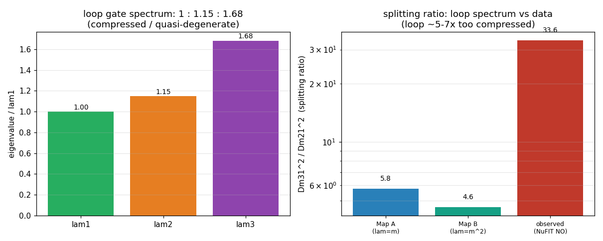

# Neutrino PMNS mixing , N4c review-response findings (honest reframe + two decisive tests, #236)

> **Purpose.** The canonical record AFTER the cold-read peer review. Two independent AI reviewers
> ([`10c_AI_reviewers.md`](10c_AI_reviewers.md)), given only the findings with no M5/OpenWave/program context,
> converged on the same central critique and the same single decisive test. N4c runs that test, adds the
> near-term mass falsifier the review flagged, and reframes the headline honestly. This document supersedes the
> N0-N4b record [`10b_findings_N4b.md`](10b_findings_N4b.md) for the FRAMING of what is predicted vs imposed vs
> fit; the N0-N4b implementation detail still lives there. Triage + plan: [`10d_bullet_proof_run.md`](10d_bullet_proof_run.md).
> Master plan: [`10a_neutrino_oscillations.md`](10a_neutrino_oscillations.md). OpenWave issue
> [#236](https://github.com/openwave-labs/openwave/issues/236) (posting HELD until the N-program finishes).

## 0. Headline (reframed, post cross-agent hostile-cold-reader-peer-reviewer pass)

The earlier headline ("three of four PMNS parameters PREDICTED") over-counted. The mu-tau mirror is ONE imposed
structural symmetry, and `theta_23 = 45`, `theta_13 = 0` (baseline), `|delta_CP| = 90` are its CONSEQUENCES
(Harrison-Scott), not three independent predictions. The honest content of the loop derivation:

| Parameter | This work | NuFIT 6.0 NO (±1 sigma) | pull | honest status |
| --- | --- | --- | --- | --- |
| `theta_12` | 35.26 deg | 33.68 ± 0.70 | **+2.3 sigma** | geometrically PINNED by the magic crossing; **NOT energy-selected** (see N4c-1) |
| `theta_23` | 45.00 deg | 43.3 ± 1.0 | +1.7 sigma | CONSEQUENCE of the imposed mu-tau MIRROR |
| `theta_13` | 8.56 deg | 8.56 ± 0.11 | 0 (set) | FREE coupling (`g_chiral* ~ 0.94`) |
| `delta_CP` | 270 deg (\|·\|=90) | 212 ± 30 | +1.9 sigma (consistent) | \|`delta_CP`\|=90 is a CONSEQUENCE of mu-tau REFLECTION; **SIGN undetermined** (handedness-degenerate) |

**The honest scorecard: ONE imposed symmetry (generating three of the entries) + ONE geometrically-pinned angle
(`theta_12`, not variationally selected) + ONE free coupling (`theta_13`) + an undetermined CP sign.** The mass
spectrum is in ~6x tension with the observed splitting hierarchy under the natural eigenvalue->mass maps (N4c-2;
the map itself is the deferred N6 question). This is materially weaker than "3 predicted", and it is the framing
that survives a hostile read.

> **All artifacts in one place , browse the complete [`sandbox_v10/` research folder](sandbox_v10/)**: the N4c
> scripts (`n4c_alpha_energy.py`, `n4c_mass_ratio.py`, `n4c_scorecard.py`), summary JSONs, figures, and the
> [`checkpoints/`](sandbox_v10/checkpoints/) progress log (17-18 are N4c). Per-round artifact index in
> [§ 7](#7-artifact-index).

## 1. What N4c changed (the review response), and the framework it lives in

| Review point (both cold readers) | N4c response | outcome |
| --- | --- | --- |
| `theta_23`, `theta_13=0`, `delta_CP` are mu-tau consequences, not 3 predictions | reframed the scorecard (above + § 3) | IMPLEMENTED |
| Is `alpha*` energetically SELECTED (is `theta_12` a prediction)? | ran `n4c_alpha_energy.py` (the decisive test) | RESULT: NOT selected (§ 2) |
| `delta_CP` SIGN not predicted (handedness-degenerate) | downgraded to \|`delta_CP`\|=90; sign open | IMPLEMENTED |
| Mass ratios 1:1.15:1.68 checkable vs data NOW | ran `n4c_mass_ratio.py` | RESULT: ~6x tension (§ 2) |
| "Hessian" is a large-displacement Gram matrix; `U=eigvecs` asserted | terminology fixed; bridge labelled a postulate (§ 4) | IMPLEMENTED |
| Loop instability is foundational, not a footnote | elevated (§ 4) | IMPLEMENTED |
| `delta` + potential independence = "substrate dropped out" | confirmed at the self-energy level (§ 2, N4c-1); reframed robustness honestly | IMPLEMENTED |
| NuFIT comparison needs error bars | pull plot (§ 0, § 3): `theta_12` ~2.3 sigma, `delta_CP` consistent | IMPLEMENTED |
| "converging toward 270" spin | softened to "being tested by DUNE/HK" | IMPLEMENTED |

**Framework + scope (so a cold read does not mis-aim).** This is a classical nonlinear field model: the
Landau-de Gennes substrate, particles as topological defects (closed disclination loops), an ALTERNATIVE to a
Standard-Model embedding, not a bolt-on to it. By construction it uses no Higgs / Yukawa / seesaw, and 10e does
NOT (here) derive the quantum oscillation probability `P(a->b)`, the three-generation count, or the absolute
mass scale. Those are separate program pieces: the SO(3)/TBM group structure is
[#199](https://github.com/openwave-labs/openwave/issues/199) (the precursor this completes); the effective-Dirac
Lagrangian and the `g ~ 1e10` / `delta ~ 1e-10` scales are [#197](https://github.com/openwave-labs/openwave/issues/197);
absolute masses (`Delta m^2`) are the deferred N6. The deliverable of 10a-10e is the four MIXING parameters.
Within that scope, the honest result is § 0.

## 2. The two decisive N4c runs (canonical implementation + result)

### N4c-1: is the magic-crossing tilt `alpha*` energetically selected? (the linchpin for `theta_12`)

`theta_12 = 35.26` (trimaximal) is the one candidate genuine prediction. It appears at the magic crossing
`(x+y) = (z+w)`, which the geometry hits at `alpha* = 46.945 deg` as the mu/tau tilt `alpha` is swept. The
reviewers' sharp point: a single scalar crossing as you sweep a free parameter is GUARANTEED by the intermediate
value theorem, so the crossing's existence is trivial; what decides prediction-vs-fit is whether the loop ENERGY
selects `alpha*` (`dE/dalpha = 0` there). `n4c_alpha_energy.py` computes, over the tilt:

| measure | what it is | behaviour near `alpha*` |
| --- | --- | --- |
| `E_self(alpha)` | the SUBSTRATE field energy of the three-loop config (the energy that would dynamically relax `alpha`) | **FLAT to 0.09%** (discretization noise floor); global min at the small-tilt EDGE (8.6 deg, the degenerate `alpha->0` where the loops coincide) |
| `tr(M_ab)(alpha)` | the tight-binding total (sum of flavour-coupling eigenvalues) | broad shallow **MAX at 48.15 deg** (1.2 deg from `alpha*`); 2.9% variation |
| `lambda_min, lambda_max` | ground / top flavour-coupling eigenvalues | extrema 18-21 deg AWAY from `alpha*` |

**Verdict: NEGATIVE on dynamical selection, with a weak structural coincidence.** The substrate self-energy is
essentially INDIFFERENT to the tilt (flat to 0.09%), and its true minimum is the degenerate small-tilt limit
where the three flavours coincide and mixing is undefined. So the loops do NOT relax to `alpha*` by energy
minimization , this **directly confirms the reviewers' "substrate dropped out of the angles" concern** at the
self-energy level (consistent with N4b: the mixing is independent of `delta` and of the 27 LdG potentials). The
ONE energetic signal is a broad, shallow MAXIMUM of the tight-binding trace within ~1 deg of `alpha*` (the three
loop displacements are maximally mutually distinct near the magic tilt) , suggestive, but a maximum, not a
minimum, and weak. So `theta_12 = 35.26` is PINNED by one scalar magic condition on the energy-overlap matrix (a
derived geometric locus, NOT a free continuous fit), coinciding with a shallow trace extremum, but it is NOT a
variationally-selected ground state. **Honest status: `theta_12` sits between "fit" and "prediction" ,
geometrically determined, conditional on the mu-tau arrangement.**

### N4c-2: the mass-spectrum ratios vs data (the near-term falsifier)

The reviewer noted the spectrum `1 : 1.15 : 1.68` is checkable against data NOW. The data fixes the ratio of the
two mass-squared splittings: `Dm31^2 / Dm21^2 ~ 2.513e-3 / 7.49e-5 ~ 33.6` (NuFIT 6.0 NO). `n4c_mass_ratio.py`
tests the gate eigenvalues (`[1690.97, 1940.99, 2844.86] = 1 : 1.148 : 1.682`) under the two natural
identifications:

| eigenvalue map | predicted splitting ratio | vs observed 33.6 |
| --- | --- | --- |
| Map A: `lambda = m` -> `(l3^2-l1^2)/(l2^2-l1^2)` | **5.76** | off by **x5.8** (too compressed) |
| Map B: `lambda = m^2` -> `(l3-l1)/(l2-l1)` | **4.62** | off by **x7.3** (too compressed) |

**Verdict: real near-term TENSION (a FLAG, not a falsification).** The loop spectrum is quasi-degenerate; the
data needs a much more spread spectrum (splitting ratio ~34). Under both natural maps the loop splittings are
~5-7x too compressed. The honest caveat: the eigenvalue->mass map is UNDEFINED here , that is exactly the
deferred N6 question (Duda's mass-as-loop-length-density picture). A successful mass model must spread the
spectrum or use a nonlinear map. Worth stating plainly before building further.

## 3. Summary tables (honest)

### PMNS scorecard with provenance + error bars

| Parameter | this work | NuFIT 6.0 NO (±1 sigma) | pull (sigma) | provenance |
| --- | --- | --- | --- | --- |
| `theta_12` | 35.26 deg | 33.68 ± 0.70 | +2.26 | geometrically PINNED (magic); not energy-selected |
| `theta_23` | 45.00 deg | 43.3 ± 1.0 | +1.70 | CONSEQUENCE of imposed mu-tau mirror |
| `theta_13` | 8.56 deg | 8.56 ± 0.11 | 0.00 (set) | FREE coupling `g_chiral* ~ 0.94` |
| `delta_CP` | 270 deg | 212 ± 30 | +1.93 (consistent) | \|·\|=90 from mu-tau reflection; SIGN undetermined |

Reading the pulls honestly: `theta_12` is ~2.3 sigma off (NOT "close"), `theta_23` is ~1.7 sigma (and
octant-ambiguous), `theta_13` is set (pull 0 by construction, it is the fit), and `delta_CP` is consistent
because the experimental range is enormous (DUNE/HK are testing maximal CP, not converging on it).

### Origin ledger (updated)

| Observable | depends on | honest status |
| --- | --- | --- |
| `theta_23` = 45, `theta_13` = 0 baseline | the mu-tau MIRROR (imposed) | CONSEQUENCE of one imposed symmetry; robust to `delta`/potential (symmetry-protected, not substrate-specific) |
| \|`delta_CP`\| = 90 | mu-tau REFLECTION (imposed) + a chiral term | CONSEQUENCE of the same symmetry; magnitude only |
| `delta_CP` sign | the loop handedness | UNDETERMINED (achiral substrate is handedness-degenerate `E(+chi)=E(-chi)`) |
| `theta_12` (trimaximal) | the magic crossing (geometry) | PINNED by one scalar condition; NOT energy-selected (N4c-1) |
| `theta_13` magnitude | the chiral strength `g_chiral ~ O(1)` | FREE (1 coupling); not `delta`, not topological |
| mass spectrum 1:1.15:1.68 | the loop-overlap eigenvalues | OUTPUT; ~6x too compressed vs data under natural maps (N4c-2); map deferred (N6) |

## 4. The bridge and loop stability (elevated from footnotes)

| Item | honest statement |
| --- | --- |
| The bridge `M_ab` | the displacements `dM_a = M_a - M_vac` are LARGE (distinct SO(3) orientations, not infinitesimal), so the energy is not quadratic in them: `M_ab = INT <grad dM_a, grad dM_b>` is a **Gram / overlap matrix** of nonlinear field configurations (a tight-binding-like coupling), NOT literally a second-variation Hessian. Earlier text called it an "energy Hessian"; that is corrected here. |
| `U = eigenvectors(M_ab)` | this identification is a MODELING POSTULATE (motivated by the tight-binding analogy and the [#199](https://github.com/openwave-labs/openwave/issues/199) SO(3) structure), NOT derived from a Lagrangian. It is the load-bearing bridge to the measured PMNS matrix and is the top open derivation. |
| Loop stability | the bare closed loop has positive line tension (`dE/dL = +6.74`) , it is NOT a stable stationary solution. The flavour "eigenstates" are therefore overlaps of configurations that are not solutions of the field equations, and a non-stationary config has no well-defined energy Hessian in the usual sense. This is FOUNDATIONAL (it gates trusting the downstream eigenvalues), not an engineering footnote. A stabilizing mechanism (twist / dressing / balancing, or a constrained stationary loop) is a prerequisite. |

## 5. Caveats, pending issues, open questions (updated for Dr. Duda)

| # | Caveat / question | status |
| --- | --- | --- |
| Q1 | **The CP sector hinges on a chiral substrate term.** Achiral M5 LdG gives NO CP; maximal `delta_CP` + `theta_13` need a chiral / Lifshitz invariant. **Does the M5 LdG carry one?** | OPEN (key physics) |
| Q2 | **`theta_13` is a free coupling** (`g_chiral`), not a predicted value; a microscopic derivation of `g_chiral` would promote it. | OPEN |
| Q3 | **The mu-tau mirror is an INPUT.** `theta_23`, `theta_13=0`, \|`delta_CP`\|=90 follow from it (Harrison-Scott). Is there a deeper (A4/S4) reason the loops sit in this arrangement? | OPEN (now the central one) |
| Q4 | **`theta_12` is NOT energetically selected** (N4c-1): the substrate self-energy is flat in the tilt (0.09%); `alpha*` coincides only with a shallow tight-binding-trace maximum. `theta_12` is geometrically pinned by the magic condition, not a dynamical prediction. | RESOLVED (negative), NEW |
| Q5 | **The `delta_CP` sign is undetermined** (achiral handedness-degeneracy `E(+chi)=E(-chi)`). The model predicts \|`delta_CP`\|=90, not the sign. | RESOLVED (negative), NEW |
| Q6 | **Mass-ratio tension** (N4c-2): the spectrum 1:1.15:1.68 gives a splitting ratio ~5-7x below the observed `Dm31^2/Dm21^2 ~ 33.6` under both natural maps. FLAG, not falsification (the map is the deferred N6 question). | OPEN, NEW |
| Q7 | **The bridge is a Gram/overlap matrix and `U=eigenvectors` is a postulate**, not derived from a Lagrangian (§ 4). | OPEN |
| Q8 | **Loop stability** (`dE/dL = +6.74 > 0`): the loop is not a stationary solution; this gates the whole construction (§ 4). | OPEN (foundational) |
| Q9 | **Absolute masses (`Delta m^2`) DEFERRED** (N6); Duda's mass-as-loop-length-density is the planned approach, and must address Q6. | DEFERRED |
| Q10 | **The substrate does little work on the angles**: the mixing is independent of `delta`, the LdG potential (N4b), AND the tilt energy (N4c-1). The angles are symmetry-determined (generic to any mu-tau nematic). The substrate's role is in the CP sector (chirality), the masses (N6), and whether it ADMITS / stabilizes the mu-tau arrangement (Q3, Q8). | NOTED (honest) |

## 6. What the cold-read reviews got right vs context gaps

About 70% of both reviews is valid and survives full program context (acted on above); ~30% is a framework/scope
gap (they reviewed a complete, SM-embedded, quantum theory of neutrinos). The full triage is in
[`10d_bullet_proof_run.md`](10d_bullet_proof_run.md); the verbatim reviews in [`10c_AI_reviewers.md`](10c_AI_reviewers.md).
Briefly: the SM-embedding, quantum-oscillation-probability, 3-generation-count, and scale-origin asks are
outside the deliberately narrowed 4-mixing-parameter scope (and are handled by #199 / #197), while the central
circularity point, the `alpha*` selection test, the `delta_CP` sign, the mass-ratio check, the Gram/postulate
bridge, and the loop-stability concern are all valid and are implemented here.

## 7. Artifact index

| Run | Script | Summary / figure | Checkpoint |
| --- | --- | --- | --- |
| N4c-1 (alpha-energy decisive test) | [`n4c_alpha_energy.py`](sandbox_v10/n4c_alpha_energy.py) | [json](sandbox_v10/n4c_alpha_energy_summary.json) · [png](sandbox_v10/n4c_alpha_energy.png) | [17](sandbox_v10/checkpoints/17_n4c_alpha_energy.md) |
| N4c-2 (mass-ratio falsifier) | [`n4c_mass_ratio.py`](sandbox_v10/n4c_mass_ratio.py) | [json](sandbox_v10/n4c_mass_ratio_summary.json) · [png](sandbox_v10/n4c_mass_ratio.png) | [18](sandbox_v10/checkpoints/18_n4c_mass_ratio.md) |
| N4c-3 (honest scorecard) | [`n4c_scorecard.py`](sandbox_v10/n4c_scorecard.py) | [json](sandbox_v10/n4c_scorecard.json) · [png](sandbox_v10/n4c_scorecard.png) | , |

Reviewed N0-N4b record (implementation detail): [`10b_findings_N4b.md`](10b_findings_N4b.md). Verbatim reviews:
[`10c_AI_reviewers.md`](10c_AI_reviewers.md). Triage + plan: [`10d_bullet_proof_run.md`](10d_bullet_proof_run.md).
Master plan + Duda's replies: [`10a_neutrino_oscillations.md`](10a_neutrino_oscillations.md). Precursor:
[#199](https://github.com/openwave-labs/openwave/issues/199). Lagrangian context:
[#197](https://github.com/openwave-labs/openwave/issues/197).

---
_N4c review-response findings for #236 (2026-06-22). Status: the honest scorecard is 1 imposed symmetry + 1
geometrically-pinned angle (`theta_12`, not energy-selected) + 1 free coupling (`theta_13`) + an undetermined CP
sign; the mass spectrum is in ~6x tension with data under the natural maps (N6 must resolve). N5 (article) and N6
(absolute masses) remain deferred. This document is canonical for the FRAMING; [`10b_findings_N4b.md`](10b_findings_N4b.md)
carries the N0-N4b implementation detail._
