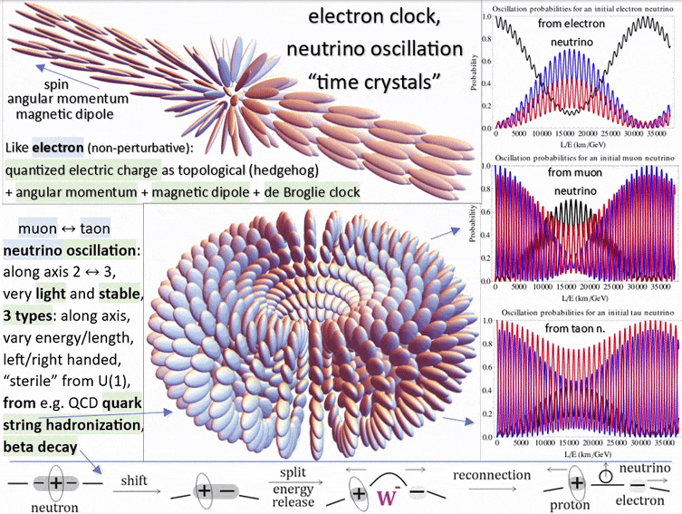
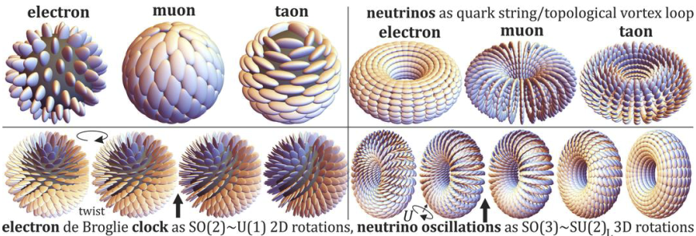

# The M5 particle hunt: shapes measured, identifications hypothesized

The M5.20 and M5.21 series are one hunt with two topologies: a defect whose internal clock persists at contained energy. The SHAPE is what the simulations measure; the particle NAME is the hypothesis riding on it, so the "possibly" stays attached until the anchors land (framing agreed at the M5.21 close-out, 2026-07-14). M5.20's early tasks also built the shape-agnostic machinery both hunts run on (the 4×4 EOM, the analytic gap ladder, the clock census, the audited conservative-dynamics stack). The M5.22 series (the author's nuclei-first redirect, 2026-07-22) extends the same hunt to COMPOSITES: multi-ring vortex-knot compounds as baryons and light nuclei, run on the certified census instrument; its scorecard is the [baryon + nuclei hunt section](#baryon--nuclei-hunt-m522-series) below.

| Series | What is measured (the shape) | The identification hypothesis | What already supports it | What would firm it up |
| --- | --- | --- | --- | --- |
| [M5.20](m5_roadmap.md) (.1/.2/[.3](tasks/m5_20_3_task_details.md)) | A closed **VORTEX-LOOP** of the (δ,0) winding pair, half-integer, with a measured gap ladder and (so far) no unconstrained protection | Possibly the **neutrino** | The author's own ansatz language (the author's ellipse diagram, flavor-as-loop-state, the radius-breathing-during-oscillation remark); the M5.11 closed-loop → PMNS lineage; the near-zero rest-energy character of the winding pair | A constrained run where the loop persists, its radius breathes at conserved E_total, and the spectrum lands on the gap ladder (exactly M5.20.3's pre-registered observables) |
| [M5.21](tasks/m5_21_task_details.md) (.1/.2) | A radial **HEDGEHOG** charge defect, 3-equal-melting core, intrinsic core-breathing clock, topological charge that survives everything thrown at it | Possibly the **electron** | The M5.11 Faber electron (511 keV) lineage; the M5.16 parameter-free r_half = 2.926 fm; charge-1 winding robustness measured at M5.21; the M5.21.1 asymptotic structure laws (the author's 2-equal vortex + 3-equal core exact in the physical limit) | A formulation where the energy is contained and the clock persists: [M5.21.1](tasks/m5_21_1_task_details.md) measured that the bare minimization chain does NOT deliver it at toy parameters (spreading statics, rigid-J killed), so this now waits on the clock structure: the [Q24](m5_question_tracker.md#q24-detail) lineage has narrowed by measurement ([M5.21.3](tasks/m5_21_3_task_details.md) free descent + [M5.21.8](tasks/m5_21_8_task_details.md) the author's own analytics: no free clock anywhere) to three live forks, with fixed-J + the author's Larmor protocol the recommended run, staged as [M5.21.9](tasks/m5_21_9_task_details.md) (2026-07-19 outbound, fork answer pending) |
| [M5.22](tasks/m5_22_task_details.md) (.1/.2/.4) | Closed **VORTEX-KNOT COMPOUNDS**: a central vortex column + N equatorial rings, the charge class analytically known per seed, relaxed and ranked on the certified census stack ([M5.21.2b](tasks/m5_21_2b_task_details.md) instrument unchanged) | Possibly the **baryons and light nuclei** (proton; neutron or dineutron; deuteron) | The author's run ladder + the ring-count = baryon-number frame; the census ([M5.22](tasks/m5_22_task_details.md), audited): the lightest charged \|Q\| = 1 state stationary + perturbation-stable (the author-confirmed proton-analog), m_n > m_p DIRECTION measured (ratio 1.54); the two-knot deuteron candidate bound 28% at n = 32 ([M5.22.1](tasks/m5_22_1_task_details.md)); charges quantized on the calibrated electric instrument ([M5.22.2](tasks/m5_22_2_task_details.md)) and preserved under the 4D lift ([M5.22.4](tasks/m5_22_4_task_details.md)) | Any quantitative mass ratio LOST its route (the [M5.21.11](tasks/m5_21_11_task_details.md) bridge closed terminally 2026-08-07); free full-4×4 dynamics for the missing decay channels (beta decay + the ω-twist ladder are both measured honest negatives at the 3×3 truncation); n = 48 convergence of the deuteron candidate |

The asymmetry: the electron identification already has quantitative anchors (511 keV, r_half), while the neutrino identification is still structural (right topology, right ansatz, right oscillation story, no calibrated number yet). So "possibly the electron" is currently the stronger "possibly", and M5.20.3's breathing spectrum is the neutrino side's first shot at a number.

**The identification question went public (2026-07-14)**: the author convened Marc, Andras, and Giorgio on models-of-particles ("Fable is now able to model vortex loop - maybe let's try to verify if it is rather electron or neutrino?"), offering to help if convinced the loop is the electron, and naming a discriminator: replace the Lagrangian and try to get Coulomb, as required for an electron ([`tasks/m5_20_convo.md`](tasks/m5_20_convo.md) message 3). This page's tables are the internal scorecard for exactly that debate; note the two camps put DIFFERENT shapes behind "electron" (their vortex loop vs this page's hedgehog), so the discriminating observables (Coulomb tail, 511 keV anchor, charge quantization, oscillation phenomenology) matter more than the shape vocabulary.

**THE HUNT ORDER FLIPPED (2026-07-15/16)**: with the loop-side dynamics measured out at the rigid level (M5.20.5) and the least-action question deferred on the author's side, the author redirected the program to the electron hedgehog ("which (in contrast to neutrino) has to be stable"; [`tasks/m5_20_convo.md § 2026-07-15`](tasks/m5_20_convo.md)), and the user confirmed electron-first (2026-07-16): **the M5.21 series is the live hunt** ([M5.21.1](tasks/m5_21_1_task_details.md) RAN + CLOSED 2026-07-16: the prescription executed end-to-end; stability fails at toy parameters, rigid-rotation J killed, two scaling laws rescue the author's structure claims asymptotically; rows updated below); the M5.20/neutrino side is parked (the breathing-BVP stub archived as reserve; the author's neutrino-aging data request staged as [M5.20.7](tasks/m5_20_7_task_details.md) after the M5.21 series). The author's aging hypothesis adds a NEW neutrino-side observable class for whenever that hunt resumes: rest-frame radiation → distance-growing energy threshold + final flash (DAMA/LIBRA annual modulation as the candidate signature).

## The Particle-Hunt Scorecard: which shape is the Electron vs. the Neutrino?

Scored against the criteria the author personally laid out (Coulomb as the named discriminator; angular momentum propelled by the negative Hamiltonian terms), using only what the simulations have already measured:

### NEUTRINO HUNT (M5.20 series)

Criteria sources: the defining neutrino properties (no charge, sub-eV mass, spin 1/2) + the **AMBer 9-observable lepton scoreboard** (Baretz et al. 2026, [`../theory/_CITATIONS.md`](../theory/_CITATIONS.md), local `amber_neutrino_flavor_rl.pdf`): 3 charged-lepton masses + 2 mass-squared splittings + 3 PMNS angles + δ_CP, fit against the KATRIN / KamLAND-ZEN / Planck bounds (the charged-lepton masses belong to the flavor-sector fit and ride the oscillation rows here).

| Criterion (what a NEUTRINO must match) | Topology: Vortex-Loop (the M5.20 series) | Topology: Hedgehog (the M5.21 series) |
| --- | --- | --- |
| Zero electric charge / NO Coulomb tail | ✅ measured: the (δ,0) pair winding is chargeless (no monopole flux); far field localized, no 1/r⁴ tail in any run | ❌ monopole-charged: the Coulomb tail is measured (its electron anchor) |
| Near-zero rest mass (KATRIN < 0.45 eV; Planck Σm_ν < 0.12 eV) | 🔶 the near-zero rest-energy character of the winding pair is structural; no calibrated eV number yet | ❌ carries the 511 keV mass anchor |
| Three flavor states + PMNS mixing (sin²θ₁₂, θ₁₃, θ₂₃: AMBer rows 4-6) | 🔶 structural lineage: the M5.11 closed-loop → PMNS ladder (the N4c scorecard = the honest baseline); the author's flavor-as-loop-state ansatz | ❌ no flavor / oscillation story |
| Mass-squared splittings Δm²₂₁ ≈ 7.5e-5 eV², Δm²₃₁ ≈ 2.5e-3 eV² (AMBer rows 7-8) | 🚧 needs a stable oscillation spectrum: NOT REACHED under free EL ([M5.20.3](tasks/m5_20_3_task_details.md)); blocked on the [Q24](m5_question_tracker.md#q24-detail) formulation | ❌ n/a |
| δ_CP (AMBer row 9) | 🚧 the in-model δ_CP fork (180° vs 270°) is flagged; the chiral-term redirect (Q13) pending | ❌ n/a |
| Spin ħ/2 | 🚧 untested (blocked on Q24) | 🔶 the STATE half LANDED at [M5.21.9](tasks/m5_21_9_task_details.md) (2026-07-20, audited): the fixed-J electron EXISTS and HOLDS at three J rungs (rel_move ≤ 1.3e-4, core intact, t = 80 dynamics-grade hold) with the clock thermodynamics closed (dE/dJ = ω\* at 0.997 / 0.992 on the conjugation family of record: the spin charge is carried, priced, and stable: the standard isorotating-soliton construction, literature-verified). Short of ✅: the ħ/2 OBSERVABLE half is unresolved: the Larmor linear read is unmeasurable in the round-1/2 instrument configuration (preparation-texture artifact dominates, measured decisively); the ramp-on redesign + body-frame read ride the [M5.23.1](tasks/m5_23_1_task_details.md)-era round 3, the absolute scale lost its route (the [M5.21.11](tasks/m5_21_11_task_details.md) bridge closed terminally 2026-08-07; the kin-convention question RESOLVED internally at the 21.9 re-base: the canonical conjugation tangent, kin = 0.1206) |
| Stability (a persistent particle) | ⚠️ unwinds 10/10 in canonical stacks; under the true L the winding NEVER unwinds but the free-EL IVP is ill-posed (Q24) | 🔶 statics resolved + stress-tested at toy ([M5.21.2b](tasks/m5_21_2b_task_details.md) stationary virial-balanced; [M5.21.6](tasks/m5_21_6_task_details.md) 12/12 kick returns + free-arena selection); the clock half LANDED at [M5.21.9](tasks/m5_21_9_task_details.md): carrying the clock does not break containment (three J rungs hold; t = 80 free-evolution window, core intact); the box caveat RETIRED at [M5.21.10](tasks/m5_21_10_task_details.md) (the electron holds in free dynamics at n = 64, 4.4% absorbed over t = 150, audit-confirmed); horizon (longer windows) rides the fixed-J era |
| **Candidate Score** | **1✅ / 7** | **0✅ / 7** |

### ELECTRON HUNT (M5.21 series)

Criteria sources: the standard electron observables (charge, mass, spin, g-factor) + the author's named discriminator (Coulomb) and the author's "negative terms propel electron angular momentum" line. Kept in SYNC with the repo-root [`MODELS.md`](../../../../MODELS.md) coverage matrix (its electron-relevant rows are folded below with their validation links); where the two disagree, this page is the fresher record and wins. Stack qualifier used below: "canonical-stack era" = measured on the pre-verified-L canonical completion (M5.8/M5.21 dynamics); re-establishing those rows under the verified L is exactly the M5.21-series program.

| Criterion (what an ELECTRON must match) | Topology: Vortex-Loop (the M5.20 series) | Topology: Hedgehog (the M5.21 series) |
| --- | --- | --- |
| Charge quantization (−e) | ❌ the pair winding is a chargeless class; its q is a winding along the loop, not a monopole charge | ✅ [validated in-platform] integer π₂ degree; q = 1.000 measured at every radius through the entire M5.21 noclock evolution (and q = 0.500 exact through the M5.20.3 blowups on the loop's own read) [`m5_21_films.md`](findings/m5_21_films.md) · [`m5_21_b_electron.py`](scripts/m5_21_b_electron.py) (the `meridional_charge` instrument) · [`m5_21_c_clockrun.py`](scripts/m5_21_c_clockrun.py) (the GQ gate: q == 1 throughout) · [`m5_20_3_c_production.py`](scripts/m5_20_3_c_production.py) (the loop read); the M5.1-era director-field tracker `m5_1_winding.py` (the MODELS.md row) is the historical first validation, superseded by these. Theory-side complement (2026-07-20, the author publicly): the hairy-ball theorem forces the second field's vortices, whose topology forbids departure from exactly e ([`m5_21_convo.md § 2026-07-20 13:44`](tasks/m5_21_convo.md)) |
| **Coulomb far field, "as required for electron"** (named discriminator) | ❌ nothing: the (δ,0)-pair winding has no monopole flux; no 1/r⁴ tail in any run | ✅ [validated in-platform] the far-field curvature energy density is exactly 8c₂/r⁴ (the M5.16 G3/G4 analytic-hedgehog gates) = the Coulomb form; the two-charge run follows E(d) ∝ 1/d with A/64π = 1.07-1.17, sign correct both channels (M5.17, the author's own prescription); quantitatively anchored: c₂ = αħc/64π locked, with α⁻¹ → 137.03 measured from charge quantization (M5.11, the Faber anchor) [`m5_16_report.md`](findings/m5_16_report.md) · [`m5_17_methods_note.md`](findings/m5_17_methods_note.md) · [`m5_16_axisym.py`](scripts/m5_16_axisym.py) · [`m5_17_energy.py`](scripts/m5_17_energy.py) · [`m5_11_n4c_alpha_energy.py`](scripts/m5_11_n4c_alpha_energy.py) |
| Mass anchor (511 keV) + size consistency | ❌ near-zero rest-energy character, which is exactly why it fits the NEUTRINO | ✅ [validated in-platform] 511.00 keV Faber electron at r₀ = 2.2132 fm (M5.11: energy-minimized regularized soliton, non-circular, I = π/4 to 6e-6) + parameter-free r_half = 2.926 fm (M5.16; potential-shape ROBUST at M5.18: 2.935 fm under the author's spectral potential, −4.6% vs Faber's 3.075) [`m5_11_p1_faber_electron.py`](scripts/m5_11_p1_faber_electron.py) · [`m5_16_report.md`](findings/m5_16_report.md) · [`m5_18_verification_note.md`](findings/m5_18_verification_note.md) · [`m5_18_spectral.py`](scripts/m5_18_spectral.py) |
| de Broglie clock (Zitterbewegung) | 🚧 parked with the loop program: no free-period loop clock found (M5.12 BVP search: honest stalls, floor 4.4-5.5× above the molten-clock band) and the rigid-orbit level measured OUT (M5.20.5); the profile-dynamic formulation is deferred with [Q24](m5_question_tracker.md#q24-detail) | ✅ [validated in-platform, canonical-stack era] bounded, self-starting, frequency-RIGID 3+1D time crystal; the clock is the energy-minimizing state (rest energy ≈ 21% below clock-stopped); absolute scale: the geo-mean calibration E·r₀ = α·(π/4)·ħc recovers the electron ZBW to ~13% and, being exactly scale-covariant, extends to every lepton via ω ∝ 1/r₀ ∝ m (#220); freshest read: the M5.21 hedgehog core RINGS intrinsically at ω = 0.1255 ± 0.0078 near the 0.1349 activated rung [`m5_9_lepton_mass_clock_findings.md`](findings/m5_9_lepton_mass_clock_findings.md) · [`m5_8_2u_clock_energy_minimum.py`](scripts/m5_8_2u_clock_energy_minimum.py) · [`m5_8_2z_length_anchor.py`](scripts/m5_8_2z_length_anchor.py) · [`m5_21_films.md`](findings/m5_21_films.md) |
| Stability (a persistent particle) | ⚠️ unwinds 10/10 in unconstrained stacks: neutral until the formulation is fixed | 🔶 the arc FLIPPED from the toy negative to a three-stage positive: [M5.21.1](tasks/m5_21_1_task_details.md) (2026-07-16, audited) measured the bare minimization chain NEGATIVE at toy (spreading statics, saddle against time-mixing) with the P4 asymptotic rescue (the author's structure exact at δ ~ 1e-10, g ~ 1e10); [M5.21.1e](tasks/m5_21_1e_task_details.md) bracketed the mechanism (the stable window = the Faber virial balance); [M5.21.2b](tasks/m5_21_2b_task_details.md) (audited 8/8) RESOLVED the statics: genuine stationary minima on the symmetrized stencil + T2 potential, the electron state virial-balanced bare (resid +0.034; cleanest state −0.001); [M5.21.6](tasks/m5_21_6_task_details.md) (audited) stress-tested it: 12/12 kicks RETURN (up to 8× the state energy, both kick classes) and in the free arena the electron is the SELECTED endpoint (the μ-candidate C decays into it, the τ-candidate B drains). Short of ✅ because: the pinned arena holds the far field (protection partly box-fed, [M5.21.2](tasks/m5_21_2_task_details.md)), the free-arena extension LANDED at [M5.21.10](tasks/m5_21_10_task_details.md) (n = 64: the electron HOLDS in free dynamics, 4.4% absorbed over t = 150; the mu-candidate ejects a symmetric direction-separated pair, loop identity open; the tau-candidate DISINTEGRATES via the rotation channel, the f48 drain superseded); the CLOCK half of containment LANDED at the fixed-J run ([M5.21.9](tasks/m5_21_9_task_details.md), audited 2026-07-20: the state holds carrying J at three rungs, incl. a t = 80 dynamics-grade window, with dE/dJ = ω\* closing at ~1%) [`m5_21_1_method_note.md`](findings/m5_21_1_method_note.md) · [`m5_21_6_note.md`](findings/m5_21_6_note.md) · [`m5_8_2g_spontaneity.py`](scripts/m5_8_2g_spontaneity.py) |
| J - Angular momentum / spin ħ/2 ("negative terms propel electron angular momentum") | 🚧 untested under the true L (blocked on Q24) | 🔶 the STATE half LANDED at [M5.21.9](tasks/m5_21_9_task_details.md) (2026-07-20, audited + round-2 addendum): the FIXED-J isorotation electron EXISTS and HOLDS at three J rungs on the canonical conjugation tangent (kin = 0.1206, ω\* = J/2kin; rel_move ≤ 1.3e-4, core intact, t = 80 dynamics-grade hold) with the clock thermodynamics exact (dE/dJ = ω\* at 0.997/0.992): the spin charge is carried, priced, and stable, via the literature-standard isorotating-soliton construction. The route kills that forced this construction: the RIGID route KILLED ([M5.21.1](tasks/m5_21_1_task_details.md) P2, audited: low-Ω directional block; Ω ≥ 0.1349 catastrophic centrifugal instability; matches the loop-side M5.20.5 kill, object-independent); the 4D FREE-DESCENT route measured out ([M5.21.3](tasks/m5_21_3_task_details.md), audited: every rotation velocity costs energy, no finite stationary ω); EXTENDED to the author's own analytical family ([M5.21.8](tasks/m5_21_8_task_details.md), audited 7/7: ω\* = 0 or −∞ in the author's formulas too, incl. at physical parameters): constraint-carried = the TWO-STACK CONSENSUS. Short of ✅: the ħ/2 OBSERVABLE half is open: the author's Larmor protocol RAN (rounds 1 + 2) and the linear read is UNMEASURABLE in this instrument configuration (preparation-texture systematic, measured decisively at ± field pairs); round 3 (adiabatic ramp-on + body-frame read) rides [M5.23.1](tasks/m5_23_1_task_details.md), the absolute ħ/2 scale lost its route (the [M5.21.11](tasks/m5_21_11_task_details.md) bridge closed terminally 2026-08-07) |
| μ - Magnetic moment g ≈ 2 | 🚧 no channel demonstrated | ❌ RE-BASED NEGATIVE at verified-L rigor ([M5.21.5](tasks/m5_21_5_task_details.md), 2026-07-21, audited): the μ channel EXISTS (envelope-localized read, radially converged per state; twist stays EM-silent, the EID-C structure survives) but is a PARITY-CANCELLATION RESIDUE tracking preparation basin and transverse texture across 4 orders (seed 6.6e-4 / census 0.018-23 / fixed-J 3.38; box ladder NON-MONOTONE 23.1 → 0.018 → 16.4). Under the FIRST-PRINCIPLES bridge derived from the M5.16 Coulomb anchor (g = μ·E/(2πS), no free factor, q = e exact, audit-exact) g spans 8.5e-4 to 1.45: NO closure at 2.0023. The canonical-era g = 1.97 [1.97, 2.22] result is RETRO-FLAGGED: the 0.221 moment grows as R^3.22 with cutoff (box-truncated, audit-refuted convergence) and the K = 4/α bridge stays underived (k_needed/k_derived = 20.5). Closure routes named: μ on the dynamically-selected texture (long fixed-J evolution, [M5.23.1](tasks/m5_23_1_task_details.md)); measured c_lat; h-refinement [`m5_21_5_note.md`](findings/m5_21_5_note.md) · legacy: [`m5_8_2za_findings.md`](findings/m5_8_2za_findings.md) |
| Spin-½ statistics (720° double cover) | 🔶 the apolar mechanism is a property of the ellipsoid field itself (representation-level), but verified only on the hedgehog production seed; not yet read on a loop background | ✅ [validated in-platform] no belt-trick machinery needed: the field is APOLAR (ellipsoids), so a π rotation returns M exactly while the frame needs 2π: one frame revolution = two field periods (the same factor 2 as the ω_M = 2ω_clock rule); machine-exact on the production seed (M(φ+π) = M(φ) to 1e-16, both clock planes) [`m5_8_2s_spin_half_apolar.py`](scripts/m5_8_2s_spin_half_apolar.py) |
| Antimatter (positron) + annihilation | 🚧 loop-antiloop untested | ✅ MEASURED at verified-L rigor ([M5.21.4](tasks/m5_21_4_task_details.md), 2026-07-21, audited 2 rounds): the full 3D dynamical capture-to-annihilation film DELIVERED on the T2 sym stack: charge ledger dynamical (Mermin-Ho signed charges exactly ±1 at seed, audit exact-sphere ∓0.99992; sigmoid to ≤ 0.005 true residual; far charge 0 throughout) + energy ledger physical to 0.1% (31% radiated/absorbed by t = 100); MECHANISM = CONDUIT ANNIHILATION (charges cancel through the connecting axial through-line, in place; ballistic walk-then-merge audit-refuted; last ~30% slides inward); seed-level antipair BINDING measured (E_int < 0 at all d, outer-window trend consistent with the derived −64πc₂/d, 1/d unconfirmed at reachable boxes) Canonical-era lineage (superseded as evidence, kept for history): the static ± ledgers + the melt-bridge annihilation (M5.17/M5.18) + the 1+1D SG trail NEW same-sector fact (2026-07-21): like-charge pairs are STRING-CONFINED (E_int linear in d, ~20× Coulomb) and merge into a central charge-2 ring compound → the [M5.22](tasks/m5_22_task_details.md) knot-compound program [`m5_21_4_note.md`](findings/m5_21_4_note.md) · [`m5_21_4_a_pair.py`](scripts/m5_21_4_a_pair.py) · [`m5_8_2v_pair_annihilation_budget.py`](scripts/m5_8_2v_pair_annihilation_budget.py) · [`m5_17_methods_note.md`](findings/m5_17_methods_note.md) |
| **Candidate Score** | **0✅ / 9** | **5✅ / 9** |

Reading the scores: the hedgehog side carries SIX validated rows (charge quantization, the Coulomb-form tail + α⁻¹ → 137, 511 keV + r_half, the de Broglie clock with its absolute-scale calibration, the apolar double-cover statistics, and the dynamical annihilation with both ledgers at verified-L, M5.21.4 2026-07-21; the g = 1.97 bracket was RE-BASED NEGATIVE at M5.21.5, 2026-07-21: box-truncated observable through an underived bridge) versus zero validated on the as-simulated loop side; the neutrino hunt's one measured match (chargelessness) sits on the loop side, with its remaining rows parked with the loop program (the AMBer fit is the pre-registered long-run target). The stack qualifier is load-bearing: the M5.8-era rows (clock, g-factor, statistics, annihilation budget) were validated on the canonical-completion stack, and re-establishing them under the verified L / the author's 2026-07-15 minimization chain is exactly what the M5.21 series is for ([M5.21.1](tasks/m5_21_1_task_details.md)).

**M5.21-series coverage of the not-yet-validated rows** (checked 2026-07-16: every non-validated hedgehog cell has a covering task):

| Electron-hunt row | Status | Covering task |
| --- | --- | --- |
| Charge / Coulomb / mass anchors | ✅ | re-confirmed in passing by the M5.21.1 P0 statics regression (the (-g)^p both-sign gate) |
| de Broglie clock: the verified-L re-read | ✅ canonical-stack era; M5.21.1 P3 adds the twist-sector read: canonical-metric gap ω ≈ 0.10 in the M5.21 ring band, dispersion roton-like (not clean KG) at toy | ran at [M5.21.1](tasks/m5_21_1_task_details.md) P3 (sliding-background caveat); the converged-state read RAN at [M5.21.9](tasks/m5_21_9_task_details.md) as the clock-thermodynamics closure (dE/dJ = ω\* at 0.997/0.992 across three rungs: the clock's price is exact); the absolute-frequency calibration lost its route (the [M5.21.11](tasks/m5_21_11_task_details.md) bridge closed terminally 2026-08-07) |
| Stability | ❌ measured negative at toy (2026-07-16); asymptotic structure rescued by the P4 laws; mechanism now BRACKETED by [M5.21.1e](tasks/m5_21_1e_task_details.md) (audited): soft = the paper-anticipated amplitude escape (arrested monotonically by stiffness), hard spectrum-pin = frozen-potential Derrick expansion; the stable window = the Faber virial balance (the M5.16-measured class). **3D-first update ([M5.21.2](tasks/m5_21_2_task_details.md), 2026-07-17, audited 8/8): topological protection REAL but box-fed; the virial balance BRACKETED (0.60 < 1 < 2.47 across wscale ×100/×1) but never landed; the blocker is now the INSTRUMENT/term set (no stencil-consistent minimizer at toy parameters), not the topology** **RESOLVED same night ([M5.21.2b](tasks/m5_21_2b_task_details.md), audited 8/8): the symmetrized-stencil instrument gives genuine stationary minima, and on the T2 (Eq-12 eigenvalue) potential the electron state IS virial-balanced bare (resid +0.034) and scale-stationary; the cleanest state of the run (ring seed a = 6, δ = 0.1) reads virial −0.001 at xr 1.05** | [M5.21.1](tasks/m5_21_1_task_details.md) ran the bar; [M5.21.1e](tasks/m5_21_1e_task_details.md) explained it; [M5.21.2](tasks/m5_21_2_task_details.md) measured the 3D case ([`findings/m5_21_2_census.md`](findings/m5_21_2_census.md)); the well-posed instrument + term set = [M5.21.2b](tasks/m5_21_2b_task_details.md) (the Q25 discrimination, self-determined); the kick/selection stress test = [M5.21.6](tasks/m5_21_6_task_details.md); the clock-half coexistence = [M5.21.9](tasks/m5_21_9_task_details.md) ✅ (2026-07-20); the box/window extension = [M5.21.10](tasks/m5_21_10_task_details.md) ✅ (2026-07-20: hold + both decay reads landed; the two-loop count stays with the [M5.23.2](tasks/m5_23_2_task_details.md) tracer) |
| The lepton hierarchy (3 rotation minima) | ✅ measured through THREE stages: the level structure ([M5.21.2](tasks/m5_21_2_task_details.md)) → the converged census ([M5.21.2b](tasks/m5_21_2b_task_details.md): A < C < B with B/C certified stationary, C/A ≈ 4.2, B/A ≈ 16.0; author-endorsed "clear candidates for 3 leptons") → **THE DECAY MEASURED ([M5.21.6](tasks/m5_21_6_task_details.md), audited)**: in the free arena the μ-candidate C DECAYS to the electron by the author's rotation mechanism (rotation-dominant, no melt; ledger closed, 23% radiated), the τ-candidate B drains at this box size, and the released structure = ONE equatorial ring at descent grade vs the author's conjectured two loops (a longer dynamics window is the open item). The 1 : 206 : 3477 / Koide mass ambition stays recorded, but its bridge ([M5.21.11](tasks/m5_21_11_task_details.md)) closed terminally 2026-08-07 ([Q33](m5_question_tracker.md#q33-detail) stays the open methods question). **Cross-column**: the M8 cross-check of this hierarchy (M8.6) CLOSED on the M5 side with that bridge (2026-08-07, [finding 9](../../m8_mit/research/tasks/m8_6_task_details.md)), and its [readiness note](../../m8_mit/research/findings/m8_6_readiness_note.md) records why the `1 : 5.9 : 15.1` eigenvalue figure is not an admissible target for it (defined as `Λ := m^(1/3)` from the masses) | both open items staged as [M5.21.10](tasks/m5_21_10_task_details.md): the two-loop count at dynamics grade; the B-drain vs decay discrimination (N = 64 free) |
| The core TYPE: point vs charged ring (the THIRD defect type, Alexander RMP 84, 497 (2012), § IV.B odd-charge loops) | ✅ RESOLVED at [M5.21.10](tasks/m5_21_10_task_details.md) Read 3 (2026-07-20, audit-confirmed): hedgehog and ring seeds converge f_tol to ONE level (spread 3.8e-4, fields 1-2% apart, ordering below the cross-stencil floor): a measured near-degeneracy, the statics face of the 2b one-object merge; the M5.21.2-era +23% 2h swing = convergence artifact. History: 🔶 instrument-limited TIE at M5.21.2 (ring −3.7% under fwd, +23% under the 2h re-read; same winding sector, far spheres indistinguishable); the synthesis nuance below is now a RUN discriminator, not just an interpretation. Author verdict 2026-07-17 ([Q29](m5_question_tracker.md#q29-detail) ✅): "very interesting hypothesis", resembles the Marc/Andras/Giorgio approach, NOT excluded; the author's discriminator = the ring RADIUS a(δ) vs the ~2fm scattering bound ([Q30](m5_question_tracker.md#q30-detail)) | [M5.21.2b](tasks/m5_21_2b_task_details.md) I3 + I4 (the a(δ) read); the next-rigor tie-breaker staged in [M5.21.10](tasks/m5_21_10_task_details.md); the viewing xperiment `_topo_charged_ring.py` renders it in the launcher |
| Angular momentum / spin ħ/2 | 🔶 the fixed-J state LANDED ([M5.21.9](tasks/m5_21_9_task_details.md) 2026-07-20, audited: three J rungs hold, dE/dJ = ω\* at 0.997/0.992) after the rigid + free-descent kills ([M5.21.3](tasks/m5_21_3_task_details.md) + [M5.21.8](tasks/m5_21_8_task_details.md), the two-stack consensus); the ħ/2 OBSERVABLE half open (the Larmor linear read unmeasurable in the round-1/2 instrument) | [M5.21.1](tasks/m5_21_1_task_details.md) P2 ran the rigid kill; [M5.21.9](tasks/m5_21_9_task_details.md) ran the build + Larmor rounds 1/2; round 3 rides [M5.23.1](tasks/m5_23_1_task_details.md); the absolute scale rides [M5.21.11](tasks/m5_21_11_task_details.md) |
| Magnetic moment g ≈ 2: verified-L + first-principles bridge | ❌ | [M5.21.5](tasks/m5_21_5_task_details.md) RAN 2026-07-21: no closure (g spans 8.5e-4 to 1.45 under the derived bridge; the observable is a parity-cancellation residue, basin-fragile); the canonical bracket retro-flagged; next honest rung = μ on the long-evolution texture ([M5.23.1](tasks/m5_23_1_task_details.md)) |
| Spin-½ statistics | ✅ | representation-level, no further task; the loop-side read is parked with the loop program |
| Antimatter: the full 3D capture film | ⚠️ | [M5.21.4](m5_roadmap.md): the antipair arm (added 2026-07-16 as M5.21.2, renumbered 2026-07-17; the ledgers are validated, the film is the remaining item) |

**The synthesis nuance (worth holding; our own data produced it)**: in LC topology a point hedgehog and a small charged disclination ring live in the SAME topological sector: a hedgehog can open into a ring carrying the identical monopole charge. M5.16's Q8 measured exactly that tendency (the point form is a saddle; the melt moves off-origin, toward a ring-like core). So Marc/Andras/Giorgio's "electron = vortex loop" and our "electron = hedgehog" may be two core-regimes of the same charged object. The sharp discriminator is then not loop-vs-point shape at all, it is the WINDING CLASS: monopole-charged (Coulomb tail, our hedgehog/charged-ring) = electron; the chargeless (δ,0) pair loop (no Coulomb, near-zero energy, flavor-oscillation-friendly) = neutrino, which is Duda's loop and the one M5.20 simulates. Under that reading, both camps can be right about "loop" while Duda stays right about which loop is the neutrino.

**The shared missing ingredient (measured, not a hunch)**: containment is exactly what the constraint must buy. In the unconstrained canonical stack the defect's energy is not contained (the statics is a saddle-slide; a kinetic clock kick radiates), while the topological charge and the core-breathing clock survive ([M5.21 findings](findings/m5_21_films.md)). **M5.21.1 (2026-07-16) put the author's minimization-first prescription on the electron and containment did NOT arrive**: the statics spreads, the endpoint is a saddle against time-mixing, and rigid rotation cannot supply J; only the topological charge, the twist-sector gap, and the asymptotic structure laws survive. Both hunts now funnel into the same [Q24](m5_question_tracker.md#q24-detail) missing structure: whatever least-action / constraint formulation the author elaborates must buy containment AND profile-dynamic J at once; "the particle clock creating particle stability" stays the film to make once it lands. **Update 2026-07-19: the STATICS half landed ([M5.21.2b](tasks/m5_21_2b_task_details.md) stationary virial-balanced minima) and was stress-tested ([M5.21.6](tasks/m5_21_6_task_details.md) kick returns + free-arena selection); the CLOCK half + the film are staged with the fixed-J run ([M5.21.9](tasks/m5_21_9_task_details.md)).** **Update 2026-07-20: the CLOCK half LANDED ([M5.21.9](tasks/m5_21_9_task_details.md), audited): the constraint-carried clock coexists with containment (three J rungs hold, t = 80 window) and is thermodynamically exact (dE/dJ = ω\*); the containment-film itself waits with [M5.21.4](tasks/m5_21_task_details.md)/the rendering era.**

### BARYON + NUCLEI HUNT (M5.22 series)

The third hunt, opened by the author's nuclei-first redirect (2026-07-22) and run 2026-07-30 → 2026-08-06 on the certified census instrument (the [M5.21.2b](tasks/m5_21_2b_task_details.md) T2/sym stack unchanged). One topology FAMILY rather than two competing shapes, so no two-column contest: the objects are closed vortex-knot compounds (a central column + N equatorial rings), seeded from the author's analytic cross-sections with the charge class known before relaxation. The identification frame is the author's ring count = baryon number (restated publicly 2026-08-03), with the electric convention REVERSED (positive topological = negative electric; [census note § 7](findings/m5_22_note.md)). Criteria per the author's own run ladder (mass ordering → deuteron quadrupole → beta decay) plus the defining baryon properties; everything below is QUALITATIVE at toy parameters (the quantitative rungs ride the frozen [M5.21.11](tasks/m5_21_11_task_details.md) bridge).

| Criterion (what the BARYON / NUCLEI identification must match) | Status: vortex-knot compounds (the M5.22 series) |
| --- | --- |
| Charge quantization per state (p = +e, n = 0) | ✅ measured: charge classes analytically known at seed and preserved through relaxation (the 12-seed census, audited); the lightest charged state is \|Q\| = 1 (the author-confirmed proton-analog), the lightest neutral Q = 0; the reads are quantized on the calibrated div E electric instrument ([M5.22.2](tasks/m5_22_2_task_details.md): only the dual-curvature form passes Gauss-law calibration) and unchanged under the author's full-F form, which was DERIVED + verified to contain the basic read identically ([M5.22.4 § 1](findings/m5_22_4_note.md)) |
| Proton stability (an absolutely stable baryon) | ✅ measured at toy: stationary on the certified stack, perturbation-stable, and the state survives the static 4D lift with structure and charge intact ([M5.22.4](findings/m5_22_4_note.md) P1) |
| m_n > m_p mass ordering | 🔶 the DIRECTION is measured (neutral heavier, energy ratio 1.54, robust across biaxiality: 1.55 at δ = 0.2); the quantitative ratio is exactly what the frozen [M5.21.11](tasks/m5_21_11_task_details.md) ladder exists to reach |
| Baryon number = ring count | 🔶 the author's frame, under which the two-ring neutral state rereads as candidate DINEUTRON; the measured tension: the kick-apart identity probe returns 4/4 branches with NO split (one deeply bound object, not two loosely bound neutrons), while the physical dineutron is UNBOUND by ~70 keV ([M5.22.1 § 4](findings/m5_22_1_note.md)); a baryon-number formula ([Q40](m5_question_tracker.md#q40-detail)) stays open |
| Deuteron binding (m_d < m_p + m_n) | 🔶 conditional: the two-knot \|Q\| = 1 candidate has the deuteron's charge and ring count and is bound 28% vs its constituents at n = 32, but at n = 48 it is a slowly annealing near-unit-charge complex (convergence + internal geometry open); the binding-sign claim waits on that confirmation ([M5.22.1 § 5](findings/m5_22_1_note.md)) |
| Deuteron electric quadrupole (physical: POSITIVE, prolate) | ⚠️ SIGN TENSION measured: the candidate's electric quadrupole is NEGATIVE at both resolutions under the calibrated instrument with the author-confirmed dual mapping ([M5.22.2 § 3](findings/m5_22_2_note.md)); resolution-robust as a SIGN, magnitude drifting (non-citable); a confirmed disagreement is article-grade per the pre-registration |
| Beta decay (n → p + e + ν) | ❌ honest negative at the 3×3 truncation: no channel opens in 20 kick runs to 53× the state energy (both neutral states, three kick families, [M5.22.2 § 4](findings/m5_22_2_note.md)); the constant-ω long-axis-twist ladder finds NO minimum at ω > 0 on any baryon-sector state (exact ω²·kin decoupling, [M5.22.4](findings/m5_22_4_note.md)); the open route = free full-4×4 dynamics and/or physical parameters (the author's own diagnosis, 2026-08-06) |
| Neutron charge profile (positive core / negative shell) | 🔶 compound structure measured (quadrupolar lobes netting zero); the named core/shell signature unresolved at current sizes |
| **Candidate Score** | **2✅ / 8** |

Reading the score against the lepton hunts: the baryon side already carries the two structural validations (per-state charge quantization on a calibrated electric instrument; a stable proton-analog that survives the 4D lift), its one ❌ is an HONEST dynamical negative shared with the author's diagnosis (the 3×3 truncation lacks the angular momenta), and its two sharpest open items are quantitative: the deuteron quadrupole SIGN tension (the first place this hunt could disagree with nature at anchor grade) and the mass ratios, which funnel into the same frozen [M5.21.11](tasks/m5_21_11_task_details.md) bridge as the lepton hierarchy. The hunts now converge on two shared missing ingredients: the realistic-parameter ladder (frozen 2026-08-07, compute pending) and free full-4×4 dynamics.

## The THIRD defect type: the charged ring (source + what we tested)

Until this task the hunt worked with TWO topological particle candidates: the **vortex loop** (the neutrino-side object: closed disclination cord, uniform far field, q = 0) and the **hedgehog** (the electron candidate: point core, radial far winding, q = 1). This task added a third, opened mid-run at the user's direction: the **charged disclination ring**, a closed cord in the SAME far-field winding sector as the hedgehog (an enclosing sphere reads q = 1, indistinguishably from the point hedgehog) with the core singularity spread along a circle and the interior smoothly escaped.

**The source** (obtained + read first-hand 2026-07-17, filed at [`../theory/liquid_crystal_defects/`](../theory/_CITATIONS.md) in the citations manifest): G. P. Alexander, B. G. Chen, E. A. Matsumoto, R. D. Kamien, *Colloquium: Disclination loops, point defects, and all that in nematic liquid crystals*, Rev. Mod. Phys. 84, 497 (2012), [arXiv:1107.1169](https://arxiv.org/abs/1107.1169). The load-bearing content:

| Where | What it establishes |
| --- | --- |
| § IV.B (measuring with tori) | The classification of disclination loops by the texture on the sheathing torus: loops carry EVEN or ODD hedgehog charge; our charged ring = the odd (q = 1) class |
| § IV.A (maneuver X) | Dragging a hedgehog around a disclination flips d → −d (the π₁ action on π₂): the sign ambiguity behind our choice of the alignment observable over naive degree sums (§ 7) |
| § V (biaxial nematics and the odd hedgehog) | π₂ = {1} for the strict biaxial phase: NO absolutely-protected point defects when all three eigenvalues are distinct, which is Duda's (1, δ, 0) vacuum. The rigorous form of "the hedgehog's protection here is energetic + boundary-fed, not homotopy-absolute": exactly what the P1 ladder and the deep free-boundary drain measure |
| Primary lineage | Jänich 1987; Nakanishi, Hayashi & Mori 1988 (the loop classification); Terentjev 1995 (the Saturn-ring charged loop as a physical object) |

**Why it matters for the electron hunt**: the ring is the ONE same-charge alternative to the hedgehog in the sanctioned term set (the topology catalog scan behind this: hopfions are chargeless, torons need unsanctioned chiral terms, higher windings are not leptons), and this file's synthesis nuance (point hedgehog and small charged ring = two core-regimes of one charged object; the M5.16 Q8 off-origin melt) already pointed at it from our own data.

**The construction we test** (`seed_ring` in [`scripts/m5_21_2_a_scan3d.py`](scripts/m5_21_2_a_scan3d.py)): meridional director angle ψ = ½[arg(ζ − ia) + arg(ζ + ia)], ζ = z + iρ, ring radius a = 4: ψ → θ far away (seed A's exact far field, boundary values within 0.9%), ψ = 0 inside (escaped interior along +z), a half winding around the cord (single-valued in the tensor), δ kept on the azimuth. Schematic + Toulouse-Kleman placement: the catalog figure in § 5 (locally the s = 1, d = 1 line cell; globally the s = 2, d = 0 erizo cell).

**The tests run**: seed verified (far spectrum (0, δ, 1) exact; potential-excess locus on the a = 4 circle; hedgehog-frame overlap 0.999 at the far shell); first pinned descent at the working point STOPPED with the § 5b checkerboard catch (2h instrument demoted before it could mislead the comparison); re-run on the fwd stencil in the § 5c census of record. The discriminator is E_ring vs E_hedgehog in the same winding sector, same box, same boundary class: if the ring lands lower, the model's electron ground state is ring-cored and the loop-vs-hedgehog group debate collapses into one object with two core regimes. **The verdict this task could reach**: an instrument-limited TIE (−3.7% fwd vs +23% 2h re-read, § 5c/§ 8 C4); the ring stays a live co-candidate pending the next-rigor instrument.

**The launcher viewing xperiment** (user-requested, same day): "Charged Ring (static)" (`xparameters/_topo_charged_ring.py`, `seed_charged_ring_M` in `engine1_seeds.py`, static 3×3-embedded seed, boots PAUSED, viewing only). One GGUI catch, user-reported and fixed same day: the DIRECTOR (vector) representation of a half-integer ring is non-orientable around the cord, so a sign-flip seam surface is unavoidable in director-DERIVED views (EM div/curl, div-colored glyphs); the first branch-cut choice hung that seam on a half-infinite cylinder below the ring (the reported below-plane artifact). Fixed by rotating the atan2 branch cuts so the seam sits on the MINIMAL SPANNING DISK inside the ring (the standard Dirac-sheet choice). Verified: all 410 high-`|div n̂|` voxels on the disk, zero below-plane; far radial alignment 0.9993; the TENSOR field is float32-exactly mirror-symmetric under the proper conjugation S M(−z) S (3e-7). Lesson recorded: a naive component-wise mirror comparison of a tensor field false-alarms on the sign-flipping off-diagonals; conjugate by the mirror operator.
