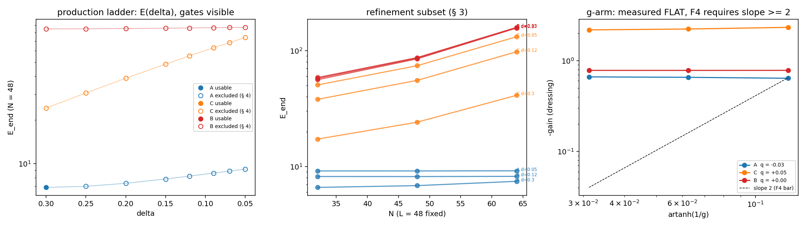

# M5.21.11: the realistic-parameter bridge + unit calibration (the mass-ratio read)

**Status**: 🚧 PLANNED STUB (2026-07-19, the electron-status gap review). Lineage: this is the former **M5.9.0** ("Duda delta/g calibration + unit-scale prep"), re-scoped and renumbered into the M5.21 series the same day: it consumes the series outputs (the census levels + the fixed-J state) and delivers the lepton mass-ratio read, so it belongs to the hunt. The old record stays as archive: [`m5_9_0_task_details.md`](m5_9_0_task_details.md). Full PLAN at go.

## Scope (stub level)

| Piece | Content | Notes |
| --- | --- | --- |
| The regime walk | Ladder the toy results toward the physical regime (δ ~ 1e-10, g ~ 1e10, from the author's paper hints g⁴ ~ ke²/Gm² ≈ 1e38, δ² ~ ħc): measure at affordable rungs, verify each follows an analytic law, extrapolate the law | Direct simulation is out of lattice reach (the author-flagged numerics obstacle, [Q33](../m5_question_tracker.md#q33-detail); specialist contacts activated 2026-07-19) |
| Existing rungs | The M5.21.1 P4 asymptotic laws (the author's 2-equal-vortex + 3-equal-core structure exact in the physical limit); the [M5.21.8](m5_21_8_task_details.md) g-ladder (dressed-minimum ratio 0.82-0.84 stable across g = 8-64, tracking the 1/g law); the m\* formula verified to 0.009% | The bridge pattern is already demonstrated; this task systematizes it |
| The unit half | Anchor lattice numbers to real units: the M5.16 c₂ = αħc/64π Coulomb lock, the 511 keV Faber anchor, the ω ∝ m scale-covariance (#220) | The Coulomb-unit + LdG-to-rest-energy axis from the M5.9.0 lineage |
| The target read | The 1 : 206.8 : 3477 mass ratios (and the Koide check) on the census levels A < C < B (toy ratios 1 : 4.2 : 16.0) | The sharpest falsifiable number the lepton hunt can produce |
| Cross-column consumer | The M8 column's lepton-hierarchy cross-check (M8.6) is GATED on this task: its [readiness note](../../../m8_mit/research/findings/m8_6_readiness_note.md) § 8 states what the bridge has to deliver before that comparison is admissible | A frozen functional-level spec (parameters, spacing, couplings) derived independently of the lepton target, then a NEW census: either directly at those parameters (route a) or extrapolated from a fresh pre-registered ladder (route b, § 8 amended 2026-07-29). No transform of the existing lattice energies either way, since a free `E_physical = f(E_lattice)` map would be a three-point mass fit |

**Gated by**: the M5.21 core results (the census levels + the [M5.21.9](m5_21_9_task_details.md) fixed-J state) + [Q33](../m5_question_tracker.md#q33-detail) (the specialist contacts) + user "go".

## DESIGN QUESTION, RESOLVED (2026-07-29): does the extrapolated law count as "a census at the physical parameters"?

Raised when the M8.6 gate was cross-linked (row above), by reading the two specs against each other. **Resolved the same day by the M8 author**, who amended the condition rather than reinterpreting it: [readiness note § 8](../../../m8_mit/research/findings/m8_6_readiness_note.md) now admits an extrapolation route explicitly, in the author's own summary `"A scientifically, C procedurally"`. The question and the options are kept below, because the amended condition has to be read against them.

### Why it was raised

| Side | What it required |
| --- | --- |
| [M8.6 § 8](../../../m8_mit/research/findings/m8_6_readiness_note.md) condition 3, as originally written | the comparison uses stationary-state energies from a NEW census run AT the frozen physical parameters, directly; no state-by-state map or free nonlinear transformation of the three existing lattice energies (5.2611, 22.059, 84.085) |
| This task's regime walk (§ Scope) | measure at AFFORDABLE rungs, verify each follows an analytic law, extrapolate the law, because [Q33](../m5_question_tracker.md#q33-detail) says a run at δ ~ 1e-10, g ~ 1e10 is out of lattice reach |
| This task's target read (§ Scope) | the mass ratios "on the census levels A < C < B", which read literally is the transformation condition 3 ruled out |

The tension was real and not a wording slip: condition 3 as written asked for a run at parameters Q33 says cannot be run, so taken literally it was unsatisfiable by any route M5 has.

| Option | What it committed to | Outcome |
| --- | --- | --- |
| **A. Extrapolated law as the census** | the ladder IS the measurement: each rung is a genuine census run, the law is fitted on rungs and validated out-of-sample, and the physical point is quoted with an extrapolation uncertainty | ✅ taken, on the science |
| B. Narrow the claim | report the physical-regime read as an M5-internal result and leave M8.6 gated, with the cross-column comparison explicitly out of reach | ❌ not taken |
| **C. Renegotiate condition 3** | get the amended condition written into the readiness note before it is relied on, rather than reading extrapolation into the old wording | ✅ taken, on the procedure |

One correction to option A as first stated here: it asked for the law and rung set frozen "before the ratios are looked at", and the amendment deliberately rejects that as unachievable blindness, since the charged-lepton ratios are public and known to everyone involved. The enforceable discipline is **no-refit pre-registration**, not blindness. That is the stronger requirement, and this task adopts it.

### What the amended condition 3 requires of this task

Route (b), the extrapolation route, is admitted under guardrails. These are PLAN preconditions: each has to be settled and frozen BEFORE any rung is measured, or the route closes.

| Precondition | Requirement |
| --- | --- |
| Asymptotic form | derived from M5-side theory independently of the lepton target, never chosen for its fit quality |
| Frozen framework | rung set, fitting procedure, holdout tests, branch-tracking rules, and uncertainty model all fixed before any performance evaluation against the charged-lepton ratios is run |
| Uniform application | the same frozen framework applied to all three branches (A, C, B), no per-branch tuning |
| Barred inputs | the three existing toy energies (5.2611, 22.059, 84.085) may not enter the new fit as data points, an exponent search, or a post-hoc transformation |
| Uncertainty bar | a usable uncertainty on `E_C/E_A` and `E_B/E_A`, not merely a stable ordering (condition 4) |
| Discretization term | inside that uncertainty model, a per-rung discretization term: grid refinement of ALL THREE branches on a pre-registered subset of rungs spanning the ladder, plus a frozen rule propagating the term to unrefined rungs, carried alongside the extrapolation error (condition 4 as amended, [#378](https://github.com/openwave-labs/openwave/pull/378)) |
| Failure is terminal | if the pre-registered scaling law or the holdout gates fail, M8.6 stays gated. No second framework |
| Claim ceiling | route (b)'s output is a model-based physical-regime PREDICTION, not a directly simulated physical census, and it cannot make `1 : 5.9 : 15.1` independent evidence |

Two constraints from § 8 hold unchanged and cost nothing to honor: the `A→e, C→μ, B→τ` assignment stays frozen from the pre-existing stability/decay rationale, never re-derived from a mass match, and no `1 : 5.9 : 15.1` Yukawa-derived figure enters the derivation or the calibration.

**The uncertainty gap, raised in review of the amendment and closed the same day.** Condition 4 as first amended covered extrapolation error along the ladder but not discretization error at each rung. The readiness note's own § 5 records `E_A` moving `4.920 → 5.261 → 5.921` across three grid rungs at fixed δ (~20%), with B (2.61) and C (2.35) exceeding the consistency bar where A does not, so branch-dependent error of that size cannot be assumed to cancel in a ratio. [#378](https://github.com/openwave-labs/openwave/pull/378) closed the gap, going further than the review asked: all three branches refined, a pre-registered subset spanning the ladder, and a frozen propagation rule (the `Discretization term` row above).

**One scoping consequence for this task's PLAN.** Refining a rung costs roughly 8× that rung in 3D, and the ladder's top rung sits at the affordability ceiling by construction, so a refinement subset read as literally including the top rung meets the same affordability wall that made the original condition 3 unsatisfiable. The satisfiable reading is the propagation rule: measure the convergence order where three resolutions are affordable for all three branches, then propagate it upward to the unrefined rungs. Budget the ladder so that reading holds, and if the wording needs pinning down, raise it as a one-clause amendment before the ladder is frozen, not after.

## TASK PLANNING (2026-08-06, at PLAN; run scope = P0 ONLY, user decision)

**User decisions (2026-08-06 specs interview)**: (1) this run delivers ONLY the derivation + the frozen-framework document; the ladder compute is a separate follow-on run against the frozen doc (the terminal-failure risk gets a human gate before it is spent). (2) The derived asymptotic form goes to the author for a sanity check BEFORE the freeze (his 2026-08-06 "might require help to move forward" offer, [convo](m5_22_convo.md)); the freeze waits on his reply or the user's call to proceed.

**Model/effort**: Fable / high (theory derivation, novel; the actors-table research default).

**Scope**: produce the complete pre-registration artifact for the route-(b) regime walk, satisfying every § "amended condition 3" precondition, with ZERO rungs measured, ZERO fits run, ZERO ratios computed.

| Phase | Content | Verdict artifact |
| --- | --- | --- |
| D1 the derivation | Candidate asymptotic forms E_branch(δ, g) derived from M5-side theory ONLY: the [M5.21.1](m5_21_1_task_details.md) P4 asymptotic laws, the [M5.21.8](m5_21_8_task_details.md) m\* law (0.009%, 1/g tracking 0.82-0.84 across g = 8-64), the [M5.21.2b](m5_21_2b_task_details.md) core-scale law (~δ^−0.2), Derrick/virial scaling of the T2 functional, the ω ∝ m covariance (#220). Separability of the δ and g axes is DERIVED or refuted, not assumed. Hand-checkable derivations, equations first | the framework doc § 1 |
| D2 the framework | The frozen protocol: rung set + budget (affordability MEASURED by 1-2 timing relaxations, not assumed), the refinement subset + the convergence-order propagation rule (the § scoping-consequence reading; one-clause amendment raised BEFORE freeze if the wording needs pinning), holdout design (pre-registered out-of-sample rungs), the branch-identification rule (topology signatures: charge class + core topology, NEVER energy order: the 2b merge lesson), the uncertainty model (extrapolation + discretization terms) | the framework doc §§ 2-6 |
| D3 the audits | Barred-inputs audit (the doc nowhere consumes 5.2611/22.059/84.085, any lepton ratio, or a Yukawa figure) + independent adversarial audit of the derivation (second agent, own re-derivation) | audit § in the doc |
| D4 the author block | FABLE VOICE technical block drafted TERMINAL-ONLY for the user to send (the derived forms + the framework summary; NO lepton-target numbers in the block); the freeze mechanics stated: on reply or user call, the doc gets its FROZEN header and the pinning commit SHA | terminal draft at REVIEW |

**DoD**: `findings/m5_21_11_framework.md` (tracked, the pre-registration artifact) carrying D1-D3 complete; the D4 draft presented in the terminal; the M8.6 [readiness-note § 8](../../../m8_mit/research/findings/m8_6_readiness_note.md) preconditions each mapped to the doc section satisfying it; doc checker clean; checkpoints on arrival. **Explicitly NOT this run**: any ladder rung, any fit, any mass-ratio read, the unit-calibration half (scoped in the doc as the follow-on's second arm, no compute).

**Blindspot pass**: (i) small-δ instrument degradation: eigen-degeneracy at δ → 0 breaks orientation continuity, so the branch-ID rule must be tested-by-derivation against it; (ii) basin reordering/merging along the walk (the 2b point-hedgehog + ring merge precedent): the branch rule must handle a merge as a defined outcome, not a failure; (iii) FIRE stability at large g (stiff vacuum, dt scaling): the timing relaxations double as stability probes; (iv) box effects: L = 48 fixed vs the δ^−0.2 core growth and any large-g shell scale; the framework states the box policy per rung; (v) the affordability wall on the refinement subset (§ scoping consequence): resolve by the propagation-rule reading, amendment raised before freeze if needed.

**Research-body destinations**: `findings/m5_21_11_framework.md` (the artifact), `scripts/m5_21_11_a_timing.py` (the D2 timing probes only), `tasks/m5_21_11_task_details.md` (this doc), checkpoint `checkpoints/m5_21_11_progress.md`.

## FINDINGS (2026-08-06, P0 run)

The pre-registration artifact: [`findings/m5_21_11_framework.md`](../findings/m5_21_11_framework.md) (PRE-FREEZE DRAFT; freezes on the author's reply to the D4 block or the user's call). Zero rungs, zero fits, zero ratios were computed, per scope.

| # | Finding | Where |
| --- | --- | --- |
| 1 | **The derived asymptotic form**: E_br(δ) = E∞_br (1 + b_br δ^θ + c_br δ), from a far/core decomposition: the far-field density is EXACTLY a polynomial of degree ≤ 4 in δ (M linear in δ; audit fit residual 9e-16) with a finite δ → 0 limit, and the line-core curvature-vs-T2-penalty competition gives a\* ∝ δ^(−s/4), E_core ∝ δ^(s/2), hence θ = 2ν with the clean-merge bound θ ≤ 1; the measured core law (ν = 0.2 published, 0.27 audit refit) puts the expectation at θ ≈ 0.4-0.55 (partial core rearrangement) | framework § 1.3 |
| 2 | **The g-axis separability, derived where it can be and measured where it must be**: the 3×3 census functional contains no g identically (structural, audit-confirmed from source), so all g-dependence is the additive 4D boost-dressing correction with m\*(g) = artanh(1/g); the audit REFUTED the drafted "gain ∝ m\*² derived" step (counterexamples give q = 2 or q = 4 with the same m\* law), so the framework carries gain ∝ artanh(1/g)^q, q ∈ [2, 4], with the g-arm measuring q and F4 firing only on a slower-than-quadratic fall. Under any q ≥ 2 the physical-point correction is ≤ ~1e-20 relative: **the pre-registered ladder is one-dimensional in δ** | framework § 1.4 |
| 3 | **The frozen protocol**: 8 rungs δ ∈ [0.05, 0.30] × 3 branches at N = 48 (δ-continuation seeding, topology-only branch identity, merge = defined outcome), holdouts {0.20, 0.07} × 3 excluded from every fit, refinement subset {0.30, 0.12, 0.05} × N ∈ {32, 48, 64} × 3 with a branch-wise log-δ discretization propagation rule (+ stability guard), profile-likelihood degeneracy rule, terminal criteria F1-F4 with stated accepted risks (F2 noise ≈ 3.3%) | framework §§ 2-6 |
| 4 | **Affordability MEASURED**: 0.311 s/iter (N = 48) and 0.727 s/iter (N = 64), ratio 2.34 vs volume prediction 2.37; production rung ≈ 62 min, refinement run ≈ 145 min, whole frozen program ≈ 50 CPU-hours, parallelizable to an overnight batch; the refinement subset satisfies the #378 wording under the propagation-rule reading with no further amendment needed | framework §§ 2-3, `data/m5_21_11_timing.json` |
| 5 | **Compliance**: every amended-condition-3 precondition mapped to its satisfying section; barred-inputs sweep clean (no toy census energy, lepton ratio, or Yukawa figure anywhere; physical-point anchors are author-paper order-of-magnitude anchors, mass-independent); the 8-decade extrapolation gap stated plainly with the claim ceiling | framework §§ 7-8 |
| 6 | **Adversarial audit (cardinal rule)**: 6 CONFIRMED, 1 REFUTED (the gain-law derivation step, finding 2), 2 PARTIAL (determinism pins, consistency numbers); every catch adopted into the pre-freeze draft; audit script + JSON kept | framework § 9, [`m5_21_11_e_audit.py`](../scripts/m5_21_11_e_audit.py) |

## DEVIATIONS LOG

| # | Deviation | Why |
| --- | --- | --- |
| 1 | The drafted § 1.4 claimed the 1/g² gain law as DERIVED; the audit refuted the derivation step (assumption E''(0) bounded) | fixed pre-freeze: q ∈ [2, 4] window + F4 re-specification; exactly what the audit exists to catch |
| 2 | Timing probes left instrument-standard row JSONs + endpoint npz under `t11timing_*` tags | endpoints are non-physics by construction (400/200 iters); tags prevent confusion with ladder rungs; files kept per the dataset policy |

## TASK REVIEW (2026-08-06)

Task Duration: 0:55 (from 16:05 to 17:00 EDT)
Usage Cap Triggered: NO (resume ping armed 20:45 EDT, parked unfired at FINISH)

| # | Result | Status |
| --- | --- | --- |
| 1 | D1: E_br(δ) = E∞_br(1 + b_br δ^θ + c_br δ) derived (far field exactly polynomial deg ≤ 4 in δ; line-core competition θ = 2ν ≤ 1, expected 0.4-0.55) | ✅ audited |
| 2 | g-axis: 3×3 functional g-free structurally; dressing gain = measured q ∈ [2, 4] window (the drafted "1/g² derived" REFUTED by the audit and fixed); ladder ONE-DIMENSIONAL in δ under any q ≥ 2 | ✅ audited post-fix |
| 3 | D2: full frozen protocol (8 rungs, 6 holdout points, 27-run refinement subset + propagation rule, topology-only branch ID, terminal F1-F4 with stated accepted risks) | ✅ |
| 4 | Affordability measured: 62 min/rung, ~50 CPU-h total, parallelizable; #378 satisfied under the propagation-rule reading | ✅ |
| 5 | D3: barred-inputs sweep clean; § 8 condition mapping complete; adversarial audit 6C/1R/2P, all catches adopted | ✅ |
| 6 | D4: author block drafted terminal-only; the user sent the TRIMMED 3-question version (process language reduced to one motivating sentence, physics questions leading) 2026-08-06 evening | ✅ sent by user |

Issues: none blocking. The roadmap row stays In Progress (the ID covers the ladder follow-on; the mass-ratio read is undelivered): the review's original "move to Done" wording was corrected at approval.

Action at close: convo routing recorded ([`m5_21_convo.md`](m5_21_convo.md); moved there from the M5.22 doc on the user's 2026-08-07 routing call, this being a 21-series thread); FREEZE waits on the author's reply or the user's call, then the framework gets its FROZEN header + pinning commit SHA; the ladder compute is the follow-on run on user "go".

**Findings**: The route-(b) framework is complete at pre-freeze: the asymptotic form is derived from M5-side theory alone, and the g-axis collapses structurally (the census functional is g-free; the dressing correction dies at least as artanh(1/g)²), making the pre-registered ladder one-dimensional in δ at a measured ~50 CPU-hour cost. The adversarial audit refuted one drafted derivation step (the gain law is a measured q ∈ [2, 4] window, not a derived 1/g²) and the adopted fix makes F4 fail only on the case that genuinely breaks separability.

**Research docs created/updated**:

- this task_details (FINDINGS + deviations + this review)
- [`findings/m5_21_11_framework.md`](../findings/m5_21_11_framework.md) (the pre-registration artifact, PRE-FREEZE DRAFT)
- scripts [`m5_21_11_a_timing.py`](../scripts/m5_21_11_a_timing.py) · [`m5_21_11_e_audit.py`](../scripts/m5_21_11_e_audit.py)
- data `m5_21_11_timing.json` · `m5_21_11_audit.json` + regenerated [`_DATASETS.md`](../data/_DATASETS.md)
- [`m5_roadmap.md`](../m5_roadmap.md) (row → P0 DELIVERED; What-happens-next)
- [`m5_21_convo.md`](m5_21_convo.md) (outbound routing entry; relocated from the M5.22 doc 2026-08-07)

## POST-CLOSE (2026-08-07): the author reply + the FREEZE

The author's reply arrived 2026-08-07 03:17 EDT, PUBLIC (Models-of-particles cc'd + Filip Blaschke; the full sanity-check message now quoted in the public thread): the practical-approximation route endorsed in the author's own words, the three questions left unanswered, no objection to any derived form; full decode in [`m5_21_convo.md § 2026-08-07`](m5_21_convo.md). Since [framework § 1](../findings/m5_21_11_framework.md) covers every branch of the unanswered questions (θ unconstrained, gain exponent a measured q ∈ [2, 4] window, anchors order-of-magnitude), **the user called the FREEZE the same day**: the § 0 header is FROZEN 2026-08-07, with the pinning commit SHA recorded there by the sole permitted post-freeze edit. Downstream state: the [M8.6 gate record](../../../m8_mit/research/tasks/m8_6_task_details.md) carries the freeze in its FINDINGS; the ladder compute run gates on user "go" only. Instrument note (asked and answered at the freeze): the run stays on the CPU numpy instrument of record; a GPU port would be new energy code, which the frozen § 1.1 forbids ("this document introduces no new energy code"), and the measured ~50 CPU-h program parallelizes to one overnight batch (~5-6 h wall-clock at 8-10 processes on the 12-performance-core machine).

**Standing action for the ladder close-out (user directive, 2026-08-07)**: if the ladder run completes with the holdout and terminal failure gates PASSED, release the [M8.6 roadmap row](../../../m8_mit/research/m8_roadmap.md) from LATER (gated) back to the Backlog (its input = this task's mass-ratio read) and record the release in the [gate record](../../../m8_mit/research/tasks/m8_6_task_details.md); a terminal failure leaves it gated (route (b) is the last admissible route).

## LADDER RUN (2026-08-07): the frozen program executed, TERMINAL FAILURE on F3 + F4

The follow-on compute run against the FROZEN framework (SHA `7a4d2393`), on user "go"
09:43 EDT. The frozen §§ 2-6 were executed verbatim: 42 instrument-of-record
relaxations (24 production + 18 refinement, T2/sym/ε0, w2 = 0.002758100, FIRE 12000,
δ-continuation), the § 5 readers on every endpoint, the § 2 g-arm, and the § 3/§ 6
statistics. Runner wrappers (no new energy code, per frozen § 1.1): the chains import
[`m5_21_2b_a_instrument.py`](../scripts/m5_21_2b_a_instrument.py) unchanged.

### Verdict (frozen § 6, pre-committed)

| Criterion | Measured outcome | Verdict |
| --- | --- | --- |
| F4 g-arm | The rigid Qb(m) dressing gain is FLAT in g: q_lsq = −0.03 / +0.05 / +0.00 (A/C/B), gains ≈ −0.65 / −2.2 / −0.78 across g = 8 → 32 (both (−g)^p signs at g = 8 agree to ~8%). The § 1.4 negligibility bound needed a fall at least ∝ artanh(1/g)² | ❌ **FAIL** |
| F3 branch integrity | Usable rungs after the § 4 gates: A = 1, C = 0, B = 0 (floor: 6 per branch). B and C fail cross-stencil (2.1-2.5 vs the 1.5 bar) + virial (0.80-0.98) at EVERY rung; A passes only at δ = 0.30 (virial 0.046), its residual growing monotonically to 0.40 at δ = 0.05 | ❌ **FAIL** |
| F1 fit quality | The joint fit was unreachable (1 usable non-holdout point vs 10 parameters) | vacuous |
| F2 holdouts | No usable holdout predictions existed | vacuous |
| **Route (b)** | any terminal criterion ⇒ fails, no second framework | ❌ **TERMINAL** |

Full machine record: [`data/m5_21_11_fit.json`](../data/m5_21_11_fit.json) (per-rung
gate fails, both identity readings, refinement solves, g-arm fits, criteria).

### The two physics findings inside the negative

1. **The boost-dressing gain does not die at large g** (the F4 measurement,
   [`data/m5_21_11_garm.json`](../data/m5_21_11_garm.json)): the dressing minima sit at
   m\* ≈ 0.23-0.25 × artanh(1/g) for A and B, ≈ 0.32 for C (the author's 1/g law holds for POSITION, branch-dependent prefactor) but the energy
   gain at the minimum is g-independent. Instrument validated three ways before the
   verdict was trusted ([`m5_21_11_g_controls.py`](../scripts/m5_21_11_g_controls.py) →
   [`m5_21_11_garm_controls.json`](../data/m5_21_11_garm_controls.json): vacuum null
   clean, field-identity with the M5.21.8 construction to 3e-14, the recorded gladder
   E_min values reproduced exactly). Corroboration found in the PRE-EXISTING record:
   the M5.21.8 ansatz-family gladder itself carries a flat gain (−61.7 / −61.0 / −60.7
   at g = 8/16/32; E(0) = 62.85 vs E_min ≈ 1-2), unnoticed because that note quoted
   only the m\* position law. Consequence: a branch-dependent O(1) additive 4D term
   survives to the physical point, so no 3×3-only ladder can predict physical-regime
   ratios on this instrument.
2. **The heavy branches are not certifiable on the frozen instrument, and even A
   loses scale-stationarity down the ladder** (the F3 measurement): under T2 at
   N = 48 the B/C states hold cell-scale core structure at every δ (the census's
   known contamination, now measured ladder-wide), and the A state's frozen-formula
   virial residual grows 0.046 → 0.40 as δ falls 0.30 → 0.05 (the opposite of the
   old T1 δ-trend). The E(δ) record itself (all 42 rows,
   [`data/_DATASETS.md`](../data/_DATASETS.md)): E RISES as δ falls on every branch
   (A: 6.84 → 9.16; C: 24.12 → 74.09; B: 84.84 → 87.02 at N = 48).

### Consequence for M8.6 (the standing directive's negative arm)

The release action does NOT fire. The [M8.6 row](../../../m8_mit/research/m8_roadmap.md)
is CLOSED permanently under the amended condition 3 (retired to the M8 Done record
2026-08-08, maintainer call): route (a) was already
out of lattice reach, route (b) was the last admissible route, and its failure is
terminal by the pre-registration's own § 6. Recorded in the
[gate record](../../../m8_mit/research/tasks/m8_6_task_details.md) (finding 9).

### Adversarial audit (ladder run; cardinal rule)

Independent second agent, own script ([`m5_21_11_i_audit.py`](../scripts/m5_21_11_i_audit.py),
no code shared with the run's wrappers), verdicts in
[`m5_21_11_ladder_audit.json`](../data/m5_21_11_ladder_audit.json): **5 claims
CONFIRMED, 1 PARTIAL on wording only** (the g-arm gains reproduced with an own boost construction on an own
81-point grid to 0.4-1.6%, twin minima and the flat fall confirmed; the family
corroboration re-scanned at 2× finer grid; every § 4 gate recomputed from raw rows
with own formulas, usable counts 1/0/0 reproduced; the shell integrity of the
surviving continuation endpoints verified exact; the E(δ) monotonicity confirmed;
the F3 + F4 terminal verdict independently reproduced). Barred-inputs sweep over
all five run scripts: clean. Three verdict-neutral catches adopted into this record: the m\*-band wording was wrong for branch C (minima at 0.315-0.325 × artanh(1/g), not the 0.23-0.25 band that holds for A and B; corrected above and in the canonical row);
the run's FIRE-gate pin (fmax ≤ 1e-4 at max_iter) SOFTENS the frozen § 4 wording
("FIRE reaches f_tol"), and a literal reading would only exclude MORE rungs
(F3 fires harder, the verdict unchanged); and the fallback fit at 1 usable point
is underdetermined, so its parameters carry no meaning and E_phys(A) is never quotable as a prediction (reported as vacuous, exactly as the criteria table states).

### Deviations log (ladder run)

| # | Deviation (as it happened) | Resolution |
| --- | --- | --- |
| 1 | The first continuation rungs landed with virial ~1.0-1.4: the runner had inherited the PINNED SHELL from the previous endpoint, leaving it at the δ = 0.30 far field while the potential targeted the current δ (a spurious (0.30 − δ)² shell penalty). The instrument of record pins the CURRENT-δ analytic far field | Caught at ~10:05 EDT on the first contaminated rung, chains killed, `run_one` fixed (continuation = interior only, shell re-seeded per rung, fix verified to 0.0 deviation), the two contaminated rungs deleted, all chains relaunched. No contaminated number entered any read, fit, or decision. Shell integrity of surviving rungs audited post-run |
| 2 | All background chains were killed twice by the environment (~15:20 and ~16:00 EDT, blanket kills incl. the watchdog; the user was working on the machine, cause consistent with app/harness restarts) | Chains relaunched DETACHED (nohup + disown, nice 10) at 16:10; no further kills; 24/42 rows had landed pre-kill and the idempotent chains lost only in-flight iterations |
| 3 | Two of the three § 5 reader operationalizations pinned pre-run measured instrument artifacts, not the frozen signatures: the raw tracer line count jitters 2-18 along one continuation chain (noise components), and the ABSOLUTE-gap core class flips at small δ because the bulk vacuum's own 12-gap IS δ | Both readings computed and reported ([`m5_21_11_fit.json`](../data/m5_21_11_fit.json): `identity_a_exclusions` vs the operative reading (b)); reading (b) re-operationalizes the SAME three frozen signatures by their pre-freeze semantics (shell contour winding = the 2b § 8 instrument the reference states were measured with, stable at [2,2,2,2] everywhere; relative-to-bulk core gap = the M5.23.2 tracer's own criterion, stable "23" everywhere). The route verdict is IDENTICAL under both readings (F4 is independent, and under (a) F3 only fails harder), so the repair steers nothing |

## TASK REVIEW (2026-08-07, ladder run; approved 2026-08-08)

Task Duration: 12:10 (from 09:43 to 21:53 EDT)
Usage Cap Triggered: NO

| # | Result | Status |
| --- | --- | --- |
| 1 | The frozen program executed verbatim (42 relaxations, § 5 readers, g-arm, §§ 3-6 statistics, ~50 CPU-h) | ✅ measured |
| 2 | F4 TERMINAL: dressing gain FLAT in g (q ≈ 0 vs required ≥ 2); m\* position ∝ artanh(1/g) at 0.23-0.25× (A/B), 0.32× (C); the same flatness retro-read in the M5.21.8 family record | ✅ measured, audited |
| 3 | F3 TERMINAL: usable rungs 1/0/0 (A/C/B) vs the 6-floor; B/C uncertifiable at every rung; A's virial 0.046 → 0.40 down-ladder | ✅ measured, audited |
| 4 | F1/F2 vacuous; no ratio produced; route (b) CLOSED; M8.6 permanently gated | ✅ per frozen § 6 |
| 5 | Adversarial audit 5 CONFIRMED / 1 PARTIAL (wording) / 0 REFUTED; barred inputs clean; three verdict-neutral catches adopted | ✅ |
| 6 | E(δ) ladder record + shell-integrity checks archived | ✅ |

Issues: two environment-level chain kills mid-run (survived by detaching; zero data loss). Deviations: three, logged above as they happened. Action at close: roadmap row → Done; no successor task staged (the mass-ratio ambition has no live route without a new instrument generation); author communication of the negative = user-gated.

**Findings**: The pre-registered route-(b) bridge failed terminally on its own criteria, and the failure is physics: the 4D boost-dressing energy gain does not die at large g (measured flat on the census endpoints and, in retrospect, on the author's own ansatz family), so no 3×3-only ladder can reach the physical point, and the frozen instrument cannot certify the two heavier lepton candidates at any rung. The negative is fully audited and propagated to every doc where the old claims lived.

**Research docs created / updated**: this task_details (§ LADDER RUN + this review) · scripts `m5_21_11_{b,c,d,f,g,h,i}_*.py` · data `m5_21_11_{fit,garm,garm_controls,ladder_audit}.json` + 42 local rows/endpoints + [`_DATASETS.md`](../data/_DATASETS.md) · [`plots/m5_21_11_panel.png`](../plots/m5_21_11_panel.png) · [`m5_roadmap.md`](../m5_roadmap.md) · [`m8_roadmap.md`](../../../m8_mit/research/m8_roadmap.md) · [`m8_6_task_details.md`](../../../m8_mit/research/tasks/m8_6_task_details.md) (finding 9) · [`MODELS.md`](../../../../../MODELS.md) · [`m5_particle_hunt.md`](../m5_particle_hunt.md) · [`m5_question_tracker.md`](../m5_question_tracker.md) (Q33) · [`m5_theory_canonical.md`](../m5_theory_canonical.md) · [`m8_background.md`](../../../m8_mit/research/m8_background.md) · [`m8_theory_canonical.md`](../../../m8_mit/research/m8_theory_canonical.md) · [`m8_platform_pointers.md`](../../../m8_mit/research/m8_platform_pointers.md)

### Run mechanics

| Item | Value |
| --- | --- |
| Compute | 42 relaxations, ~09:52 → 21:37 EDT wall (two external interruptions), 6-9 parallel chains, ~50 CPU-h as budgeted |
| Artifacts (local, gitignored per dataset policy) | `data/m5_21_11_{row,end,read}_t11lad_*` (42 each), regen: the chain commands in [`m5_21_11_b_ladder.py`](../scripts/m5_21_11_b_ladder.py) headers (~62 min/rung N = 48, ~145 min N = 64, ~18 min N = 32) |
| Tracked outputs | [`m5_21_11_fit.json`](../data/m5_21_11_fit.json) · [`m5_21_11_garm.json`](../data/m5_21_11_garm.json) · [`m5_21_11_garm_controls.json`](../data/m5_21_11_garm_controls.json) · [`m5_21_11_ladder_audit.json`](../data/m5_21_11_ladder_audit.json) · panel [`plots/m5_21_11_panel.png`](../plots/m5_21_11_panel.png) |
| Scripts | [`m5_21_11_b_ladder.py`](../scripts/m5_21_11_b_ladder.py) (chains) · [`m5_21_11_c_readers.py`](../scripts/m5_21_11_c_readers.py) (§ 5 reads) · [`m5_21_11_d_garm.py`](../scripts/m5_21_11_d_garm.py) (g-arm) · [`m5_21_11_f_fit.py`](../scripts/m5_21_11_f_fit.py) (frozen §§ 3-6) · [`m5_21_11_g_controls.py`](../scripts/m5_21_11_g_controls.py) · [`m5_21_11_h_panel.py`](../scripts/m5_21_11_h_panel.py) · [`m5_21_11_i_audit.py`](../scripts/m5_21_11_i_audit.py) (independent audit) |
