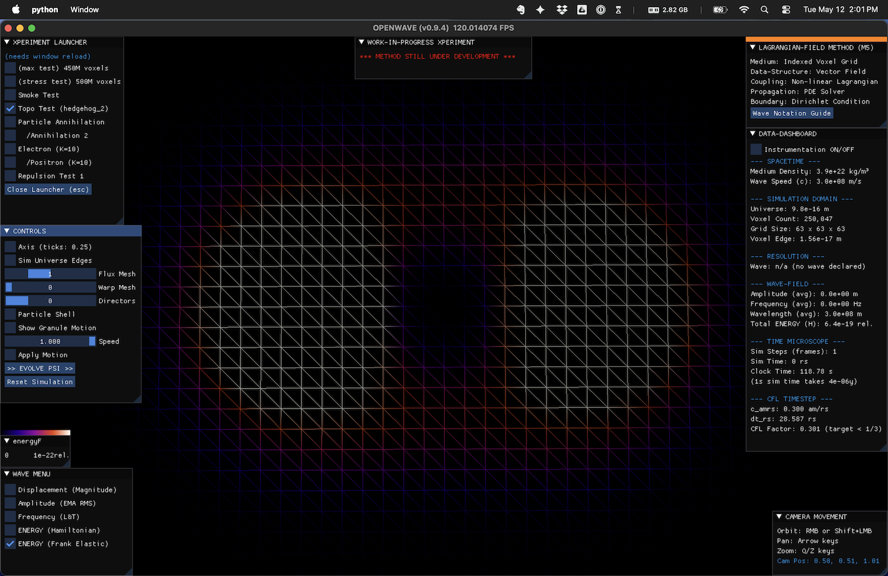
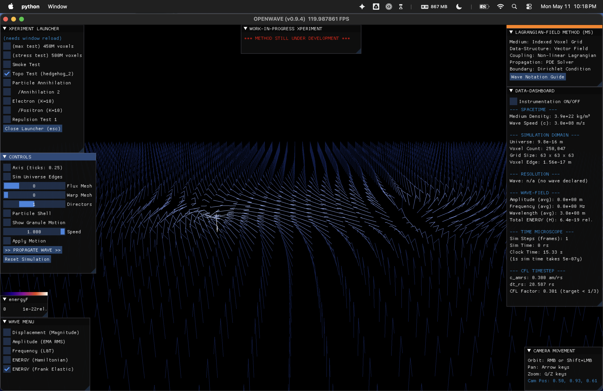
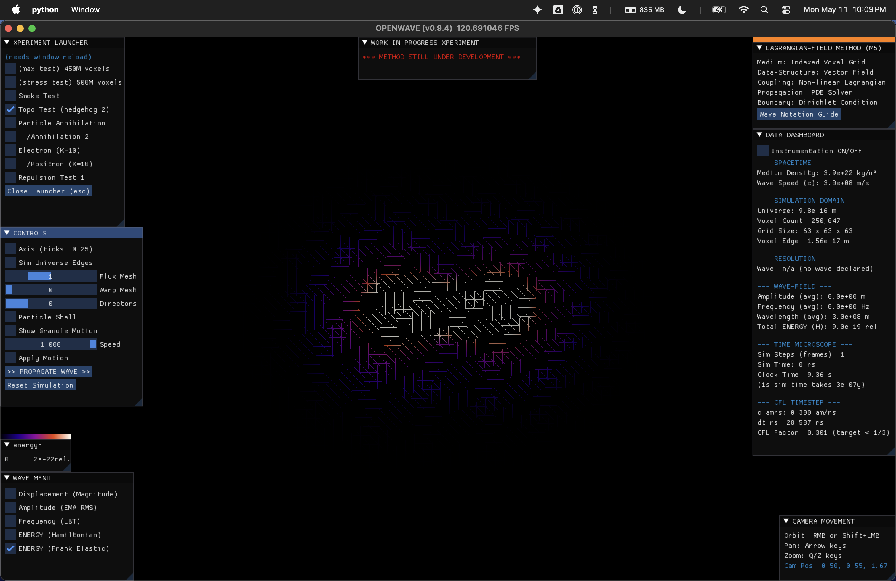
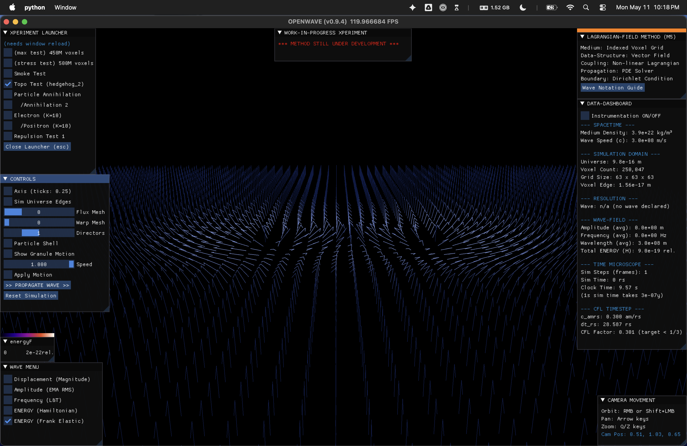

# Visual Geometry of M5.1 Coulomb Interaction

Captured 2026-05-11 during M5.1 task 7 (1/d Coulomb gating) verification in the OpenWave GUI. Side-by-side screenshots of a hedgehog defect pair under two configurations: **opposite charges (Q=+1, Q=−1, attractive)** vs **same charges (Q=+1, Q=+1, repulsive)**, viewed both via Frank elastic energy density (`WAVE_MENU=5`) and via director-glyph rendering (`SHOW_DIRECTORS=3`).

These are the **visual companion** to the quantitative `research/m5_1_coulomb.py` headless test (R² = 0.978 with attractive sign). The headless test proves the *1/d scaling*; these screenshots show the *geometric mechanism* — exactly the field-line patterns classical EM textbooks attribute to point charges, but emerging here from pure topology (director winding) on a Lagrangian field, with no electromagnetism postulated.

---

## SETUP

| Parameter | Value |
| --- | --- |
| Grid | 65³ |
| Defect pair | offset ±10 voxels along x from grid center |
| `seed_hedgehog` | weighted superposition with `DOMAIN_QUARTER_FRACTION = 0.20` |
| `AUTO_RELAX_STEPS` | 60 (lightly relaxed; preserves topology) |
| WAVE_MENU palette | ironbow (dark vacuum → bright peak) |
| Camera | oriented to view the connecting axis |

---

## OPPOSITE CHARGES (Q=+1, Q=−1) — ATTRACTIVE

### ATTRACTIVE - Frank elastic density (WAVE_MENU=5)

**Observed**: a clear **dumbbell / elongated bridge** of F density along the axis connecting the two cores. Energy is concentrated *between* the defects, not just at their cores.

### ATTRACTIVE - Director field (SHOW_DIRECTORS=3)

**Observed**: directors flow *smoothly from one defect to the other*. Near the +1 defect they point outward (radial); near the −1 defect they point inward (anti-radial). In the middle of the axis they lie roughly horizontal, completing the smooth interpolation from outward → inward.

### ATTRACTIVE - Why this shape

| Element | Reason |
| --- | --- |
| Bright bridge along axis | Directors must rotate continuously between the two winding orientations; the rotation costs Frank elastic energy |
| Smooth flow | Q=+1 directors and Q=−1 directors are *compatible* — they can meet smoothly in the middle |
| Energy lowers as d shrinks | The shorter the bridge, the less integrated `\|∇n̂\|²` between → lower total F → **attractive interaction** |

This matches the classical EM picture of field lines connecting opposite point charges — straight from + to −, no perpendicular splaying.

---

## SAME CHARGES (Q=+1, Q=+1) — REPULSIVE

### REPULSIVE - Frank elastic density (WAVE_MENU=5)

**Observed**: a **pinched / perpendicular** F density pattern. Energy is *pushed sideways*, away from the axis connecting the cores; the connecting region itself is comparatively dim while there's intensity above / below / around the cores.

### REPULSIVE -Director field (SHOW_DIRECTORS=3)

**Observed**: directors near both defects point outward (both are Q=+1). In the middle of the connecting axis they *can't smoothly interpolate* — both endpoints want directors pointing toward the OTHER defect's exterior, creating a high-gradient region. The field is forced into a "squeezed" configuration.

### REPULSIVE -Why this shape

| Element | Reason |
| --- | --- |
| No clean axial bridge | Both defects have the same winding sense — directors can't smoothly flow between them |
| Energy splayed perpendicular | The "stress" of the topological mismatch finds an escape route perpendicular to the connecting axis |
| Energy rises as d shrinks | Shorter d → tighter squeeze → higher integrated `\|∇n̂\|²` → higher total F → **repulsive interaction** |

This matches the classical EM picture of field lines between like charges — pushed perpendicular, never directly connecting + to + or − to −.

---

## CLASSICAL EM ANALOG — TABULAR COMPARISON

| Aspect | Classical EM (textbook) | M5 director field (this screenshot) |
| --- | --- | --- |
| Opposite charges | E-field lines directly connect + → − | Director directly interpolates Q=+1 → Q=−1 |
| Same charges | E-field lines push perpendicular, never directly connect | Director squeezed perpendicular, can't smoothly bridge |
| Energy density between attractive pair | High along axis | F density high along axis (dumbbell) |
| Energy density between repulsive pair | Pushed sideways | F density splayed perpendicular (pinched) |
| Energy vs separation | E(d) ~ ±1/d | F_total(d) ~ a + b/d (b<0 attractive, b>0 repulsive) |
| Mechanism | Coulomb's law (postulated) | Frank elastic of topological winding (derived) |

The M5 framework reproduces the *exact geometric pattern* of classical Coulomb field lines from a single starting point: a unit-vector director field with topological defects. EM is not postulated — it emerges as the geometry of director winding.

---

## WHAT THIS PROVES (AND WHAT IT DOESN'T)

### Proves

| Claim | Evidence |
| --- | --- |
| M5 reproduces Coulomb-like field geometry | Visual match to textbook EM patterns |
| Sign convention is correct | Opposite = bridge; same = perpendicular splay |
| Both quantitative (1/d) and qualitative (field shape) Coulomb agreement | Headless test R²=0.978 + these screenshots |
| Topology mechanism works without postulating EM | Pure Frank elastic, no Maxwell equations introduced |

### Doesn't prove

| Claim | Why not (yet) |
| --- | --- |
| Defects actually accelerate toward / away from each other | Static M5.1 (no V(ψ), no defect dynamics) — that's M5.2+ |
| Full Maxwell equations emerge | Need M5.2 wave dynamics + M5.3 Hamiltonian to extract the EM tensor |
| Magnetic-field T-component | M5.2 (Close Eq. 23 with spin density `s`) |
| Photon emission on annihilation | M5.4 headline test |

---

## REFERENCES

- **Quantitative test**: `openwave/xperiments/m5_lagrangian_field/research/m5_1_coulomb.py`
- **Quantitative plot**: `research/plots/m5_1_coulomb.png` (E vs d + E vs 1/d linear fit)
- **Strategic context**: [`3c_topological_defect.md § STRATEGIC MAPPING`](3c_topological_defect.md) — wave vs topology decomposition; Coulomb listed under "FORCES — Topology"
- **M5.1 task entry**: [`3d_path_to_m5.md § Phase M5.1 — task 7`](3d_path_to_m5.md)
- **Roadmap status**: [`0_ROADMAP.md`](0_ROADMAP.md) — M5.1 complete; M5.2 unblocked
