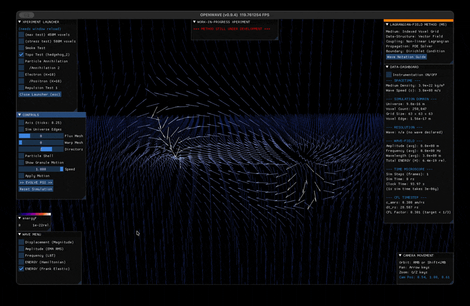

# OpenWave M5 — Lagrangian field method, status + roadblock

## TL;DR

- M5 implements a Lagrangian field theory `S[ψ] = ∫ dt d³x [ ½\|ψ̇\|² − ½c²\|∇ψ\|² − V(ψ) ]` on a Vector(3) director field `ψ`, on a Taichi-GPU voxel grid. Topological defects are treated as field configurations (not external objects placed in a medium), per the framework Dr. Duda has advocated and consistent with Robert Close's elastic-solid derivation.
- **Topological charge quantization**: M5 implements the standard mechanism — director field on S², integer charge by Brouwer-degree (Gauss-law-equivalent) wrapping count. Measured `Q = ±0.996` on seeded ±1 hedgehog defects, `Q = 0` in vacuum. Quantization is geometric, not postulated.
- **Paper alignment** (added 2026-05-12 after reading arxiv:2108.07896 "Framework for liquid crystal based particle models" v7 Nov 2025): the M5 work and Dr. Duda's framework paper line up directly. Their Fig. 2 is the analytical version of our M5.1 Coulomb test (same Faber dipole ansatz, same `E(d)` integration, same `~1/d` behavior). The paper also addresses our roadblock from inside the framework — see "Where the paper addresses our roadblock" section below.
- **M5.1 result**: a relaxed pair of opposite-sign hedgehog defects reproduces **Coulomb's `1/d` law from pure topology** (R² = 0.978, attractive sign). The geometric field-line picture matches the classical EM textbook exactly — no electromagnetism is postulated; it emerges as the geometry of director winding. Quantitative + visual confirmation below. Charge quantization and Coulomb force come from the *same* field configuration, not separate postulates.
- **M5.2 roadblock**: when we step the same hedgehog forward under the wave equation `∂²ψ/∂t² = c²∇²ψ − ∂V/∂ψ`, the topological charge Q decays from `+0.996` to `~0` within 4-5 steps, regardless of which V(ψ) we add (Klein-Gordon mass, Mexican-hat φ⁴, biharmonic 4th-derivative). The decay is *identical* across configurations at every sample step.
- **Diagnosis**: the seed (a Frank-elastic-relaxed hedgehog with `|n̂| = 1` everywhere and `Q ≈ 1`) is *not* a stationary point of the full dynamic equation. `∇²ψ ≠ 0` at the relaxed state, so the leapfrog's first step immediately kicks the field. We have not found a V(ψ) that turns the seed into a soliton, and we suspect the right move is to construct the initial condition differently. Questions for the group below.

---

## What M5 is

M5 is OpenWave's Lagrangian-field implementation, built after a 2026-04 sandbox phase that tested 8 candidate Lagrangians from Dr. Duda's framework, Robert Close's *Foundations of Physics* 2025 paper, and the Skyrme / LdG literature. Selected recipe per the sandbox results:

- **Field**: Vector(3) `ψ` on a voxel grid (current production: 65³ to 384³, Taichi-Metal on M4 Max)
- **Action**: `S = ∫ ½|ψ̇|² − ½c²|∇ψ|² − V(ψ)` — wave-eq kinetic + gradient + potential
- **Topology**: defects extracted from director winding `n̂ = ψ / |ψ|`; charge measured via Brouwer-degree integral on a sphere
- **Frank elastic**: `H_F = (K/2)·|∇n̂|²` — the static elastic-stress functional that gives 1/d Coulomb
- **Gradient-descent relax**: tangent-projected, unit-vector-preserving descent on Frank energy (port from sandbox Exp 2)
- **Planned V(ψ) lineage**: Close Eq. 23 + Klein-Gordon mass + LdG biaxial (Faber regularization for M5.6)

Roadmap and validation history: [`3d_path_to_m5.md`](3d_path_to_m5.md).

---

## Concrete result — M5.1 Coulomb from pure topology

A relaxed pair of opposite-sign hedgehog defects under gradient descent on Frank elastic energy reproduces **Coulomb's law from pure topology** — no electromagnetism postulated. The defects feel each other via the elastic stress in the director texture between them.

| Measurement | Result |
| --- | --- |
| Quantitative E(d) fit | R² = 0.978, attractive sign |
| Separations swept | d ∈ {8, 10, 12, 14, 16, 18, 20} voxels |
| Threshold | R² ≥ 0.95 — PASS |
| Same-charge run | R² = 0.14 (sign-correct REPULSIVE; informational) |
| Implementation | `xperiments/m5_lagrangian_field/research/m5_1_coulomb.py` |

The geometric mechanism matches the classical EM field-line picture exactly.

## Opposite charges (Q = +1, Q = −1) — attractive

A clear dumbbell / elongated bridge of F-density along the axis connecting the two cores. Energy is concentrated *between* the defects, not just at their cores — the inter-defect texture carries the field.

Directors flow smoothly from one defect to the other. Near the `+1` defect they point outward (radial); near the `−1` defect they point inward (anti-radial). In the middle of the axis they lie roughly horizontal, completing the smooth interpolation from outward → inward. As `d` shrinks the integrated `|∇n̂|²` in the bridge falls → **attractive interaction**.

## Same charges (Q = +1, Q = +1) — repulsive

A pinched / perpendicular F-density pattern. Energy is pushed sideways, away from the axis connecting the cores; the connecting region itself is comparatively dim.

Directors near both defects point outward (both are `Q = +1`). In the middle of the connecting axis they cannot smoothly interpolate — both endpoints want directors pointing toward the OTHER defect's exterior, creating a high-gradient region. The field is forced into a "squeezed" configuration. As `d` shrinks the integrated `|∇n̂|²` in the perpendicular splay rises → **repulsive interaction**.

### Comparison to classical EM

| Aspect | Classical EM | M5 director field |
| --- | --- | --- |
| Opposite charges | E-field lines connect + → − directly | Director interpolates Q=+1 → Q=−1 directly |
| Same charges | E-field lines push perpendicular | Director squeezed perpendicular |
| Energy density between attractive pair | High along axis | F-density high along axis (dumbbell) |
| Energy density between repulsive pair | Pushed sideways | F-density splayed perpendicular (pinched) |
| Energy vs separation | `E(d) ~ ±1/d` | `F_total(d) ~ a + b/d` (b<0 attractive, b>0 repulsive) |
| Mechanism | Coulomb's law (postulated) | Frank elastic of topological winding (derived) |

The winding-number tracker measured `Q = ±0.996` on seeded ±1 hedgehogs and `Q = 0` in vacuum, confirming the topological charge is what we think it is. Full write-up of the visual result: [`3f_coulomb_visual_geometry.md`](3f_coulomb_visual_geometry.md).

---

## Where we got stuck — M5.2 dynamic stability

The natural next step is dynamic: rather than relax the hedgehog under Frank-energy gradient descent (a static optimization), step it forward under the wave equation `∂²ψ/∂t² = c²·∇²ψ − ∂V/∂ψ` and see if it stays coherent. The expectation: with the right V(ψ), the relaxed hedgehog should be a long-lived resonance. It is not.

### Negative results across V(ψ) escalation

In each case we seed a `Q = +1` hedgehog, relax for 20 steps on Frank energy (which gives `|n̂| = 1` everywhere and `Q = +0.996`), and then propagate. The winding number Q is sampled on a sphere of radius 5 voxels around the seed center every few steps. All runs use `dx ≈ 15 am`, `dt ≈ 28 rs`, CFL safety factor 0.95.

| V(ψ) recipe | Step at which Q drops below 0.5 |
| --- | --- |
| V = 0 (free wave, expected Derrick collapse) | step 4 |
| V = ½m²·\|ψ\|² (Klein-Gordon, electron mass) | step 4 (identical to V=0 at electron scale) |
| V += ¼λ(\|ψ\|² − 1)² (φ⁴ Mexican-hat) | step 4 |
| V += ½κ·\|∇²ψ\|² (biharmonic 4th-derivative) | step 4 |

The Q-decay timing is **identical** across all configurations to f32 precision. `|Q_free − Q_with_V(ψ)|` stays below 1e-3 at every sample step. Notably:

- The φ⁴ Mexican-hat *does* tighten `|ψ|` around the unit sphere (max excursion drops from 1.83 to 1.27 over 20 steps), so the term is mathematically active — it just isn't acting on the right degree of freedom to preserve topology.
- The biharmonic stabilizer is stable at `κ ≤ 0.003·c²·dx²` (nonlinear φ⁴ feedback amplifies higher-k modes, tightening the linearized CFL bound). At the stable scale, Q decay is again identical to the free wave.

### Our diagnosis

The seed is *not* a stationary point of the dynamic equation.

After Frank-energy relaxation the field has `|n̂| = 1` everywhere and `Q ≈ 1`. But it still has `∇²ψ ≠ 0` — Frank energy is minimized over director orientation, not over the full Lagrangian. The leapfrog's first step `ψ_new = ψ + (c·dt)²·∇²ψ − V'(ψ)·dt²` therefore immediately kicks the field. Subsequent dynamic evolution destroys the texture coherence at the winding-sample radius (5 voxels) within 2–5 steps — well before any V(ψ) term has time to act.

We have not found a V(ψ) that turns the Frank-energy minimum into a full-Lagrangian minimum. We suspect the issue is methodological: we need an initial condition that is a stationary point of the full dynamic equation from the start.

---

## Where the paper addresses our roadblock

After hitting the negative results above, a closer read of Dr. Duda's framework paper (arxiv:2108.07896 v7, local `scientific_source/liquid_crystal_model.pdf`) suggests the issue is structural, not parameter-tuning:

| Paper element | Implication for our roadblock |
| --- | --- |
| Field is `M(x) = O(x) D O^T(x)` — real symmetric 3×3 matrix (biaxial), NOT Vector(3) ψ | Our M5.2 work is on the wrong substrate. Biaxial M field is the architectural target. |
| Lagrangian Eq. 18: `L = Σ ‖F_μ0‖² − Σ ‖F_μν‖² − V(M)` with `F_μν = [M_μ, M_ν]` matrix commutator | More structure than scalar `S = ½ψ̇² − ½c²(∇ψ)² − V(ψ)`. Maxwell + KG + GEM all derive from this. |
| Fig. 9 — Klein-Gordon **emerges** from biaxial-twist dynamics with `Λ = (1, δ, 0)` and `δ ~ ℏ` | Our M5.2 Step 2 (adding KG mass to V_psi) was the wrong implementation. KG is a result, not a starting term. |
| Fig. 10 — 4D LdGS with `D = diag(g, 1, δ, 0)` has **negative-energy contributions from spacetime signature** that auto-propel the de Broglie clock / Zitterbewegung | Static stability is not the goal in this framework. The particle IS the time-periodic clock. Three-way confirmation: Duda paper Fig. 10, Robert Close's email reply ("explore amplitudes of certain harmonic waves — likely l=1, amplitude ≈ wavelength; I doubt you'll find completely stable non-radiating solutions"), and Werbos's chaoiton claim ("Static solitons don't exist in this theory; the stable objects are chaoitons — time-periodic, localized"). |
| Eq. 13 Higgs-like potential: `V_LG(M) = a Tr(M²) − b Tr(M³) + c (Tr(M²))²` (Landau-de Gennes) | This is the "Mexican-hat" we were trying to approximate at the scalar level. Activated by Faber regularization. |
| §III note: "Choosing the details especially of potential is very difficult, will rather require PDE simulations" | The paper explicitly states the framework needs numerical work to nail down — i.e., what OpenWave is for. We are at the right place to do that work. |

**Updated diagnosis**: not "find a better V(ψ) for Vector(3)", but "graduate to the matrix-field biaxial framework where the static-stability question dissolves into the resonance-lifetime question."

---

## Open questions for the group

A specific yes/no/which on any of the following — even a one-line steer — would unblock us:

> **Status after reading paper (2026-05-12 update)**: Q1, Q2, and Q3 below were drafted before re-reading the framework paper. The paper plus prior correspondence with Dr. Close substantially answer them already — the answers are annotated below each question. Q4 remains open. We're keeping the questions for any new readers and to give Dr. Duda / others a chance to confirm or correct our reading.

**Question 1 — initial-condition construction.** In a topological-defect-as-particle framework, is the stable single-particle solution constructed as:

- (a) A texture relaxed against the **full** Lagrangian (gradient descent on `E_grad + V(ψ)` together, with whatever soft constraints preserve topology during relaxation), or
- (b) An **exact-soliton ODE** solved as a boundary-value problem on the radial profile `f(r)` for `ψ = f(r)·r̂`, then used as initial condition, or
- (c) Something else (Bogomolny-saturated profile, Hopf-invariant construction, multi-component ansatz with the unit-vector field as a particular component)?

> **Updated answer (paper + Close)**: none of (a)/(b)/(c) — the question's premise was wrong. There is no static stable solution. Robert Close's reply: "Even including the nonlinear term, I would expect your result of dispersing waves in most cases. But I suspect that certain amplitudes of certain harmonic waves will keep energy localized longer (i.e. as an unstable particle or resonance). My suggestion is to explore a wide range of amplitudes (probably l=1 harmonic wave is the most interesting). A likely criterion is that the maximum displacements should be comparable to the wavelength (or half or twice). Unless you have a good way to model an infinite system, I doubt that you will find completely stable non-radiating solutions." Duda paper Fig. 10 confirms: 4D Lorentz-signature negative-energy terms automatically propel the de Broglie clock. The "particle" IS the time-periodic resonance. Confirm?

**Question 2 — V(ψ) shape.** Is there a particular V(ψ) known to admit a stable 3D hedgehog soliton? We've tested φ⁴ Mexican-hat (`¼λ(|ψ|² − 1)²`) and biharmonic (`½κ|∇²ψ|²`) without success. Likely candidates we have not yet implemented:

- Faddeev–Skyrme cross-product term `½ε·|∂_i n̂ × ∂_j n̂|²` (topology-aware 4th-derivative)
- LdG biaxial polynomial `−a·Tr(Q²) + b·Tr(Q³) + c·(Tr(Q²))²` with the `(δ, 1, g)` axis hierarchy (long-term — M5.6 / Faber regularization)
- Sine-Gordon-like or other specific algebraic forms used in the topological-soliton literature

Is one of these *the* answer, or is the soliton existence theorem itself contingent on a specific Lagrangian we haven't tried?

> **Updated answer (paper)**: the question is on the wrong substrate. The paper's Lagrangian (Eq. 18) is on the matrix field `M = ODO^T`, not Vector(3) ψ; the Higgs-like potential is Eq. 13's LdG form `V_LG(M) = a Tr(M²) − b Tr(M³) + c (Tr(M²))²`. None of our scalar V(ψ) probes were testing the actual proposed potential. Confirm?

**Question 3 — connection / curvature layer.** A natural mathematical reformulation of the deeper-field picture expresses the director field as the "deeper" field, with `A` as a connection on it and `F` as its curvature; the topological charge is then counted by Gauss's law on `F`. In M5 we have the director `ψ` and we read out integer winding directly via the Brouwer-degree integral — there is no explicit `A`-as-primary-field layer in our action. Is that explicit connection/curvature layer **load-bearing** for hedgehog stability under the dynamic EOM (i.e., does the soliton existence theorem require `A` as a primary field rather than a derived quantity from `ψ`), or does it yield the same physics in different mathematical clothing?

> **Updated answer (paper §II)**: load-bearing. The paper's `A_μ = [M, ∂_μ M]` (Eq. 19) makes `A` a derived but anti-symmetric matrix object, with `F_μν = ∂_μ A_ν − ∂_ν A_μ` as its curvature. This is the "deeper field" formulation done correctly. The Brouwer-degree integral we use is the right diagnostic, but the underlying field is the matrix `M`, not Vector(3) ψ. Confirm?

**Question 4 — lab anchor.** Liu et al. *Nature Physics* 2026 reported the first direct laser creation of isolated hopfions + skyrmions — an independent confirmation that the lab side of the topology-as-particles hypothesis is settled. Does that change the priority of what the framework needs simulated first (hedgehog before hopfion? simpler stabilizer before LdG? something else)?

---

## Links to code, data, and roadmap

- M5.1 Coulomb visual document (full screenshots + commentary): [`3f_coulomb_visual_geometry.md`](3f_coulomb_visual_geometry.md)
- Headless Coulomb gating test (the script that produced R²=0.978): `xperiments/m5_lagrangian_field/research/m5_1_coulomb.py`
- M5 phase-by-phase roadmap (M5.0 through M5.8): [`3d_path_to_m5.md`](3d_path_to_m5.md)
- Strategic map of which physics is "topology" vs "waves" in M5: [`3c_topological_defect.md`](3c_topological_defect.md)
- Step 3 / 4a / 4b negative-result test scripts:
  - `xperiments/m5_lagrangian_field/research/m5_2_kg_defect_survival.py`
  - `xperiments/m5_lagrangian_field/research/m5_2_phi4_defect_survival.py`
  - `xperiments/m5_lagrangian_field/research/m5_2_biharmonic_defect_survival.py`
- OpenWave repository: <https://github.com/openwave-labs/openwave>
